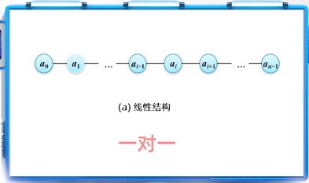
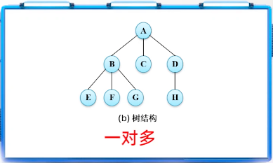
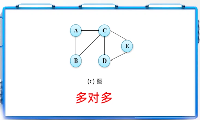
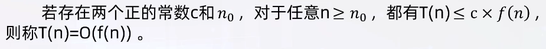
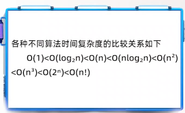

# 学习笔记：数据结构（Java版）（MOOC郑州大学）.md

- [学习笔记：数据结构（Java版）（MOOC郑州大学）.md](#学习笔记数据结构java版mooc郑州大学md)
  - [Chapter\_1\_数据结构的基本概念](#chapter_1_数据结构的基本概念)
    - [Chapter\_1\_导读](#chapter_1_导读)
    - [无处不在的数据结构](#无处不在的数据结构)
    - [什么是数据结构](#什么是数据结构)
    - [数据结构包含两个方法](#数据结构包含两个方法)
    - [从三个方面理解数据结构的概念](#从三个方面理解数据结构的概念)
      - [数据的逻辑结构](#数据的逻辑结构)
        - [线性结构](#线性结构)
        - [树结构](#树结构)
        - [图](#图)
      - [数据的存储结构](#数据的存储结构)
        - [数据的存储机构的两种基本形式](#数据的存储机构的两种基本形式)
      - [运算、处理、算法](#运算处理算法)
        - [算法的基本操作](#算法的基本操作)
    - [数据类型](#数据类型)
      - [数据类型 与 数据结构](#数据类型-与-数据结构)
    - [抽象数据类型](#抽象数据类型)
    - [算法](#算法)
      - [算法的特性](#算法的特性)
      - [算法设计目标](#算法设计目标)
      - [算法描述方法](#算法描述方法)
    - [算法分析](#算法分析)
      - [时间代价分析](#时间代价分析)
        - [事先分析估算](#事先分析估算)
        - [常见数量阶](#常见数量阶)
      - [空间代价分析](#空间代价分析)
  - [Chapter\_2\_线性表](#chapter_2_线性表)
    - [线性表的定义](#线性表的定义)
      - [线性表的基本概念](#线性表的基本概念)
      - [线性表的抽象数据类型](#线性表的抽象数据类型)
    - [线性表的顺序表示和实现](#线性表的顺序表示和实现)
    - [线性表的链式表示和实现](#线性表的链式表示和实现)
      - [双链表](#双链表)
      - [循环链表](#循环链表)
    - [顺序表和链表的比较](#顺序表和链表的比较)
  - [Chapter\_3\_栈和队列](#chapter_3_栈和队列)
    - [栈](#栈)
      - [顺序栈](#顺序栈)
      - [链式栈](#链式栈)
      - [顺序栈和链式栈的比较](#顺序栈和链式栈的比较)
    - [队列](#队列)
      - [顺序队列](#顺序队列)
      - [链式队列](#链式队列)
  - [Chapter\_4\_字符串、数组和广义表](#chapter_4_字符串数组和广义表)
    - [字符串](#字符串)
      - [串的概念与存储结构](#串的概念与存储结构)
      - [串抽象数据类型](#串抽象数据类型)
      - [串的存储结构](#串的存储结构)
      - [c/c++语言 和 Java语言中的字符串](#cc语言-和-java语言中的字符串)

## Chapter_1_数据结构的基本概念

### Chapter_1_导读

- 无处不在的数据结构
- 数据结构的基本概念
- 算法及算法描述
- 算法分析

- 重点：
  - 数据的逻辑结构及存储结构、抽象数据类型；

- 难点：
  - 算法性能分析

### 无处不在的数据结构

1. 学生学籍管理问题（学生学籍表）
   1. 线性结构，例如：图书表
2. 人机对弈
   1. 树结构，例如：企业组织结构
3. 七巧板
   1. 图结构

### 什么是数据结构

- 数据：
  - 所有能输入到计算机中且能被计算机处理到符号的总称。
- 数据元素：
  - 是数据的基本单位，表示数据集合中的一个个体。
- 数据项：
  - 数据元素中有独立含义的最小单位。

- 数据结构：
  - 是相互之间存在一定关系的数据元素的`集合`。

### 数据结构包含两个方法

- 数据
- 数据之间的关系

### 从三个方面理解数据结构的概念

1. 逻辑结构：线性结构、树状结构、图状结构
2. 存储机构；
3. 运算；

<font color="red">`逻辑结构`是`存储结构`的抽象表示，而`存储结构`是`逻辑结构`在计算机内的表示形式</font>

#### 数据的逻辑结构

- 数据的逻辑结构：
  - 指数据元素之间的逻辑关系，是从实际问题抽象出的数学模型。

- 根据数据元素之间逻辑关系的不同，数据结构分为三种：
  - 线性结构
  - 树结构
  - 图

##### 线性结构

数据元素和数据元素之间通过一条连线表达它们之间的前后关系，这种关系是`一对一`的；



##### 树结构

通过连线表达数据元素之间的关系，像一颗倒长的树，树根在上面，从树根开始先下层有多个分支，每个节点在向下关联其他节点的时候，可以关联多个，所以是 `一对多`的关系；



##### 图

对于图而言，任意两个顶点之间都有可能有关系，因此是`多对多`的关系；



#### 数据的存储结构

- 数据的存储结构：
  - 指数据元素及其关系在计算机中的存储表示或实现，也称为`物理结构`；

##### 数据的存储机构的两种基本形式

- 基本形式有两种：
  - 顺序存储结构
    - 使用一组连续的内存单元依次存放数据元素，数据元素在内存中的物理存储次序与它们的逻辑次序相同；
  - 链式存储结构
    - 使用若干地址分散的存储单元存储数据元素，逻辑上相邻的数据元素在物理位置上不一定相邻，数据元素之间的逻辑关系用指针来表示；

<font color="red">在`链式存储结构`中，我们除了存储元素的数值以外，还要再存储元素之间的关系，用指针来存储，需要为指针再额外开辟空间。</font>

#### 运算、处理、算法

- 算法：
  - 每种数据结构都需要一组对其元素实现特定功能的操作，也称为运算、处理、算法。

##### 算法的基本操作

- 基本操作如；
  - 初始化、判断是否为空、存取、统计元素个数、遍历、插入、查找、排序等等。
  - 除此之外，还会根据自身的特点，定义一些特定的操作。

### 数据类型

- 数据类型：
  - 是一个值的集合和定义在这个值集上的一组操作的总称；
  - 数据类型定义了数据的取值，此外，对集合上的运算也实现了，它是一个笔记具体的概念。

#### 数据类型 与 数据结构

- 数据类型：具体；
- 数据结构：抽象；

<font color="red">数据类型是已经实现了的数据结构。</font>

### 抽象数据类型

- 抽象数据类型（abstract data type, ADT）：
  - 一个数学模型以及定义在该模型上的一组操作。

- 抽象数据类型 = 逻辑结构 + 抽象运算；

- 使用ADT描述数据结构，可以将数据及其操作的定义与实现相分离。
  - ADT定义数据模型（逻辑结构）操作集合；
  - ADT实现数据表示（存储结构）操作实现；

### 算法

算法是对特定问题求解步骤的一种描述，是指令的有限序列。

#### 算法的特性

- 有穷性：
  - 是说算法在执行有穷步骤后一定能结束。算法的步骤是有限的，且能在有限时间内完成；
- 确定性：
  - 是说算法当中的每一条指令都有明确的含义，不存在二义性；
- 可行性：
  - 是算法的每一条指令都可以转换为程序设计语言对应的语句，如果在计算机上不可行，这就违背了可行性原则；
- 有输入：
  - 算法可以有0个或多个输入数据，输入数据是算法的加工对象；
- 有输出：
  - 算法一个或多个输出，输出数据是与输入数据的有确定关系的量值，是算法执行后的结构；

#### 算法设计目标

- 正确性：
  - 是指算法要满足应用问题的需求，要对任何合法的输入都会得出正确的结果；
- 健壮性：
  - 是指对于错误的输入，算法应该能够识别，并且做出处理，而不是产生错误动作或陷入瘫痪，它其实是评价算法对错误输入的抵抗能力；
- 高效性：
  - 可以分为时间高效、空间高效；
    - 时间高效：算法执行的时间越短越好；（首要目标）
    - 空间高效：算法占用的空间越小越好；
- 可读性：
  - 是指算法表达思路清晰，简单明了，易于理解；

#### 算法描述方法

- 自然语言
- 流程图
- 程序设计语言
- 伪代码

### 算法分析

- 时间代价：
  - 算法执行时间所花的CPU时间量；
- 空间代价：
  - 算法执行所占用的存储空间量；

#### 时间代价分析

- 事后统计：
  - 需要编写程序实现算法结果；
  - 依赖于计算机软硬件的影响；
- 事先分析估算：
  - 算法的运行时间只依赖于问题规模；

##### 事先分析估算

算法执行所耗费的时间T是问题规模n的函数，记作`T(n)`：


由于基本操作执行的时间是一个固定的时间单位，因此算法的执行时间就只能依赖于基本操作执行的次数。

在考察时间性时，我们其实是要分析随着问题规模n的增加，基本操作执行的次数增加得快不快，也就是增长率如何。

采用算法的渐进时间复杂度作为算法时间效率的度量，简称`时间复杂度`,用`大O记号`表示：



定义说明了函数T(n)和f(n)具有相同的增长趋势，T(n)最大的增长趋势是趋同于f(n)的。

在求解时间复杂度时也就是只用求出f(n)的增长率即可，在此意义下，基本操作就是循环最内层的原操作。

算法的时间效率时间复杂度来度量，求解时一般是求循环最内层操作执行次数多的数量级。

##### 常见数量阶

- 一个没有循环的算法的执行睡觉与问题规模n无关，记作O(1)，也称作常数阶；
- 一个只有一重循环的算法的执行时间与问题规模n的增长呈线性增大关系，记作O(n)，也称线性阶。
- 其余常用的算法时间复杂度还有`平方阶O(n2)`、`平方阶O(n3)`、`对数阶O(log2n)`、`指数阶O(2n)`等；



#### 空间代价分析

- 空间代价分析：
  - 算法的空间代价时指执行时所占用的存储空间量，包括：输入数据占用的存储空间、程序指令占用的存储空间，辅助变量占用的存储空间。
  - <font color="red">辅助变量占用的存储空间时度量算法空间代价的依据；</font>
  - 算法在执行过程中需要的辅助空间数量称为算法的`空间复杂度S(n)`，S(n)也应该时问题规模的函数，记作：`S(n)=O(f(n))`；表示算法的空间增长率与f(n)的增长率相同。

## Chapter_2_线性表

### 线性表的定义

- 是由n(n≧0) 个类型相同的数据元素组成的有限序列；记作：$l(a_{0},a_{1},\cdots,a_{i},\cdots,a_{n-1})$

#### 线性表的基本概念

- 元素个数n(表的长度),n=0为空表
- $a_{i-1}$ 和 $a_{i}$（$0\le i < n$）之间存在`序偶关系`<$a_{i-1},a{i}$>；
  - ${a_{i}}$ 的`直接前驱`是 $a_{i-1}$；
  - $a_{i-1}$ 的`直接后继`是 ${a_{i}}$；
  - $a_{0}$ 无直接前驱，称为 `表头` 元素；
  - $a_{n-1}$ 无直接后继，称为 `表尾` 元素；

#### 线性表的抽象数据类型

``` java
ADT List<T> {
    boolean isEmpty();  // 判断线性表是否为空
    int size();         // 返回线性表长度
    T get(int i);       // 返回第i个元素
    void set(int i, T x);   // 设置第i元素位x
    String toString();  // 所有元素的描述字符串
    int insert(int i, T x); // 插入x作为第i个元素
    T remove(int i);    // 删除第i个元素
    int search(T key);  // 查找与key相等元素
    boolean equals(Object obj) // 比较线性表元素是否对应相等
}
```

### 线性表的顺序表示和实现

`线性表的顺序`表示指的是用`一组地址连续的`存储单元一次存储线性表的数据元素。

假设线性表的每个元素需要占用 $l$ 个存储单元，并以所占的第一个单元的存储地址作为数据元素的存储位置。则现象表中第 $i+1$ 个数据元素的存储位置 $LOC(a_{i+1})$ 和第 $i$ 个数据元素的存储位置 $LOC(a_{i})$ 之间满足下列关系：
$$ LOC(a_{i+1}) = LOC(a_{i}) + l $$

一般来说，线性表的第 $i$ 个数据元素 $a_{i}$ 的存储位置为：

$$ LOC(a_{i}) = LOC(a_{1}) + (i-1) \times l $$

$LOC(a_{1})$ 是线性表的第一个数据元素 $a_{i}$ 的存储位置，通常称做线性表的`起始位置` 或 `基地址`。

线性表的顺序存储结构称为`顺序表（Sequential List）`。将数据元素按照其`逻辑次序`依次存放到一片`连续的`地址空间，就形成了顺序表。

数据元素在内存的`物理存储次序`反映了线性表数据元素之间的`逻辑次序`。

### 线性表的链式表示和实现

线性表的链式存储结构的特点是用一组**任意的**存储存储单元存储线性表的数据元素（这组存储单元可以是连续的，也可以是不连续的）。

逻辑上相邻的数据元素在物理位置上不一定相邻，因此，必须采用附加信息表示数据元素之间的逻辑关系。

存储一个数据元素的存储单元称为`节点（Node）`，一个结点至少包含以下两部分： `数据域（data）`和`地址域（next）`；

在单链表最前面增加一个特殊的节点，称为`头节点`;

#### 双链表

- 双链表：
  - 是每个结点有两个地址域的线性表，两个地址域分别指向前驱节点和后继节点：`前驱域（prev）`，`数据域（data）`，`后继域（next）`；

#### 循环链表

- 将最后一个节点的next域指向head，形成环形结构，这就是`循环单链表`。
- 单链表和双链表同理。

### 顺序表和链表的比较

| 时间性能比较 | 顺序表                                                                                                         | 链表                                                            |
| ------------ | -------------------------------------------------------------------------------------------------------------- | --------------------------------------------------------------- |
| 随机访问操作 | 顺序表对于按位置随机访问的操作，时间性能为 $O(1)$                                                              | 链表按位置访问只能从头开始依次向后扫描，所需的平静时间为 $O(n)$ |
| 插入删除操作 | 顺序表需要移动数据元素，时间性能为 $O(n)$                                                                      | 链表不需要移动数据元素，插入或删除后继结点所需的时间为 $O(1)$   |
| 一般规律     | 若线性表需要频繁进行查找却很少进行插入或删除操作，或者操作和数据元素的为序密切相关时，宜采用顺序表作为存储结构 | 若线性表需要频繁进行插入和删除操作，则宜采用链表作为存储结构    |

| 空间性能比较 | 顺序表                                                                                               | 链表                                                                                               |
| ------------ | ---------------------------------------------------------------------------------------------------- | -------------------------------------------------------------------------------------------------- |
| 结点存储密度 | 顺序表只需存储数据元素引用，存储空间利用率较高                                                       | 链表除类纯粹数据元素引用外，还要存储元素之间逻辑关系的引用变量，引用的结构性开销占了整个结点的一半 |
| 存储空间分配 | 顺序表需要分配一定长度的存储空间，分配过大，存储空间得不到充分利用，操作浪费，分配过小，则会产生溢出 | 链表不需要固定长度的存储空间，对链表中的元素个数没有限制                                           |
| 一般规律     | 如果事先知道线性表的大致长度，使用顺序表的空间利用率会更高                                           | 当线性表中元素个数变化较大或未知时，最好采用链表实现                                               |

## Chapter_3_栈和队列

栈和队列是`两种特殊的线性表`；`特殊`之处在于插入和删除的位置受到了限制；

- `栈`的主要特点是只能在栈顶操作（插入和删除操作只允许在线性表的一段进行），也就是遵循`后进先出（先进后出）`的运算规则；
- `队列`的主要特点是只能在一端插入，另一端删除的一种线性表（插入和删除操作分别在线性表的两端进行），也就是遵循先进先出的运算规则；

### 栈

- 栈的定义：
  - `栈（Stack）`是一种特殊的线性表，其插入和删除操作只允许在线性表的一端进行;
  - 通常称允许插入、删除操作的一端为`栈顶（Top）`;
  - 不允许操作的一端称为`栈底（Bottom）`;
  - 当表中没有元素时称为`空栈`;
  - 假设栈 $S=(a_0,a_1,a_2,a_3,...a_{n-1})$ ，则 $a_0$ 称为`栈底元素`， $a_{n-1}$ 称为`栈顶元素`；标识栈顶位置的指针称为`栈顶指针`；栈中元素按照 $a_0,a_1,a_2,a_3,...a_{n-1}$ 的`次序`进栈，退栈的第一个元素为`栈顶元素`。换句话说，栈的修改是按照`后进先出`的原则进行的。因此，栈称为`后进先出表(LIFO，last in first out)`；
  - 习惯上将每次删除（称为退栈）操作又称为`出栈或弹出`（`POP`）操作；删除的元素总是当前栈中“最新”的元素（栈顶元素）。
  - 每次插入（称为进栈）操作称为`入栈或压入`（`PUSH`）操作，入栈的元素总是当前栈中“最新”的元素。
  - 在空栈中`最先插入的元素`总被放在栈的底部，只有`所有元素被弹出之后`它才能被删除。

- 栈的数据元素：
  - 栈的数据元素和线性表的数据元素完全相同，即栈的数据元素是 $n(n\geqq0)$ 个相同类型的数据元素组成的有限序列，其中 $n$ 为数据元素个数，称为栈的长度。 $n=0$ 时，为空栈。

- 栈的基本运算：
  - InitStack(S) 构造一个栈；
  - StackEmpty(S) 判栈空，若S为空栈返回true，否则返回false；
  - StackFull(S) 判栈满，若S为满栈，则返回true，否则返回false；该运算只适用于栈的顺序存储结构；
  - Push(S, x) 入栈，若栈S不满，则将元素x压入S的栈顶；
  - Pop(S) 出栈。若栈S非空，则将S的栈顶元素弹出，并且返回；
  - StackTop(S) 取栈的栈顶元素，不修改栈顶指针。

- 栈的溢出：
  - 当栈满时进栈运算称为：`上溢`；
  - 当栈空时出栈运算称为：`下溢`；

- 栈的分类：
  - 就线性表而言，实现栈的方法有很多，由于栈也是线性表，因此线性表的存储结构对栈也适用。着重介绍 `顺序栈` 和 `链式栈`；

#### 顺序栈

- 由于栈是运算受限的线性表，因此线性表的存储结构对栈也适应；
- 栈的顺序存储结构简称为`顺序栈（Sequential Stack）`，它是运算受限的线性表。因此，可以用`数组`来实现顺序栈；
- 因为栈底位置是固定不变的，所以可以将栈底位置设置在数组的两端的任意一个端点；栈顶位置是随着进栈和出栈操作而变化的，一般需用一个整形变量top；

#### 链式栈

- 栈的链式存储称为链式栈；
- 链式栈的基本运算同顺序栈，定义也同线性表的链表定义，它是对链表实现的简单化（因为它只是对链表的头部操作）。
- 可用`单向链表`实现链栈；
- 它的元素只能在表头进行插入和删除。在链式存储结构中，不需要给出表头节点（head），因为其中唯一的已知条件是栈顶指针top，它是指向链式栈的第一个节点（相当于头指针）。

#### 顺序栈和链式栈的比较

- 实现链式栈和顺序栈的操作，都是需要常数时间，即时间复杂度为 $O(1)$ 。主要两者从空间和时间两个方面考虑：
  - 初始时，顺序栈必须说明一个固定的长度，当栈不够满时，造成一些空间的浪费，而链式栈的长度可变则是长度不需要预先设定，相对比较节省空间，但是在每个节点中，设置了一个指针域，从而产生了结构开销；
  - 当需要多个栈共享时，顺序存储中可以充分利用顺序栈的单向延伸性。可以使用一个数组存储两个栈，使每个栈从各自的端点向中间延伸，这样浪费的空间就会减少。但是这种情况只有当两个栈的空间需求有相反的需求时，这种方法才有效。也就是说，最好一个栈增长，一个栈缩短。反之，如果两个栈同时增长，则可能比较容易造成栈的溢出。如果多个顺序栈共享空间，则可能需要大量的数据移动，造成时间的开销增大。而链式栈由于存储的不连续性，一般不存在栈满的问题，所以一般不需要栈的共享。

### 队列

- 队列的定义：

  - `队列（ Queue）`也是一种运算受限的特殊线性表。其插入和删除操作分别在线性表的两端进行（只允许在表的*一端*进行插入，而在*另一端*进行删除）。允许删除的一端称为`队头（front）`，允许插入的一端称为队尾（rear）。

  - 当队列中没有元素时称为`空队列`。

  - 在空队列中依次加入元素 $a_0,a_1,...a_{n-1}$ 之后， $a_0$ 是`队头元素`， $a_{n-1}$ 是`队尾元素`。则退出队列的次序也只能是 $a_0,a_1,...a_{n-1}$ ，也就是说队列的修改是依 `先进先出` 的原则进行的，例如：排队购物；

  - 先进入队列的成员总是先离开队列。因此队列亦称作`先进先出表（FIFO，first in first out）`的线性表，简称 `FIFO表`;

- 队列的操作：
  - 一般情况下，`入队（enqueue）`操作，又称队列的插入；
  - `出队（dequeue）`操作，又称队列的删除；

- 队列的数据元素：
  - 队列的数据元素和线性表的数据元素完全相同，即队列的数据元素是 $n (n\geqq)0$ 个相同类型的数据元素 $a_{0}$，$a_0,a_1,...a_{n-1}$ 组成的有限序列，记为： $\left\{ a_0,a_1,...a_{n-1} \right\}$ ; 
  - 其中，$n$ 为数据元素的个数，称为队列的长度。 $n=0$ 时，为空队列。

- 队列的运算：
  - 构建队列，构造一个空队列；
  - 判队空，队空返回真，否则返回假；
  - 判队满，队满返回真，否则返回假，仅限于顺序存储结构；
  - 入队，队列非满时，从队尾插入元素；
  - 出队，队列非空时，从队首删除元素；
  - 取队首元素，返回队首元素，不修改首指针；

- 队列的溢出：
  - 队列在顺序存储时，经常出现`“假溢出”`现象，解决“假溢出”现象的方法有很多种，但通常采用`循环队列`方式存储。

- 队列的分类：
  - 队列的存储具有顺序和链式存储两种，因此队列可分为`顺序队列`和`链式队列`；

- 队列抽象数据类型

``` Java
/** 队列 */
public interface Queue<T> {
    /** 判空 */
    boolean isEmpty();
    /** 入队 */
    boolean add(T t);
    /** 返回对头元素 */
    T peek();
    /** 出队，返回队头 */
    T poll();
}
```

#### 顺序队列

- 顺序队列的定义：
  - 由于队列的对头和队尾的位置是变化的，因而要设置两个指针`front`和`rear`分别指示对头元素和队尾元素在数组空间中的位置，它们的初始值在队列初始化时可以置为0（或-1）；

- 顺序队列的操作：
  - 入队时：将rear加1，然后将新元素插入rear所指的位置；
  - 出队时，删去front所指的元素，然后将front加1并返回被删除元素；
  - 在非空队列里，`头指针`始终指向对头元素，而`尾指针`始终指向队尾元素。

- 假溢出：
  - 所谓`假溢出`是指在入队和出队操作中，头尾指针不断增加而不减小或只减小而不增加，致使被删除元素的空间无法重新利用，最后造成队列中有空闲空间，但是不能狗插入元素，也不能够删除元素的现象；
  - 现在解决“假溢出”比较好的解决方案是使用`循环向量`，存储在循环向量中的队列称为`循环队列（Circular Queue）`；
  - 将顺序队列设计成在逻辑上首尾相接的循环结构，则可循环使用顺序队列的连续存储单元；

  - 循环队列的操作：
    - 假设数组的空间是m，只要在入、出队列时，将队首和队尾的指针队m做`求模运算`即可以实现对首和队尾指针队循环，即对首和队尾指针队取值范围是 $0$ 到 $m-1$ 之间；
    - 入队时： $rear=(rear+1) \% maxsize$ ;
    - 出队时： $front=(front+1) \% mixsize$ ;
    - 在入队时，先不修改rear的值，而是先判断 $(rear+1) \% maxsize == front$ ，如果成立，表示队列已满  （此时实际还有front指向到位置空闲）；
    - 出队时，只要判断 $front == rear$ ，如果成立表示队列已空，否则只要 $front =(front+1) \% mixsize$ 直接删除元素即可；
    - 此种方法存储的数据元素个数是：`maxsize - 1`;

#### 链式队列

- 基本概念：
  - 定义链队列的存储结构基本和线性表的定义相同，是队链表实现的*简单化*。
  - 队列的各种运输比链式存储的普通线性表运算实现时要*方便得多*，主要原因是队列的各种运算*只能在队列的两端操作*。
  - 队列是特殊的线性表，只考虑对线性表的*两端操作*的情况，并且只能一端插入（对首），另一端删除（队尾）；
  - 而线性表除此之外，还需要考虑中间结点的插入、删除、查询等操作。
  - 理解时，可以把队列的入、出队运算当作线性表两端进行插入删除的特例即可。
  - 队列的操作都是在头尾进行的，链表刚好可以支持这种操作。
  - 队列的链式存储结构简称`链队列`，它是限制仅在表头删除和表尾插入的`链表`。
  - 显然仅有链表的头指针不便于在表尾做插入操作，为此再增加一个尾指针，指向链表的最后一个结点。
  - 于是，一个链队列由头指针和尾指针唯一确定。

## Chapter_4_字符串、数组和广义表

### 字符串

#### 串的概念与存储结构

- 串的基本概念
  - 一个`串`是由 $n (n\geqq0)$ 个字符组成的有限序列，记为 $s=``s_{0}s_{1} \cdots s_{n-1}"$，其中，s是串名，双引号括起来的字符序列 $s_{0}s_{1} \cdots s_{n-1}$ 是串值；
  - 一个字符在串中的位置称为该字符在串中的`序号`，约定串第一个字符的序号为`0`；
  - 由串s中任意连续字符组成的子序列称为s的`子串`，s称为`主串`；
    - 空串是任意串的子串；
    - 任意串都是它自身的子串；
    - 除自身外，串的其他子串称为其真子串；
  - `子串的序号`是指该子串首字符在主串中的序号；
  - 两个`串相等`是指，串长度相同且对应位置上的字符也相同；

#### 串抽象数据类型

``` java
public interface SString {
  // 数据：线性表中的数据元素类型为char
  int length(); // 长度
  char charAt(); // 第i个字符
  void setCharAt(int i, char ch); // 设置第i个字符ch
  SString substring(int begin, int end);  // 子串
  SString concat(String s); // 连接
  SString insert(int i, SString s); // 插入s串
  SString delete(int begin, int end); // 删除子串
  int indexOf(SString pattern); // 模式匹配
  void removeAll(SString pattern); // 删除所有匹配子串
  void replaceAll(SString pattern, SString s); // 替换所有与pattern匹配的子串为s
}
```

#### 串的存储结构

- 串的顺序存储结构
  - 采用字符数组将串中的字符序列依次存储在数组的相邻单元中。
  - 顺序串具有随机存取特性，存取指定位置字符的时间复杂度为 $O(1)$ ;
  - 缺点是插入，删除时需要移动数据元素，平均移动数据量时串长度的一半，插入、删除操作的时间复杂度为 $O(n)$ ;
- 串的链式存储结构
  - 串的链式存储结构有单字符链表和块链表两种；
    - 单字符链表：单个字符链式连接： $s_1 \to s_2 \to \cdots \to s_{n-1}$ ;
    - 块链表：char数组链式连接：$char[]_1 \to char[]_2 \to \cdots \to char[]_{n}$ ;
  - 链式存储的串，存取指定位置字符的时间复杂度为 $O(n)$ ;
  - 单字符链表虽然插入删除操作不需要移动数据元素，但占用存储空间太多；块链表的插入和删除操作需要移动元素，效率较低；

#### c/c++语言 和 Java语言中的字符串

- c/c++语言采用字符数组或字符指针表示字符串，但字符串不同意字符数组，字符串只是采用字符数组作为其存储结构，它要实现字符串抽象数据类型所要求的操作；
- Java语言将字符串及其操作封装成字符串类，实现字符串抽象数据类型，这正是数据结构的理论成果促进程序设计语言发展的体现；
- Java语言的字符串类主要由常量字符串String，变量字符串StringBuffer。这两种字符串类都采用顺序存储结构，能够存储任意长度的字符串，实现的基本操作；