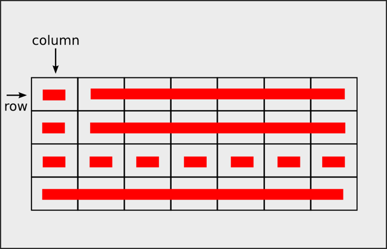
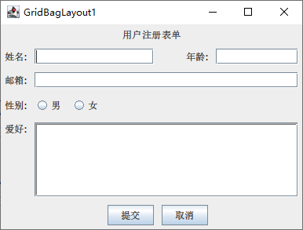

# 网格布局（GridBagLayout）

## GridBagLayout 基本概念

GridBagLayout 将容器划分为一个网格系统，但与 GridLayout 不同，它的网格单元大小可以不同，组件也可以跨越多个单元格。



## GridBagConstraints 主要属性

| 属性名 | 作用 | 默认值 |
|--------|------|--------|
| `gridx`, `gridy` | 组件在网格中的位置坐标 | `RELATIVE` |
| `gridwidth`, `gridheight` | 组件占据的网格数量 | 1 |
| `weightx`, `weighty` | 组件在水平/垂直方向上的拉伸权重 | 0.0 |
| `fill` | 组件如何填充其显示区域 | `NONE` |
| `anchor` | 组件在其显示区域中的对齐方式 | `CENTER` |
| `insets` | 组件周围的外部边距 | `new Insets(0,0,0,0)` |
| `ipadx`, `ipady` | 组件的内部填充 | 0 |

## 填充其显示区域方式(fill属性)

| 填充方式 | 说明 |
|----------|------|
| `GridBagConstraints.NONE` | 不调整组件大小，保持原始尺寸 |
| `GridBagConstraints.HORIZONTAL` | 组件水平拉伸以填充显示区域 |
| `GridBagConstraints.VERTICAL` | 组件垂直拉伸以填充显示区域 |
| `GridBagConstraints.BOTH` | 组件在水平和垂直方向都拉伸以填充显示区域 |

## 区域中的位置(anchor属性)

### 水平方向位置

| 位置 | 说明 |
|------|------|
| `GridBagConstraints.WEST` | 靠左对齐 |
| `GridBagConstraints.CENTER` | 水平居中 |
| `GridBagConstraints.EAST` | 靠右对齐 |

### 垂直方向位置

| 位置 | 说明 |
|------|------|
| `GridBagConstraints.NORTH` | 靠上对齐 |
| `GridBagConstraints.CENTER` | 垂直居中 |
| `GridBagConstraints.SOUTH` | 靠下对齐 |

### 组合位置（同时指定水平和垂直方向）

| 位置 | 说明 |
|------|------|
| `GridBagConstraints.NORTHWEST` | 左上角对齐 |
| `GridBagConstraints.NORTHEAST` | 右上角对齐 |
| `GridBagConstraints.SOUTHWEST` | 左下角对齐 |
| `GridBagConstraints.SOUTHEAST` | 右下角对齐 |
| `GridBagConstraints.CENTER` | 居中对齐 |

## 示例代码



``` java
import javax.swing.*;
import java.awt.*;

public class GridBagLayout1 extends JFrame {
    public GridBagLayout1() {

        JPanel mainPanel = new JPanel(new GridBagLayout());
        GridBagConstraints gbc = new GridBagConstraints();

        // 设置通用的边距
        gbc.insets = new Insets(5, 5, 5, 5);

        // 第一行：标题
        gbc.gridx = 0;
        gbc.gridy = 0;
        gbc.gridwidth = 6; // 跨越4列
        gbc.fill = GridBagConstraints.HORIZONTAL; // 填充水平方向
        gbc.anchor = GridBagConstraints.CENTER; // 居中对齐
        mainPanel.add(new JLabel("用户注册表单", JLabel.CENTER), gbc);

        // 重置gridwidth
        gbc.gridwidth = 1;

        // 第二行：姓名
        gbc.gridx = 0;
        gbc.gridy = 1;
        gbc.anchor = GridBagConstraints.EAST;
        mainPanel.add(new JLabel("姓名:"), gbc);

        gbc.gridx = 1;
        gbc.gridwidth = 2;
        gbc.fill = GridBagConstraints.HORIZONTAL;
        gbc.weightx = 1.0;
        mainPanel.add(new JTextField(8), gbc);

        // 重置gridwidth
        gbc.gridwidth = 1;

        gbc.gridx = 3;
        gbc.fill = GridBagConstraints.NONE;
        gbc.weightx = 0.0;
        gbc.anchor = GridBagConstraints.EAST;
        mainPanel.add(new JLabel("年龄:"), gbc);

        gbc.gridx = 4;
        gbc.gridwidth = 2;
        gbc.fill = GridBagConstraints.HORIZONTAL;
        gbc.weightx = 1.0;
        mainPanel.add(new JTextField(5), gbc);

        // 重置gridwidth
        gbc.gridwidth = 1;

        // 第三行：邮箱
        gbc.gridx = 0;
        gbc.gridy = 2;
        gbc.fill = GridBagConstraints.NONE;
        gbc.weightx = 0.0;
        gbc.anchor = GridBagConstraints.EAST;
        mainPanel.add(new JLabel("邮箱:"), gbc);

        gbc.gridx = 1;
        gbc.gridwidth = 5;
        gbc.fill = GridBagConstraints.HORIZONTAL;
        gbc.weightx = 1.0;
        mainPanel.add(new JTextField(20), gbc);

        // 重置gridwidth
        gbc.gridwidth = 1;

        // 第四行：性别
        gbc.gridx = 0;
        gbc.gridy = 3;
        gbc.fill = GridBagConstraints.NONE;
        gbc.weightx = 0;
        gbc.anchor = GridBagConstraints.WEST;
        mainPanel.add(new JLabel("性别:"), gbc);

        gbc.gridx = 1;
        gbc.fill = GridBagConstraints.NONE;
        gbc.anchor = GridBagConstraints.WEST;
        mainPanel.add(new JRadioButton("男"), gbc);

        gbc.gridx = 2;
        gbc.fill = GridBagConstraints.NONE;
        mainPanel.add(new JRadioButton("女"), gbc);


        // 第五行：爱好
        gbc.gridx = 0;
        gbc.gridy = 4;
        gbc.anchor = GridBagConstraints.NORTHWEST;  // 居右
        mainPanel.add(new JLabel("爱好:"), gbc);

        gbc.gridx = 1;
        gbc.gridwidth = 5;
        gbc.weightx = 1.0;
        gbc.weighty = 1.0;
        gbc.fill = GridBagConstraints.BOTH; // 水平垂直填充
        gbc.anchor = GridBagConstraints.NORTHWEST;
        JTextArea hobbyArea = new JTextArea(3,20);
        hobbyArea.setBorder(BorderFactory.createLoweredBevelBorder());
        mainPanel.add(new JScrollPane(hobbyArea), gbc);

        // 重置gridwidth
        gbc.gridwidth = 1;
        gbc.weightx = 0;
        gbc.weighty = 0;

        // 第六行：按钮
        gbc.gridx = 2;
        gbc.gridy = 5;
        gbc.fill = GridBagConstraints.NONE;
        gbc.anchor = GridBagConstraints.EAST;
        mainPanel.add(new JButton("提交"), gbc);

        gbc.gridx = 3;
        gbc.anchor = GridBagConstraints.WEST;
        mainPanel.add(new JButton("取消"), gbc);

        add(mainPanel);
    }

    public static void main(String[] args) {
        SwingConsole.run(new GridBagLayout1(), 400, 300);
        JFrame f = new GridBagLayout1();
        f.setTitle(f.getClass().getSimpleName());
        f.setDefaultCloseOperation(JFrame.EXIT_ON_CLOSE);
        f.setSize(400, 300);
        f.setLocationRelativeTo(null); // 位置为null时，在屏幕中间显示
        f.setVisible(true);
    }
}
```