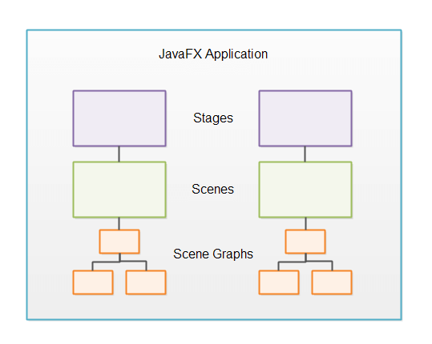
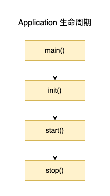

# 1. JavaFX Learn

- [1. JavaFX Learn](#1-javafx-learn)
  - [1.1. JavaFX Overview](#11-javafx-overview)
    - [1.1.1. Stage（舞台）](#111-stage舞台)
    - [1.1.2. Scene（场景）](#112-scene场景)
      - [1.1.2.1. Scene Graph](#1121-scene-graph)
      - [1.1.2.2. Nodes](#1122-nodes)
    - [1.1.3. Controls（控件）](#113-controls控件)
    - [1.1.4. Layouts（布局）](#114-layouts布局)
      - [1.1.4.1. 嵌套布局](#1141-嵌套布局)
    - [1.1.5. Charts（图表）](#115-charts图表)
    - [1.1.6. 2D Graphics](#116-2d-graphics)
    - [1.1.7. 3D Graphics](#117-3d-graphics)
    - [1.1.8. Audio](#118-audio)
    - [1.1.9. Video](#119-video)
    - [1.1.10. WebView](#1110-webview)
  - [application 的声明周期](#application-的声明周期)

## 1.1. JavaFX Overview

通常，JavaFX应用程序包含一个或多个与窗口相对应的 `Stage (舞台)` 。每个 `Stage` 都有一个 `Scene (场景)`。每个 `Scene` 都可以有一个控件、布局等的对象图，称为场景图。这些概念将在后面进行更详细的解释。以下是JavaFX应用程序的一般结构示意图：
    

### 1.1.1. Stage（舞台）

`Stage` 是`JavaFX`应用程序的外部框架。`Stage` 通常对应于一个窗口。在`JavaFX`可以在浏览器中运行的早期，`Stage` 也可以指`JavaFX`可以自己绘制的网页内的区域。
- 每个阶段都由`JavaFX`应用程序中的一个`Stage`对象表示。`JavaFX`应用程序有一个由`JavaFX`运行时为您创建的主`Stage`对象。如果需要打开额外的窗口，`JavaFX`应用程序可以创建额外的`Stage`对象。例如，对于对话框、向导等。

### 1.1.2. Scene（场景）

要在JavaFX应用程序的舞台上显示任何内容，您需要一个场景。一个阶段一次只能显示一个场景，但可以在运行时交换场景。就像剧院中的舞台可以在演出期间重新排列以显示多个场景一样，JavaFX中的舞台对象可以在JavaFX应用程序的使用寿命期间显示多个场面（一次一个）。

`Scene`由JavaFX应用程序中的`Scene`对象表示。`JavaFX`应用程序必须创建所需的所有`Scene`对象。

#### 1.1.2.1. Scene Graph

所有视觉组件（控件、布局等）都必须附加到要显示的场景，并且该场景必须附加到舞台才能使整个场景可见。附加到场景的所有控件、布局等的总对象图称为场景图。

#### 1.1.2.2. Nodes

附加到场景图的所有组件都称为节点。所有节点都是名为JavaFX.scene.Node的JavaFX类的子类。

有两种类型的节点：分支节点和叶节点。分支节点是指可以包含其他节点（子节点）的节点。分支节点也被称为父节点，因为它们可以包含子节点。叶节点是指不能包含其他节点的节点。

### 1.1.3. Controls（控件）

JavaFX控件是在JavaFX应用程序中提供某种控制功能的JavaFX组件。例如，按钮、单选按钮、表格、树等。

要使控件可见，必须将其附加到某个场景对象的场景图。

控件通常嵌套在一些JavaFX布局组件中，该组件管理控件相对于彼此的布局。

JavaFX包含以下控件：

- Accordion
- Button
- CheckBox
- ChoiceBox
- ColorPicker
- ComboBox
- DatePicker
- Label
- ListView
- Menu
- MenuBar
- PasswordField
- ProgressBar
- RadioButton
- Slider
- Spinner
- SplitMenuButton
- SplitPane
- TableView
- TabPane
- TextArea
- TextField
- TitledPane
- ToggleButton
- ToolBar
- TreeTableView
- TreeView

### 1.1.4. Layouts（布局）

JavaFX布局是包含其他组件的组件。布局组件管理嵌套在其中的组件的布局。JavaFX布局组件有时也称为父组件，因为它们包含子组件，并且布局组件是JavaFX类JavaFX.scene.parent的子类。

布局组件必须附加到某个场景对象的场景图才能可见。

JavaFX包含以下布局组件：

- Group
- Region
- Pane
- HBox
- VBox
- FlowPane
- BorderPane
- BorderPane
- StackPane
- TilePane
- GridPane
- AnchorPane
- TextFlow

#### 1.1.4.1. 嵌套布局

可以将布局组件嵌套在其他布局组件中。这对于实现特定布局非常有用。例如，要获得未在网格中布局但每行不同的组件的水平行，可以在VBox组件内嵌套多个HBox布局组件。

### 1.1.5. Charts（图表）

JavaFX内置了一组现成的图表组件，因此您不必每次需要基本图表时都从头开始编写图表。JavaFX包含以下图表组件：

- AreaChart
- BarChart
- BubbleChart
- LineChart
- PieChart
- ScatterChart
- StackedAreaChart
- StackedBarChart

### 1.1.6. 2D Graphics

JavaFX包含一些功能，可以轻松地在屏幕上绘制2D图形。

### 1.1.7. 3D Graphics

JavaFX包含一些功能，可以轻松地在屏幕上绘制3D图形。

### 1.1.8. Audio

JavaFX包含一些功能，可以轻松地在JavaFX应用程序中播放音频。这在游戏或教育应用程序中通常很有用。

### 1.1.9. Video

JavaFX包含一些功能，可以轻松地在JavaFX应用程序中播放视频。这通常在流媒体应用程序、游戏或教育应用程序中很有用。

### 1.1.10. WebView

JavaFX包含一个能够显示网页（HTML5、CSS等）的WebView组件。JavaFX WebView组件基于WebKit，WebKit是Chrome和Safari中也使用的网页渲染引擎。

WebView组件可以将桌面应用程序与web应用程序混合使用。有时候这是有用的。例如，如果你已经有了一个不错的网络应用程序，但需要一些只有桌面应用程序才能合理提供的功能，比如磁盘访问、与HTTP以外的其他网络协议（如UDP、IAP等）的通信。

## application 的声明周期

通过下面的代码，观察 application 的 `声明周期` ：

  ``` java
  import javafx.application.Application;
  import javafx.stage.Stage;

  // application的生命周期

  public class Learn00202 extends Application {

      public static void main(String[] args) {
          System.out.println("main() -> " + Thread.currentThread().getName());
          launch();
      }

      @Override
      public void init() throws Exception {
          System.out.println("init() -> " + Thread.currentThread().getName());
          super.init();
      }

      @Override
      public void stop() throws Exception {
          System.out.println("stop() -> " + Thread.currentThread().getName());
          super.stop();
      }

      @Override
      public void start(Stage stage) throws Exception {
          System.out.println("start() -> " + Thread.currentThread().getName());
          stage.setTitle("My first JavaFX02");
          stage.show();
      }

  }
  /* OUTPUT:
  main() -> main
  init() -> JavaFX-Launcher
  start() -> JavaFX Application Thread
  stop() -> JavaFX Application Thread
  */
  ```

生命周期图，如下：

