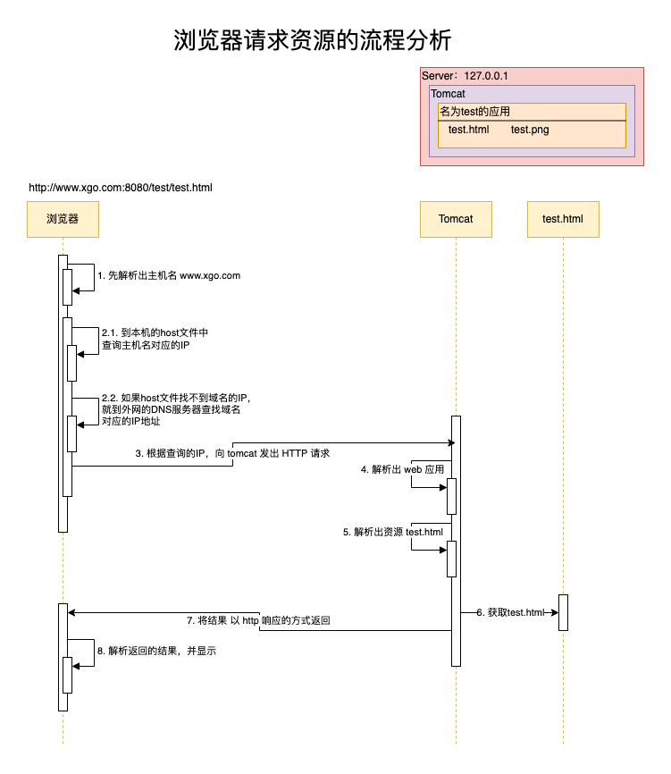

# 1 web与tomcat

- [1 web与tomcat](#1-web与tomcat)
  - [1.1. WEB 开发介绍](#11-web-开发介绍)
  - [1.2. Tomcat](#12-tomcat)
  - [1.3. IDEA 开发 Java Web 时 Tomcat 相关配置](#13-idea-开发-java-web-时-tomcat-相关配置)
  - [1.4. 浏览器请求资源的流程分析](#14-浏览器请求资源的流程分析)

## 1.1. WEB 开发介绍

- WEB，表示网络资源（html，image，css，js），它用于表示 WEB 服务器供浏览器访问的资源

- WEB 服务器上供外界访问的 WEB 资源分为：
  - 静态 WEB 资源：指 web 页面中供人们浏览的数据始终是不变。
  - 动态 WEB 资源，比如：Servlet、PHP 等。

- 静态 web 资源开发技术
  - html、css

- 常有动态 web 资源开发技术：
  - Servlet、SpringBoot、SpringMVC、PHP、ASP 等

## 1.2. Tomcat

- Tomcat 目录说明
  - bin ：存放启动和关闭 Tomcat 的脚本文件
  - conf ：存放 Tomcat 服务器的各种配置文件
  - lib ：存放Tomcat 服务器的支撑jar包
  - logs ：存放Tomcat 的日志文件
  - temp ：存放Tomcat 运行时产生的临时文件
  - webapps ：web应用所在目录，即供外界访问的web资源的存放目录
  - work ：Tomcat 的工作目录

- 特别说明：
  - conf/server.xml：用于配置tomcat的基本设置（启动端口、关闭端口、主机名）
  - conf/web.xml：用于指定tomcat运行时配置（比如：servlet等。。。）

## 1.3. IDEA 开发 Java Web 时 Tomcat 相关配置

- on update action ：表示当我们更新操作是，Tomcat 会自动更新类和资源（当jsp/html文件修改时，可以生效，但是如果你修改的java文件，需要 Redeploy 才会生效）;

- on frame deactivation ：表示IDEA失去焦点(比如最小化)，也会导致 jsp/html 发生更新，但是java修改了，还是需要 Redeploy ;

## 1.4. 浏览器请求资源的流程分析

