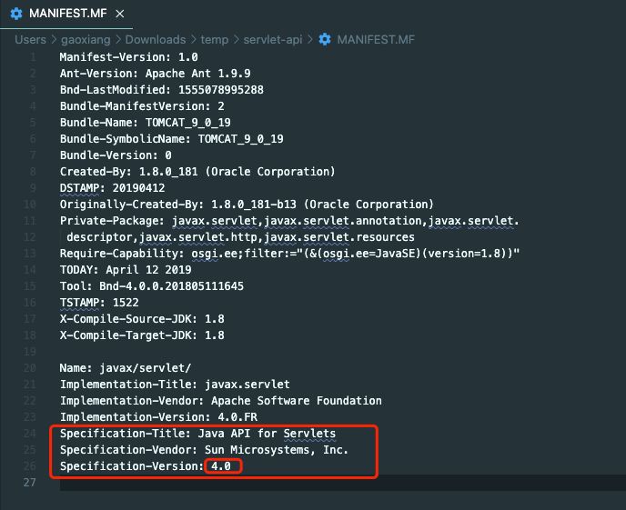
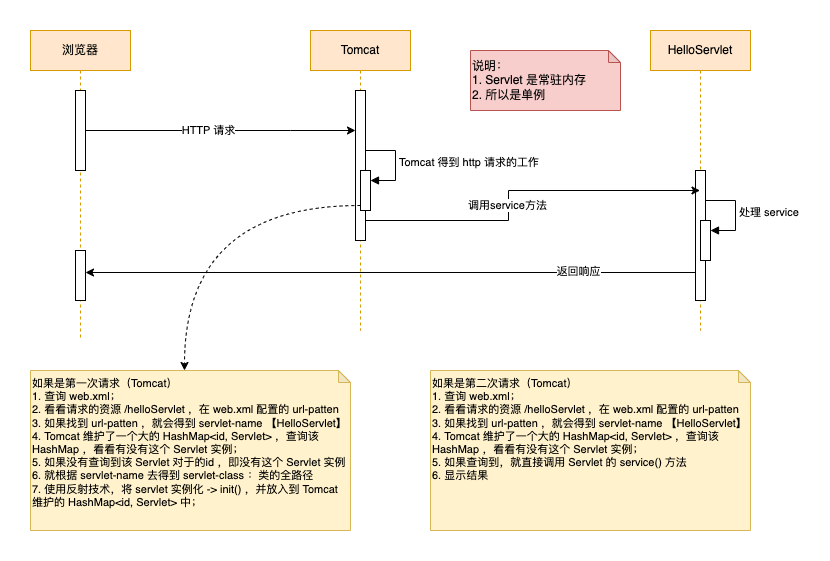

# 2. Servlet

- [2. Servlet](#2-servlet)
  - [2.1. 什么是 Servlet](#21-什么是-servlet)
  - [2.2. Servlet 开发方式说明](#22-servlet-开发方式说明)
  - [2.3. 手动编写一个 Servlet](#23-手动编写一个-servlet)
  - [2.4. 浏览器访问 Servlet 的流程分析](#24-浏览器访问-servlet-的流程分析)

## 2.1. 什么是 Servlet

- `Servlet` 在<u>*开发动态WEB工程中*</u>，得到广泛的应用；

- `Servlet` （Java 服务器小程序），它的特点：
  - 它是由服务器端调用和执行的（一句话，是 Tomcat 解析和执行的）；
  - 它是用Java语言编写的，本质就是Java类；
  - 它是按照`Servlet`规范开发的；
  - 功能强大，可以完成几乎所有的网站功能；

## 2.2. Servlet 开发方式说明

- `servlet 3.0之前` 使用 `web.xml`，`servlet 3.0 之后` 支持 `注解`；

- 如果查看 servlet 版本：
  - 在 `tomcat` 的 `lib` 目录中找到 `servlet-api.jar` ，解压 `jar` 文件，查看里面的 `MANIFEST.MF` 文件； 例如 `tomcat 9` 截图：

    

## 2.3. 手动编写一个 Servlet

- `HelloServlet.java`

    ``` java
    import javax.servlet.*;
    import java.io.IOException;
    import java.io.PrintWriter;

    public class HelloServlet implements Servlet {
        /**
         * 1. 初始化 servlet
         * 2. 当创建 HelloServlet 实例时，会调用 init 方法
         * 3. 该方法只会被调用一次
         * @param servletConfig
         * @throws ServletException
         */
        @Override
        public void init(ServletConfig servletConfig) throws ServletException {
            System.out.println("HelloServlet.init()");
        }

        /**
         * 返回 servlet 的配置
         * @return 返回 ServletConfig 对象
         */
        @Override
        public ServletConfig getServletConfig() {
            return null;
        }

        /**
         * 1. service 方法处理 浏览器的请求（包括get/post）
         * 2. 当浏览器每次请求 servlet 时，就会调用一次 service
         * 3. 当 tomcat 调用该方法时，会把 http 请求的数据封装成实现了 ServletRequest 接口的 request 对象
         * 4. 通过 ServletRequest 对象，可以得到用户提交的数据
         * 5. ServletResponse 对象可以用于返回数据给 tomcat，tomcat 再返回浏览器
         * @param servletRequest
         * @param servletResponse
         * @throws ServletException
         * @throws IOException
         */
        @Override
        public void service(ServletRequest servletRequest, ServletResponse servletResponse) throws ServletException, IOException {
            System.out.println("HelloServlet.service()");
            PrintWriter writer = servletResponse.getWriter();
            writer.print("<h3>Hello Servlet !!!!<h3>");
        }

        /**
         * 返回 servlet 信息
         * @return
         */
        @Override
        public String getServletInfo() {
            return null;
        }

        /**
         * 1. 该方法是在 servlet 销毁时，被调用
         * 2. 只会被调用一次
         */
        @Override
        public void destroy() {
            System.out.println("HelloServlet.destroy()");
        }
    }
    ```

- `web.xml`

    ``` xml
    <!DOCTYPE web-app PUBLIC
    "-//Sun Microsystems, Inc.//DTD Web Application 2.3//EN"
    "http://java.sun.com/dtd/web-app_2_3.dtd" >

    <web-app>
    <display-name>Archetype Created Web Application</display-name>
    <!--web.xml 主要用来配置该 web 应用使用到的 servlet
        1. servlet-name：给 servlet 取名，该名字唯一
        2. servlet-class：servlet 的类的全路径：Tomcat 在反射生成该 servlet 需要使用
        3. url-pattern: 这个就是该 servlet 访问的 URL 的配置（路径）
    -->

    <!-- 配置HelloServlet -->
    <servlet>
        <servlet-name>HelloServlet</servlet-name>
        <servlet-class>org.xgo.learn.servlet.controller.HelloServlet</servlet-class>
    </servlet>
    <servlet-mapping>
        <servlet-name>HelloServlet</servlet-name>
        <url-pattern>/helloServlet</url-pattern>
    </servlet-mapping>
    </web-app>
    ```

## 2.4. 浏览器访问 Servlet 的流程分析

