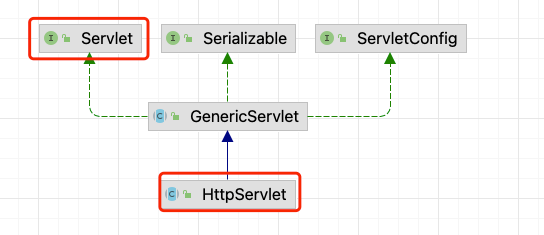

# 3. HttpServlet

- [3. HttpServlet](#3-httpservlet)
  - [3.1. HttpServlet 介绍](#31-httpservlet-介绍)
  - [3.2. Servlet 注意事项和细节](#32-servlet-注意事项和细节)
  - [3.3. Servlet 注解方式](#33-servlet-注解方式)
    - [3.3.1. 注解的工作原理简单模拟：](#331-注解的工作原理简单模拟)

## 3.1. HttpServlet 介绍

- 在实际项目中，都是使用继承 HttpServlet 类开发 Servlet 程序，更加方便；



## 3.2. Servlet 注意事项和细节

- Servlet 是一个供其他 Java 程序（Servlet 引擎）调用的 Java 类，不能独立运行；
- 针对浏览器的多次 Servlet 请求，通常情况下，服务器只会创建一个 Servlet 实例对象，也就是说 Servlet 实例对象一旦创建，它就会驻留在内存中，为后续的其他请求服务，直至 web 容器退出 / 或者 redeploy 该 web 应用，servlet 实例对象才会销毁；
- 在 Servlet 的整个生命周期内，init 方法只被调用一次。而对每次请求都导致 Servlet 引擎调用一次 servlet 的 service 方法。
- 对于每次访问请求，Servlet 引擎都会创建一个新的 `HttpServletRequest` 请求对象和一个新的 `HttpServletResponse` 响应对象，然后将这两人对象作为参数传递给它调用的Servlet的`service()`方法service方法再根据请求方式分别调用doxXX方法；
- 5.如果在`<servlet>`元素中配置了一个`<load-on-startup>`元素，那么WEB应用程序在启动时，就会装载并创建Servlet的实例对象、以及调用Servlet实例对象的`init()`方法；

## 3.3. Servlet 注解方式

- 使用 `@WebServlet` 注解配置 Servlet
  - urlPattern 对应 web.xml 的 `<url-pattern>`
  - {"/ok1","/ok2"} 可以给 OkServlet 配置多个 `url-pattern`
  - initParams 对应 web.xml 中的 `<init-param>`
- 注解的简单使用：

    ``` java
    @WebServlet(urlPatterns = {"/ok1", "/ok2"},
        initParams = {@WebInitParam(name = "xx", value = "yy")})
    public class OkServlet extends HttpServlet {
        @Override
        public void init() throws ServletException {
            System.out.println("OkServlet.init");
        }

        @Override
        protected void doGet(HttpServletRequest req, HttpServletResponse resp) throws ServletException, IOException {
            System.out.println("OkServlet.doGet");
            resp.getWriter().print("annotation OkServlet");
        }
    }
    ```

### 3.3.1. 注解的工作原理简单模拟：

``` java
public class TestAnnotationServlet {

    private static final Map<String, HttpServlet> hm = new HashMap();

    public static void main(String[] args) throws Exception {

        // 1. 首先要得到扫描的包 路径
        String classAllPath = "org.xgo.learn.servlet.controller.annotation.OkServlet";
        // 2. 得到 OkServlet 的 Class 对象
        Class<?> aClass = Class.forName(classAllPath);
        // 3. 通过 class 对象， 得到 Annotation
        WebServlet annotation = aClass.getAnnotation(WebServlet.class);
        System.out.println(annotation);
        String[] strings = annotation.urlPatterns();
        for (String url : strings) {
            System.out.println("url=" + url);
        }

        // 4. 如果匹配URL，如果时第一次，Tomcat 就会创建一个 OkServlet 实例，放入到 hashMap
        // 通过反射的方式，创建 OkServlet
        Constructor<?> constructor = aClass.getDeclaredConstructor();
        OkServlet okServlet = (OkServlet) constructor.newInstance();
        System.out.println("instance= " + okServlet);

        // 简单模拟放入 hashMap
        hm.put(aClass.getName(), okServlet);
    }
}
```
