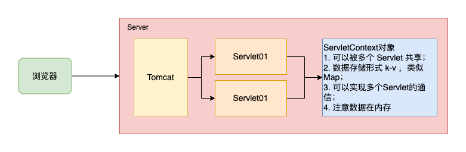

# 6. ServletContext

- [6. ServletContext](#6-servletcontext)
  - [6.1. ServletContext 基本介绍](#61-servletcontext-基本介绍)
  - [6.2. ServletContext 可以做什么](#62-servletcontext-可以做什么)
  - [6.3. ServletContext 案例](#63-servletcontext-案例)
    - [6.3.1. 案例1：获取工程相关信息](#631-案例1获取工程相关信息)
    - [6.3.2. 案例2：简单的网站访问次数计数器](#632-案例2简单的网站访问次数计数器)

## 6.1. ServletContext 基本介绍

- ServletContext 是一个接口，它表示 Servlet 上下文对象；
- 一个 web 工程，只有一个 ServletContext 对象实例；
- ServletContext 对象是在 web 工程启动的时候被创建，在 web 工程停止时销毁；
- ServletContext 对象可以通过 `ServletConfig.getServletContext()` 方法获得 `ServletContext` 对象引用，也可以通过 `this.getServletContext()` 来获得其对象的引用；
- 由于一个 web 应用中的所有 Servlet 共享一个 ServletContext 对象，因此 Servlet 对象之间可以通过 `ServletContext` 对象来实现多个 `Servlet` 间通讯。 `ServletContext` 对象通常也被称之为 `域对象` ;



## 6.2. ServletContext 可以做什么

- 获取 `web.xml` 中配置的上下文参数 `context-param` ；
- 获取当前的工程路径，格式：`/工程路径`；
- 获取工程部署后在服务器硬盘上的绝对路径；
- 想 `Map` 一样存取数据，多个 Servlet 共享数据；

## 6.3. ServletContext 案例

### 6.3.1. 案例1：获取工程相关信息

- web.xml

    ``` xml
    <web-app>
    <context-param>
        <param-name>website</param-name>
        <param-value>https://www.xgo.pub</param-value>
    </context-param>
    <context-param>
        <param-name>company</param-name>
        <param-value>xgo</param-value>
    </context-param>
    </web-app>
    ```

- ContextServlet.java

    ``` java
    @WebServlet(urlPatterns = {"/context01"})
    public class ContextServlet extends HttpServlet {
        @Override
        protected void doGet(HttpServletRequest req, HttpServletResponse resp) throws ServletException, IOException {
            // 1. 获取 ServletContext 对象
            ServletContext servletContext = getServletContext();
            // 2. 获取 context-param 数据
            String website = servletContext.getInitParameter("website");
            String company = servletContext.getInitParameter("company");
            System.out.printf("website=%s, company=%s \n", website, company);
            // 3. 获取项目的工程路径
            String contextPath = servletContext.getContextPath();
            System.out.printf("contextPath=%s \n", contextPath);
            // 4. 获取项目发布，正在的工作路径
            URL resource = servletContext.getResource("/");
            // 真实工作 根路径
            String realPath = servletContext.getRealPath("/");
            System.out.printf("resource=%s \n", resource);
            System.out.printf("realPath=%s \n", realPath);
        }
    }
    ```

### 6.3.2. 案例2：简单的网站访问次数计数器

- CounterUtils.java

    ``` java
    /**
     * 网站计数器 Utils
     */
    public class CounterUtils {

        /**
         * Servlet 访问一次，计数加一次
         *
         * @param servletContext
         * @return
         */
        public static Integer add(ServletContext servletContext) {
            Integer counter = (Integer) servletContext.getAttribute("counter");
            if (null == counter) {
                counter = 1;
            } else {
                counter++;
            }
            servletContext.setAttribute("counter", counter);
            return counter;
        }

    }
    ```

- CounterServlet01.java

    ``` java
    @WebServlet(urlPatterns = {"/counter01"}, name = "CounterServlet_01")
    public class CounterServlet01 extends HttpServlet {
        @Override
        protected void doGet(HttpServletRequest req, HttpServletResponse resp) throws ServletException, IOException {
            ServletConfig servletConfig = getServletConfig();
            String servletName = servletConfig.getServletName();

            ServletContext servletContext = getServletContext();
            // 计数器值+1
            Integer counter = CounterUtils.add(servletContext);

            String output = String.format("正在访问%s，当前网站访问人数是：%d", servletName, counter);
            System.out.printf("%s \n", output);

            resp.setContentType("text/html");
            resp.setCharacterEncoding("UTF-8");
            try (PrintWriter writer = resp.getWriter()) {
                output = "<h1>" + output + "</h1>";
                writer.print(output);
            }
        }
    }
    ```
