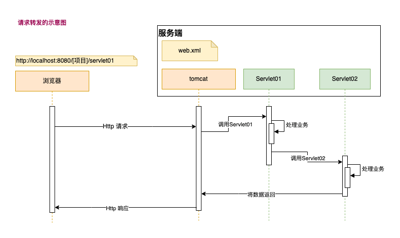

# 7. HttpServletRequest

- [7. HttpServletRequest](#7-httpservletrequest)
  - [7.1. HttpServletRequest 介绍](#71-httpservletrequest-介绍)
  - [7.2. HttpServletRequest 常用方法](#72-httpservletrequest-常用方法)
  - [7.3. HttpServletRequest 案例](#73-httpservletrequest-案例)
  - [7.4. HttpServletRequest 注意事项和细节](#74-httpservletrequest-注意事项和细节)
  - [7.5. 请求转发](#75-请求转发)
    - [7.5.1. 为什么需要请求转发](#751-为什么需要请求转发)
    - [7.5.2. 请求转发说明](#752-请求转发说明)
    - [7.5.3. 请求转发案例](#753-请求转发案例)
    - [7.5.4. 请求转发注意事项和细节](#754-请求转发注意事项和细节)

## 7.1. HttpServletRequest 介绍

- HttpServletRequest 对象代表客户端的请求；
- 当客户端通过 HTTP 协议访问服务器时，HTTP 请求头中的所有信息都封装在这个对象中；
- 通过这个对象的方法，可以获取客户传入的信息；

## 7.2. HttpServletRequest 常用方法

| 方法名 | 描述 |
| --- | --- |
| getRequestURI() | 获取请求的资源路径：/[工程名]/[servlet] |
| getRequestURL() | 获取请求的统一资源定位符：http://localhost:8080/[工程名]/[servlet] |
| getRemoteAddr() | 获取客户端的IP地址 |
| getHeader() | 获取请求头 |
| getParameter() | 获取请求的参数 |
| getParameterValues() | 获取请求的参数（多个值的时候使用）,返回数组 |
| getMethod() | 获取请求的方式：GET、POST、PUT、DELETE |
| setAttribute(key,value) | 设置域数据 |
| setAttribute(key) | 获取域数据 |
| getRequestDispatcher() | 获取请求转发对象 |

## 7.3. HttpServletRequest 案例

``` java
@WebServlet(urlPatterns = {"/req/register"})
public class RequestServlet extends HttpServlet {
    @Override
    protected void doPost(HttpServletRequest req, HttpServletResponse resp) throws ServletException, IOException {
        System.out.println("RequestServlet.doPost() start");

        // 获取请求的资源路径
        String requestURI = req.getRequestURI();
        System.out.printf("requestURI: %s \n", requestURI);

        StringBuffer requestURL = req.getRequestURL();
        System.out.printf("requestURL: %s \n", requestURL);

        // 获取客户IP
        String remoteAddr = req.getRemoteAddr();
        System.out.printf("remoteAddr: %s \n", remoteAddr);

        // 获取头信息
        String host = req.getHeader("Host");
        System.out.printf("host: %s \n", host);

        String referer = req.getHeader("Referer");
        System.out.printf("referer: %s \n", referer);

        String userAgent = req.getHeader("User-Agent");
        System.out.printf("userAgent: %s \n", userAgent);

        // 获取参数
        // 注意：获取参数中乱码解决方案
         req.setCharacterEncoding("UTF-8");

        String name = req.getParameter("name");
        String pwd = req.getParameter("pwd");
        String[] fruits = req.getParameterValues("fruit");
        System.out.printf("name=%s, pwd=%s, fruits=%s \n", name, pwd, Arrays.toString(fruits));

        // 获取 requestBody 中的 raw(原始数据)
        // 注意，getParameter() 和 getInputStream() 两者只能选其一
//        ServletInputStream inputStream = req.getInputStream();
//        BufferedReader reader = new BufferedReader(new InputStreamReader(inputStream));
//        String line;
//        while ((line = reader.readLine()) != null) {
//            System.out.println(URLDecoder.decode(line, "utf-8"));
//        }
//        reader.close();

    }
}
```

## 7.4. HttpServletRequest 注意事项和细节

- 获取 `doPost` 参数中文乱码解决方案，注意 `setCharacterEncoding("utf-8")` 要写在 `req.getParameter()` 前面；

    ``` java
    req.setCharacterEncoding("UTF-8");

    String name = req.getParameter("name");
    String pwd = req.getParameter("pwd");
    ```

- 处理 http 响应数据中文乱码

    ``` java
    resp.setContentType("text/html;charset=utf-8");
    try (PrintWriter writer = resp.getWriter()) {
        writer.print("<h1>SUCCESS 成功 !!! ~~~</h1>");
    }
    ```

## 7.5. 请求转发



### 7.5.1. 为什么需要请求转发

- 实际开发中，往往业务比较复杂，需要子啊一次请求中，使用到多个 Servlet 完成一个任务（Servlet链，流水作业）；

### 7.5.2. 请求转发说明

- 实现请求转发：请求转发指一个 web 资源收到客户端请求后，通知服务器去调用另外一个 web 资源进行处理；
- `HttpServletRequest` 对象提供了一个 `getRequestDispatcher()` 方法，该法返回一个 `RequestDispatcher` 对象，调用这个对象的 `forward` 方法可以实现请求转发；
- request 对象同时也是一个域对象，开发人员通过 request 对象在实现转发时，把数据通过 request 对象带给其他 web 资源处理；
  - `setAttribute()`
  - `getAttribute()`
  - `removeAttribute()`
  - `getAttributeNames()`

### 7.5.3. 请求转发案例

- RequestDispatcherServlet1.java

    ``` java
    @WebServlet(urlPatterns = {"/req/d1"})
    public class RequestDispatcherServlet1 extends HttpServlet {
        @Override
        protected void doGet(HttpServletRequest req, HttpServletResponse resp) throws ServletException, IOException {

            req.setAttribute("name","gao");

            RequestDispatcher requestDispatcher = req.getRequestDispatcher("/req/d2");
            requestDispatcher.forward(req,resp);
        }
    }
    ```

- RequestDispatcherServlet2.java

    ``` java
    @WebServlet(urlPatterns = {"/req/d2"})
    public class RequestDispatcherServlet2 extends HttpServlet {
        @Override
        protected void doGet(HttpServletRequest req, HttpServletResponse resp) throws ServletException, IOException {

            String name = (String) req.getAttribute("name");
            System.out.printf("getAttribute(), name: %s", name);

            resp.setContentType("text/html;charset=utf-8");
            try (PrintWriter writer = resp.getWriter()) {
                writer.print("<h1>DISPATCHER SUCCESS 成功 !!! ~~~</h1>");
            }
        }
    }
    ```

### 7.5.4. 请求转发注意事项和细节

- 浏览器地址不会变化（地址会保留在第1个servlet的url）；
- 在同一次 HTTP 请求中，进行多次转发，仍然是一次 HTTP 请求；
- 在同一次 HTTP 请求中，进行多次转发，多个 Servlet 可以共享 request域/对象的数据；
- 可以转发到 WEB-INF 目录下
- 不能访问当前 WEB 工程外到资源
- 注意：因为浏览器地址栏会停止在第一个 servlet ，如果你刷新页面，会再次发出请求（并且会带数据），所以在支付页面情况下，不要使用请求转发，否则会造成重复支付；