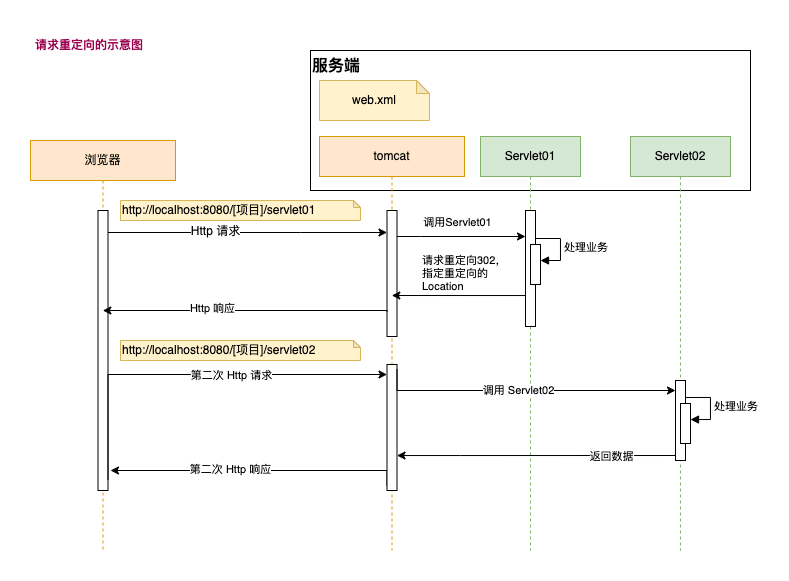

# 8. HttpServletResponse

- [8. HttpServletResponse](#8-httpservletresponse)
  - [8.1. HttpServletResponse 介绍](#81-httpservletresponse-介绍)
  - [8.2. HttpServletResponse 注意事项和细节](#82-httpservletresponse-注意事项和细节)
  - [8.3. 请求重定向](#83-请求重定向)
    - [8.3.1. 请求重定向 案例](#831-请求重定向-案例)
    - [8.3.2. 请求重定向注意事项和细节](#832-请求重定向注意事项和细节)

## 8.1. HttpServletResponse 介绍

- 每次HTTP请求，Tomcat 会创建一个 `HttpServletResponse` 对象传递给 Servlet 程序去使用。
- HttpServletResponse 表示所有响应信息，如果需要设置返回给客户端的信息，通过 `HttpServletResponse` 对象来进行设置即可。

- 常用方法：

    | 方法名 | 描述 |
    | --- | --- |
    | setStatus(int sc) | 设置响应状态码 |
    | setHeader(name, value) | 设置响应头 |
    | getWriter() | 返回字符文本给客户端 |
    | getOutputStream | 返回二进制数据（文件）给客户端 |

  - >注意：两个流同时只能使用一个。使用了字节流，就不能再使用字符流，反之亦然，否则会报错。

## 8.2. HttpServletResponse 注意事项和细节

- 字符乱码问题
  - 方案1:

    ``` java
    // 设置服务器字符集为 utf-8
    resp.setCharacterEncoding("UTF-8");
    // 通过响应头，设置浏览器也使用 UTF-8 字符集
    resp.setHeard("Content-Type", "text/html;charset=UTF-8");
    ```

  - 方案2:

    ``` java
    /*
    1. setContentType 会设置服务器和客户端都用 utf-8 字符集，还设置了响应头
    2. setContentType 要在获取流对象（getWriter）之前调用才有效；
    */
    resp.setContentType("text/html;charset=UTF-8");
    PrintWriter writer = resp.getWriter();
    ```

## 8.3. 请求重定向

- 请求重定向指：一个 web 资源收到客户端请求后，通知客户端去访问另一个 web 资源，这称之为请求重定向



### 8.3.1. 请求重定向 案例

- 请求重定向的使用：当访问 DownServlet 下载文件，重定向到 DownServletNew 下载文件

- `down.html` 提供 `下载文件` 链接：

    ``` html
    <body>
    <a href="/learn_01/resp/downServlet">下载文件</a>
    </body>
    ```

- `DownServlet` 重定向到 `DownServletNew`

    ``` java
    @WebServlet("/resp/downServlet")
    public class DownServlet extends HttpServlet {
        @Override
        protected void doGet(HttpServletRequest req, HttpServletResponse resp) throws ServletException, IOException {
            ServletContext servletContext = getServletContext();
            // 获取上下文路径，即：http://localhost:8080/【项目名】/[servlet] 中的项目名
            String contextPath = servletContext.getContextPath();

            // 方法1：使用 resp.sendRedirect() 方法
            resp.sendRedirect(contextPath + "/resp/downServletNew");
            // 方法2：设置 302 响应码，并指定 location
            // resp.setStatus(302);
            // resp.setHeader("Location",contextPath + "/resp/downServletNew");
        }
    }
    ```

- `DownServletNew` 负责获取文件资源，并且下载

    ``` java
    @WebServlet("/resp/downServletNew")
    public class DownServletNew extends HttpServlet {
        @Override
        protected void doGet(HttpServletRequest req, HttpServletResponse resp) throws ServletException, IOException {
            System.out.println("DownServletNew.doGet...");
            ServletContext servletContext = getServletContext();

            resp.setContentType("text/plain");
            // Content-Disposition 是HTTP协议中的一个头部字段，用于指示文件的名称和下载方式
            resp.setHeader("Content-Disposition","attachment; filename=\"example.txt\"");
            int bytesRead;
            byte[] buffer = new byte[1024];

            // 获取文件，并且下载
            String realPath = servletContext.getRealPath("/resp/file.txt");
            try (FileInputStream fileInputStream = new FileInputStream(realPath);
                    ServletOutputStream outputStream = resp.getOutputStream();) {
                while ((bytesRead = fileInputStream.read(buffer)) != -1) {
                    outputStream.write(buffer, 0, bytesRead);
                }
            }
        }
    }
    ```

### 8.3.2. 请求重定向注意事项和细节

- 使用 `resp.sendRedirect()` 进行重定向；例如：`resp.sendRedirect(contextPath + "/resp/downServletNew");`
- 最佳应用场景：网站迁移； 旧域名迁移到新域名；
- 浏览器地址发生变化，本质是两次 http 请求；
- 不能共享 Request 域中国呢到数据，本质是两次 http 请求，会生成两个 HttpServletRequest 对象；
- 不能重定向到 `/WEB-INF` 下的资源；
- 可以重定向到 WEB 工程以外的资源，比如 到 `www.baidu.com`;
- 重定向有两种方式：参考 `DownServlet`；
- 获取 `Application Context` 的方法 ： `servletContext.getContextPath()`；
