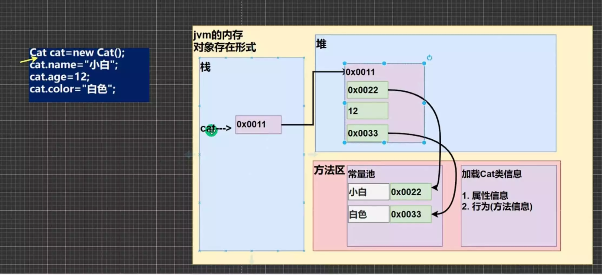
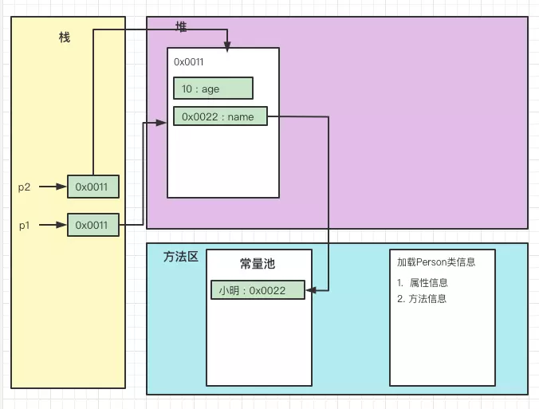
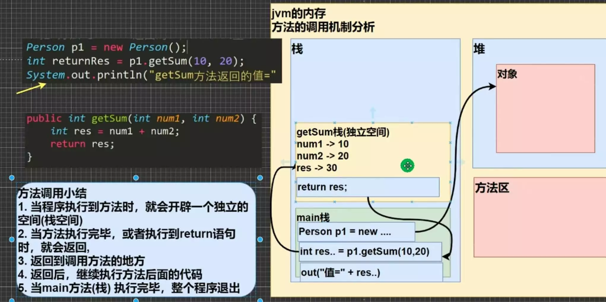
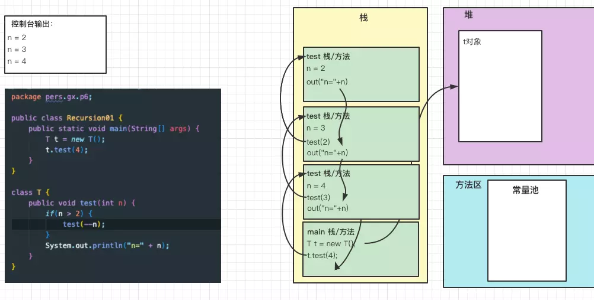

# 1_面向对象编程（基础）

- [1_面向对象编程（基础）](#1_面向对象编程基础)
  - [类与对象](#类与对象)
    - [类与对象的区别](#类与对象的区别)
    - [对象在内存中存在形式](#对象在内存中存在形式)
    - [属性/成员变量](#属性成员变量)
    - [如何创建对象](#如何创建对象)
    - [如何访问属性](#如何访问属性)
    - [类和对象的内存分配机制*](#类和对象的内存分配机制)
  - [成员方法](#成员方法)
    - [方法调用机制](#方法调用机制)
    - [方法的妙用](#方法的妙用)
    - [方法的定义](#方法的定义)
    - [方法传参机制](#方法传参机制)
  - [对象克隆](#对象克隆)
  - [方法的递归](#方法的递归)
    - [简单的递归方法](#简单的递归方法)
    - [递归重要规则](#递归重要规则)
    - [经典案例：阶乘](#经典案例阶乘)
    - [经典案例：斐波那契数列](#经典案例斐波那契数列)
    - [经典案例：猴子吃桃子问题](#经典案例猴子吃桃子问题)
    - [经典案例：老鼠出迷宫](#经典案例老鼠出迷宫)
    - [经典案例：汉诺塔](#经典案例汉诺塔)
    - [经典案例：八皇后](#经典案例八皇后)
  - [方法重载](#方法重载)
  - [可变参数](#可变参数)
  - [作用域 scope](#作用域-scope)
  - [构造方法/构造器](#构造方法构造器)
  - [对象创建流程](#对象创建流程)
  - [关键字 this](#关键字-this)
  - [本章练习](#本章练习)

## 类与对象

类是 描述了一系列具有相同特征（即数据元素，也可以称为属性）和行为（即功能方法） 的一种自定义数据类型。
对象 是通过某个类来创建出来的实例。

### 类与对象的区别

- 类是抽象的，概念的，代表一类事务，比如人类，猫类... ， 即它是数据类型；
- 对象是具体的，实际的，代表一个具体事物，即是实例；
- 类是对象的模版，对象是一个个体，对应一个实例；

### 对象在内存中存在形式



### 属性/成员变量

- 从概念或叫法上看：成员变量 = 属性 = field （即 成员变量是用来表示属性的）；
- 属性是类的一个组成部分，一般是基本数据类型，也可是引用类型（对象，数组）；

---

- 注意事项：
  1. 属性的定义语法同变量，示例：`访问修饰符 属性类型 属性名;`.
  2. 属性的定义类型可以为任意类型，包含基本类型或引用类型。
  3. 属性如果不赋值，有默认值，规则和数组一致。具体：`int 0, short 0, byte 0, long 0l, float 0.0f, double 0, char \u0000, boolean false, Object null`。

### 如何创建对象

1. 先声明再创建。

    ``` java
    Cat cat ;
    cat = new Cat();
    ```

1. 直接创建

    ``` java
    Cat cat = new Cat();
    ```

### 如何访问属性

`对象名.属性名;`

### 类和对象的内存分配机制*

``` java
Person p1 = new Person();
p1.age = 10;
p1.name = "小明";
Person p2 = p1; // p1 赋给了 p2
System.out.println(p2.age);

// 请问：p2.age 究竟是多少？并画出内存图： 
```



- Java 内存的结构分析
  - 栈：一般存放基本数据类型（局部变量）
  - 堆：存放对象
  - 方法区：常量池（常量，比如字符串），类加载信息

- Java创建对象的流程简单分析

    ``` java
    Person p = new Person();
    p.name = "jack";
    p.age = 10
    ```

  1. 先加载Person类信息（属性和方法信息），只加载一次；
  2. 在堆中分配空间，进行默认初始化；
  3. 把对象在堆中的地址赋给 p (栈中), p 就指向对象了；
  4. 进行指定初始化，比如 p.name = "jack" ， p.age = 10 

## 成员方法

### 方法调用机制



### 方法的妙用

- 成员方法的好处
  - 提高代码的复用性
  - 可以将实现的细节封装起来，然后供其他用户来调用即可。
  
### 方法的定义

``` java
public 返回数据类型 方法名 (行参列表...) { // 方法体
    语句;
    return 返回值;
}
```

1. 参数列表：表示成员方法输入；
2. 数据类型（返回类型）：表示成员方法输出，void表示没有返回值；
3. 方法主体：表示为了实现某一功能代码块；
4. return 语句不是必须的。

- 注意事项和使用细节
  - 访问修饰符，用于控制方法使用的范围，4种：public, protected, 默认, private；
  - 返回数据类型
    1. 一个方法最多有一个返回值；
    2. 返回类型可以为任意类型，基本类型+引用类型；
    3. 如果方法要求有返回数据类型，则方法体中最后的执行语句必须为return值；而且要求返回数据类型必须和return的值的类型一致或者兼容； 
  - 方法名
    - 遵循驼峰命名法，最好见名知义
  - 参数列表
    - 一个方法可以有0个参数，也可以有多个参数，中间用逗号隔开；
    - 参数类型可以为任意类型，包含基本类型或引用类型；
    - 调用带参数的方法时，一定对应着参数列表传人相同类型或兼容类型；
    - 方法定义时的参数称为形式参数，简称形参；方法调用时的参数称为实际参数，简称实参，实参和形参的类型要一致或兼容、个数、顺序必须一致！
  - 方法体
    - 里面写完成功能的具体的语句，可以为输入、输出、变量、运算、分支、循环、方法调用，但里面不能再定义方法！即：方法不能嵌套定义。
  - 方法调用说明
    - 同一个类中的方法调用：直接调用即可。
    - 跨类中的方法A类调用B类方法：需要通过对象名调用。比如 对象名.方法名(参数)。
    - 特别说明：跨类的方法调用和方法的访问修饰符相关。

### 方法传参机制

参数：`parameter`

- 传参机制：
  - 基本类型 传入方法 ，是值的专递（相当值复制），形参的任何改变不影响实参。
  - 引用类型 传入方法 ，只传入入参对象的引用，形参的任何改变会影响实参。

## 对象克隆

[查看代码](./code/src/pers/gx/p5/MethodExercise02.java)

克隆就是 创建一个新对象，对值进行copy。

## 方法的递归

### 简单的递归方法

[查看代码](./code/src/pers/gx/p6/Recursion01.java)



### 递归重要规则

- 执行一个方法时，就创建一个新的受保护的独立空间（栈空间）；
- 方法的局部变量是独立的，不会相互影响，比如n变量；
- 如果方法中使用时引用类型变量（比如数组），就会共享该引用类型的数据；
- 递归必须向退出递归的条件逼近，否则就是无限递归，出现StackOverFlowError(栈溢出)；
- 当一个方法执行完毕，或者遇到return，就会返回，遵守谁调用，就将结果返回给谁，同时当方法执行完毕或者返回时，该方法就执行完毕。

### 经典案例：阶乘

[查看代码](./code/src/pers/gx/p7/Factorial.java)

### 经典案例：斐波那契数列

[查看代码](./code/src/pers/gx/p8/LeonardoFibonacci.java)

### 经典案例：猴子吃桃子问题

[查看代码](./code/src/pers/gx/p9/MonkeyEatingPeach.java)

### 经典案例：老鼠出迷宫

正确示例：[查看代码](./code/src/pers/gx/p10/MiGong.java)

错误示例：[查看代码](./code/src/pers/gx/p10/MiGongWrong.java)

### 经典案例：汉诺塔

*没搞懂*

### 经典案例：八皇后

## 方法重载

重载：Overload

Java 中允许同一个类中，多个同名方法的存在，但要求 形参列表不一致！

- 重载的好处
  - 减轻了起名的麻烦
  - 减轻了记名的麻烦

- **方法重载注意事项**
  - **方法名：必须相同**
  - **参数列表：必须相同 （参数类型 或 个数 或 顺序，至少有一样不同，参数名无要求）**
  - **返回类型：无要求**

- 案例
  - [查看代码](./code/src/pers/gx/p12/MethodMain.java)

## 可变参数

- 基本概念
  - Java允许将同一个类中`多个同名` `同功能`但`参数个数不同`的方法，封装成一个方法，就可以通过可变参数实现。

- 基本语法

  ``` java
  访问修饰符 返回类型 方法名(数据类型... 形参名)
  ```

- 注意事项
  - 可变参数的实参可以为0个或任意多个
  - 可变参数的实参可以为数组

    ``` java
    static void m (int... i){ }
    public static void main(String[] args) {
        int[] i = new int[]{1,2,3};
        m(i);
    }
    ```

  - 可变参数的本质就是数组
  - 可变参数可以和普通类型的参数一起放在形参列表，但必须保证可变参数在最后

    ``` java
    static void m (String s, int... i){ }
    public static void main(String[] args) {
        int[] i = new int[]{1,2,3};
        m("str",i);
    }
    ```

  - 一个形参列表中只能出现一个可变参数。

## 作用域 scope

- 基本使用
  - 在Java编程中，主要的变量就是属性（成员变量）和局部变量。
  - Java中作用域的分类
    - 全局变量：也就是属性，作用域为整个类体；
    - 局部变量：也就是除了属性之外的其他变量，作用域为定义它的代码块中，代码块就是 `{}`中！
  - **全局变量可以不赋值，直接使用，因为有默认值，局部变量必须赋值后，才能使用，因为没有默认值。**

- 注意事项
  - 属性和局部变量可以重名，访问时遵循就近原则；
  - 在同一个作用域中，比如在同一个成员方法中，两个局部变量，不能重名。
  - 属性生命周期较长，伴随着对象的创建而创建，伴随着对象的死亡而死亡。局部变量，生命周期较短，伴随着它的代码块的执行而创建，伴随着代码块的结束而死亡。即在一次方法调用过程中。

## 构造方法/构造器

- 基本语法
  - 构造方法又叫构造器（constructor），是类的一种特殊的方法，它的主要作用是**完成对新对象的初始化**。

- 基本语法
  
  ``` java
  [修饰符] 类名(形参列表){
    方法体
  }
  ```

- 特点
  - 方法名和类名相同
  - 没有返回值
  - 在创建对象时，系统会自动的调用该类的构造器完成对对象的初始化。

- 注意事项
  - 一个类可以定义多个构造器，即构造重载
  - 构造器名和类名要相同
  - 构造器没有返回值
  - 构造器是完成对象的初始化，并不是创建对象
  - 在创建对象时，系统自动的调用该类的构造方法
  - 如果没有定义构造方法，系统会自动给类生产一个默认无参构造方法（也叫**默认构造方法**）。
  - 一旦定义了自己的构造器，默认的构造器就覆盖了，就不能再使用默认的无参构造器，除非手动写了一个无参构造器。

## 对象创建流程

- 流程分析
  1. 加载类信息（某某.class），只会加载一次；
  2. 在堆中分配空间（地址）
  3. 完成初始化；
     1. 默认初始化，基本数据类型为0，引用数据类型为空；
     2. 显示初始化话，比如 private int age = 10; => 将age 默认初始化值0 改为 10 ；
     3. 执行构造方法进行初始化 ；
  4. 在对象在堆中的地址，返回给栈中的引用。

> 注意： 上面的流程 不包含 静态域

## 关键字 this

Java虚拟机会给每个对象分配this，代表当前对象。

通常写 `this` 的时候，都是指“这个对象”或者“当前对象”，而且它本身表示对当前对象的引用。

- 注意事项
  - this 关键字可以用来访问本类的属性、方法、构造器；
  - this 用于区分当前类的属性和局部变量；
  - 访问成员方法的语法：this.方法名(参数列表)；
  - 访问构造器语法：this(参数列表)；**注意：只能出现在构造器方法里的第一行，且只能使用一次；**；
  - this不能在类定义的外部使用，只能在类定义的方法中使用。**注意：静态方法，静态域除外**；

- 练习
  - [查看代码](./code/src/pers/gx/p14/TestPerson.java)

## 本章练习

- [作业01](./code/src/pers/gx/homework/Homework01.java)
- [作业02](./code/src/pers/gx/homework/Homework02.java)
- [作业03](./code/src/pers/gx/homework/Homework03.java)
- [作业04](./code/src/pers/gx/homework/Homework04.java)
- [作业05](./code/src/pers/gx/homework/Homework05.java)
- [作业06](./code/src/pers/gx/homework/Homework06.java)
- [作业07](./code/src/pers/gx/homework/Homework07.java)
- [作业08](./code/src/pers/gx/homework/Homework08.java)
- [作业09](./code/src/pers/gx/homework/Homework09.java)
- [作业10](./code/src/pers/gx/homework/Homework10.java)
- [作业11](./code/src/pers/gx/homework/Homework11.java)
- [作业12](./code/src/pers/gx/homework/Homework12.java)
- [作业13](./code/src/pers/gx/homework/Homework13.java)