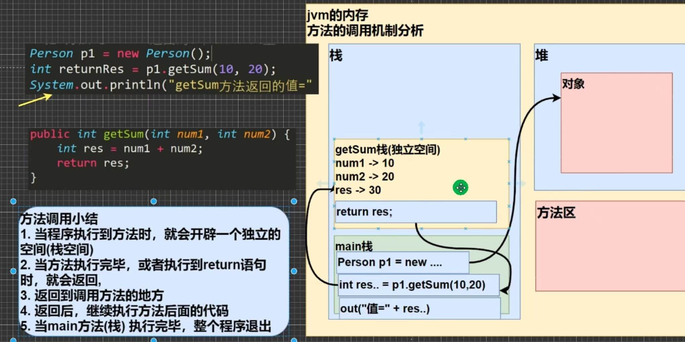
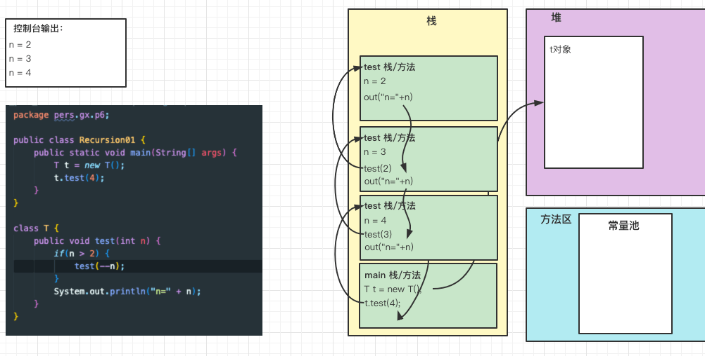

# 1_面向对象编程（基础）

- [1_面向对象编程（基础）](#1_面向对象编程基础)
  - [类与对象](#类与对象)
    - [类与对象的区别](#类与对象的区别)
    - [对象在内存中存在形式](#对象在内存中存在形式)
    - [属性/成员变量](#属性成员变量)
    - [如何创建对象](#如何创建对象)
    - [如何访问属性](#如何访问属性)
    - [类和对象的内存分配机制*](#类和对象的内存分配机制)
  - [成员方法](#成员方法)
    - [方法调用机制](#方法调用机制)
    - [方法的妙用](#方法的妙用)
    - [方法的定义](#方法的定义)
    - [方法传参机制](#方法传参机制)
  - [对象克隆](#对象克隆)
  - [方法的递归](#方法的递归)
    - [简单的递归方法](#简单的递归方法)
    - [递归重要规则](#递归重要规则)
    - [经典案例：阶乘](#经典案例阶乘)
    - [经典案例：斐波那契数列](#经典案例斐波那契数列)
    - [经典案例：猴子吃桃子问题](#经典案例猴子吃桃子问题)

## 类与对象

类是 描述了一系列具有相同特征（即数据元素，也可以称为属性）和行为（即功能方法） 的一种自定义数据类型。
对象 是通过某个类来创建出来的实例。

### 类与对象的区别

- 类是抽象的，概念的，代表一类事务，比如人类，猫类... ， 即它是数据类型；
- 对象是具体的，实际的，代表一个具体事物，即是实例；
- 类是对象的模版，对象是一个个体，对应一个实例；

### 对象在内存中存在形式


### 属性/成员变量

- 从概念或叫法上看：成员变量 = 属性 = field （即 成员变量是用来表示属性的）；
- 属性是类的一个组成部分，一般是基本数据类型，也可是引用类型（对象，数组）；

---

- 注意事项：
  1. 属性的定义语法同变量，示例：`访问修饰符 属性类型 属性名;`.
  2. 属性的定义类型可以为任意类型，包含基本类型或引用类型。
  3. 属性如果不赋值，有默认值，规则和数组一致。具体：`int 0, short 0, byte 0, long 0l, float 0.0f, double 0, char \u0000, boolean false, Object null`。

### 如何创建对象

1. 先声明再创建。

    ``` java
    Cat cat ;
    cat = new Cat();
    ```

1. 直接创建

    ``` java
    Cat cat = new Cat();
    ```

### 如何访问属性

`对象名.属性名;`

### 类和对象的内存分配机制*

``` java
Person p1 = new Person();
p1.age = 10;
p1.name = "小明";
Person p2 = p1; // p1 赋给了 p2
System.out.println(p2.age);

// 请问：p2.age 究竟是多少？并画出内存图： 
```


- Java 内存的结构分析
  - 栈：一般存放基本数据类型（局部变量）
  - 堆：存放对象
  - 方法区：常量池（常量，比如字符串），类加载信息

- Java创建对象的流程简单分析

    ``` java
    Person p = new Person();
    p.name = "jack";
    p.age = 10
    ```

  1. 先加载Person类信息（属性和方法信息），只加载一次；
  2. 在堆中分配空间，进行默认初始化；
  3. 把对象在堆中的地址赋给 p (栈中), p 就指向对象了；
  4. 进行指定初始化，比如 p.name = "jack" ， p.age = 10 

## 成员方法

### 方法调用机制



### 方法的妙用

- 成员方法的好处
  - 提高代码的复用性
  - 可以将实现的细节封装起来，然后供其他用户来调用即可。
  
### 方法的定义

``` java
public 返回数据类型 方法名 (行参列表...) { // 方法体
    语句;
    return 返回值;
}
```

1. 参数列表：表示成员方法输入；
2. 数据类型（返回类型）：表示成员方法输出，void表示没有返回值；
3. 方法主体：表示为了实现某一功能代码块；
4. return 语句不是必须的。

- 注意事项和使用细节
  - 访问修饰符，用于控制方法使用的范围，4种：public, protected, 默认, private；
  - 返回数据类型
    1. 一个方法最多有一个返回值；
    2. 返回类型可以为任意类型，基本类型+引用类型；
    3. 如果方法要求有返回数据类型，则方法体中最后的执行语句必须为return值；而且要求返回数据类型必须和return的值的类型一致或者兼容； 
  - 方法名
    - 遵循驼峰命名法，最好见名知义
  - 参数列表
    - 一个方法可以有0个参数，也可以有多个参数，中间用逗号隔开；
    - 参数类型可以为任意类型，包含基本类型或引用类型；
    - 调用带参数的方法时，一定对应着参数列表传人相同类型或兼容类型；
    - 方法定义时的参数称为形式参数，简称形参；方法调用时的参数称为实际参数，简称实参，实参和形参的类型要一致或兼容、个数、顺序必须一致！
  - 方法体
    - 里面写完成功能的具体的语句，可以为输入、输出、变量、运算、分支、循环、方法调用，但里面不能再定义方法！即：方法不能嵌套定义。
  - 方法调用说明
    - 同一个类中的方法调用：直接调用即可。
    - 跨类中的方法A类调用B类方法：需要通过对象名调用。比如 对象名.方法名(参数)。
    - 特别说明：跨类的方法调用和方法的访问修饰符相关。

### 方法传参机制

参数：`parameter`

- 传参机制：
  - 基本类型 传入方法 ，是值的专递（相当值复制），形参的任何改变不影响实参。
  - 引用类型 传入方法 ，只传入入参对象的引用，形参的任何改变会影响实参。

## 对象克隆

[查看代码](./code/src/pers/gx/p5/MethodExercise02.java)

克隆就是 创建一个新对象，对值进行copy。

## 方法的递归

### 简单的递归方法

[查看代码](./code/src/pers/gx/p6/Recursion01.java)




### 递归重要规则

- 执行一个方法时，就创建一个新的受保护的独立空间（栈空间）；
- 方法的局部变量是独立的，不会相互影响，比如n变量；
- 如果方法中使用时引用类型变量（比如数组），就会共享该引用类型的数据；
- 递归必须向退出递归的条件逼近，否则就是无限递归，出现StackOverFlowError(栈溢出)；
- 当一个方法执行完毕，或者遇到return，就会返回，遵守谁调用，就将结果返回给谁，同时当方法执行完毕或者返回时，该方法就执行完毕。

### 经典案例：阶乘

[查看代码](./code/src/pers/gx/p7/Factorial.java)

### 经典案例：斐波那契数列

[查看代码](./code/src/pers/gx/p8/LeonardoFibonacci.java)

### 经典案例：猴子吃桃子问题

[查看代码](./code/src/pers/gx/p9/MonkeyEatingPeach.java)
