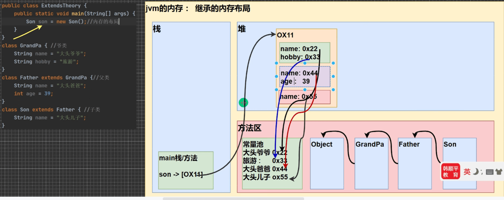

# 2_面向对象编程（中级）

- [2_面向对象编程（中级）](#2_面向对象编程中级)
  - [包](#包)
  - [访问修饰符](#访问修饰符)
  - [面向对象编程的三大特性](#面向对象编程的三大特性)
  - [封装](#封装)
  - [继承](#继承)
    - [继承基本介绍](#继承基本介绍)
    - [继承给编程带来的便利](#继承给编程带来的便利)
    - [继承的细节问题](#继承的细节问题)
    - [继承的内存分析](#继承的内存分析)
    - [练习](#练习)
  - [super 关键字](#super-关键字)
    - [super 与 this 的比较](#super-与-this-的比较)
  - [方法重写/覆盖（override）](#方法重写覆盖override)
    - [overload 与 override 比较](#overload-与-override-比较)
    - [练习](#练习-1)

## 包

- 包的三大作用
  - 区分相同名字的类
  - 方便管理类
  - 控制访问范围

- 包的基本语法
  - 声明包

  ``` java
  package 【包名】
  ```

  - 引入包中类

  ``` java
  import java.util.Scanner; // 表示只会引入java.util 包下的Scanner 类
  import java.util.*; // 表示将java.util包下的所有类都引入（导入）
  ```

- 包的本质分析
  - 包的本质实际上就是创建不同的文件夹来保存类文件

- 常用的包
  - `java.lang.**` // lang包是基本包，默认引入，不需要再引入
  - `java.util.*` // util包，系统提供的工具包，工具类，使用 Scanner
  - `java.net.*` // 网络包，网络开发
  - `java.awt.*` // 是做Java的界面开发，GUI

- 注意事项
  - package的作用是声明当前类所在的包，需要放在类的最上面，一个类中最多只能有一句package
  - import指令 位置放在package的下面，在类定义前面，可以有多句且没有顺序要求

## 访问修饰符

- Java提供了四种修饰符，用于控制方法和属性（成员变量）的访问权限（范围）：
  - 公开级别：用public修饰，对外公开
  - 受保护级别：用protected修饰，对子类和同一个包中的类公开
  - 默认级别：没有修饰符，向同一个包的类公开
  - 私有级别：用private修饰，只有类本身可以访问，不对外公开。

| 权限修饰符 | 类内部 | 本包 | 子类 | 外部包 |
| ---------- | ------ | ---- | ---- | ------ |
| public     | Y      | Y    | Y    | Y      |
| protected  | Y      | Y    | Y    | N      |
| default    | Y      | Y    | N    | N      |
| private    | Y      | N    | N    | N      |

- 注意事项
  - 修饰符可以用来修饰 `类中的属性`，`类中的成员方法` 和 `类`;
  - 只有默认的和public才能修饰类！**注意：** *内部类可以使用任意修饰符*;
  - 属性和方法 的访问规则是一样的；

## 面向对象编程的三大特性

三大特征：封装、继承、多态；

## 封装

- 封装的介绍

封装（encapsulate）就是把抽象出的数据[属性]和对数据的操作方法[方法]封装在一起，数据被保护在内部，程序的其他部分只有通过被授权的操作[方法]，才能对数据进行操作。

- 封装的好处
  - 隐藏实现细节
  - 可以对数据进行验证，保证安全合理

- 封装的步骤
  
  1. 将属性私有化；
  2. 提供一个公共的set方法，用于对属性判断并赋值
  3. 提供一个公共的get方法，用于获取属性的值

- 快速入门案例

``` java
/*
请大家看一个小程序(Encapsulation01.java)，不能随便查看人的年龄，工资等隐私，
并对设置的年龄进行合理的验证。年龄合理就设置，否则给默认·年龄，必须在1-120，年龄，
工资不能直接查看，
name的长度在2-6之间·
*/
```

[查看代码](./code2/src/main/java/org/gx/chapter08/p04/Encapsulation01.java)

- 课堂练习

``` java
/*
com.hspedu.encap 包:AccountTest.java 和 Account.java
创建程序，在其中定义两个类：Account和AccountTest类体会Java的封装性。1. Account类要求具有属性：姓名（长度为2位3位或4位）、余额(必须>20)密码（必须是六位），如果不满足，则给出提示信息，并给默认值2.通过setXxx的方法给Account 的属性赋值。
3.在AccountTest中测试
提示知识点：:String name=int len = name.length();
*/
```

[查看代码](./code2/src/main/java/org/gx/chapter08/p05/encap/AccountTest.java)

## 继承

### 继承基本介绍

继承可以解决代码复用，让我们的编程更加靠近人类思维，当多个类存在相同的属性和方法时，可以从这些类中抽象出父类，在父类中定义这些相同的多属性和方法，所有的子类不需要重新定义这些属性和方法，只需要通过extends来声明继承父类即可。

### 继承给编程带来的便利

- 代码的复用性提高了；
- 代码的扩张性和维护性提高了；

### 继承的细节问题

1. 子类继承了父类所有的属性和方法，但是父类私有属性不能在子类直接访问，要通过公共的方法去访问；
2. 子类必须调用父类的构造器，完成父类的初始化；
3. 当创建子类对象时，不管使用子类的哪个构造器，默认情况下总会去调用父类的午无参构造器，如果父类没有提供无参构造器，则必须在子类的构造器中用super去指定使用父类的哪个构造器完成对父类的初始化工作，否则，编译不会通过；
4. 如果希望指定去调用父类的某个构造器，则显示的调用一下；
5. super在构造器中使用时，需要放在构造器第一行；
6. super() 和 this() 都只能放在构造器第一行，因此这两个方法不能存在一个构造器中；
7. java 所有类都是`Object`类都子类，Object是所有类的基类；
8. 父类构造器的调用不限于直接父类！将一直往上追溯直到Object类（顶级父类）；
9. 子类最多只能继承一个父类（指直接继承），即Java中是**单继承机制**；
10. 不能滥用继承，子类和父类之间必须满足 `is-a` 的逻辑关系；

### 继承的内存分析



### 练习

[查看代码](./code2/src/main/java/org/gx/chapter08/p10/ExtendsExercise03.java)

## super 关键字

super 代表父类的引用，用于访问父类的属性、方法、构造器

- super 的使用
  - 访问父类的属性，但不能访问父类的private属性；
  - 访问父类的方法，不能访问父类的private方法；
  - 访问父类的构造器；

- super给编程带来的便利
  - 调用父类的构造器的好处 （分工明确，父类属性由父类初始化，子类的属性由子类初始化）；
  - 当子类中有和父类中的成员重名时，为了访问父类的成员，必须通过super。如果没有重名，使用super、this、直接访问是一样的效果；
  - super的访问不限于直接父类，如果爷爷类和本类中有同名的成员，也可以使用super去访问爷爷类的成员；如果多个基类中都有同名的成员，使用super访问遵循就近原则。 A -> B -> C 

### super 与 this 的比较

| No. | 区别点     | this                                                   | super                                    |
| --- | ---------- | ------------------------------------------------------ | ---------------------------------------- |
| 1   | 访问属性   | 访问本类中的属性，如果本类没有此属性则从父类中继续查找 | 访问父类中的属性                         |
| 2   | 调用方法   | 访问本类中的方法，如果本类没有此方法则从父类中继续查找 | 直接访问父类中的方法                     |
| 3   | 调用构造器 | 调用本类的构造器，必须放在构造器的首行                 | 调用父类构造器，必须放在子类构造器的首航 |
| 4   | 特殊       | 表示当前对象                                           | 子类访问父类对象                         |

## 方法重写/覆盖（override）

方法重写（覆盖）就是子类有一个方法，和父类的某个方法的名称、返回类型、参数一样，那么我们就说子类的这个方法覆盖了父类的方法


- <font color=red>*注意事项* **(重要)**</font>
  - <font color=red>子类方法的参数、方法名称，要和父类方法的参数，方法名称完全一样。</font>
  - <font color=red>子类方法的返回类型和父类方法返回类型一样，或者是父类返回类型的子类。</font>
  - <font color=red>子类方法不能缩小父类方法的访问权限；</font>

### overload 与 override 比较

| 名称             | 发生范围     | 方法名 | 参数列表 | 返回类型 | 修饰符                     |
| ---------------- | ------------ | ------ | -------- | -------- | -------------------------- |
| 重载（overload） | 本类         | 相同   | 类型，个数或者顺序 至少有一个不同     | 相同     | 没有要求                   |
| 重写（override） | 子类覆盖父类 | 相同   | 相同     | 相同，或者是父类型的子类    | 不能缩小父类方法的访问权限 |

### 练习

[查看代码](./code2/src/main/java/org/gx/chapter08/p11/Override01.java)
