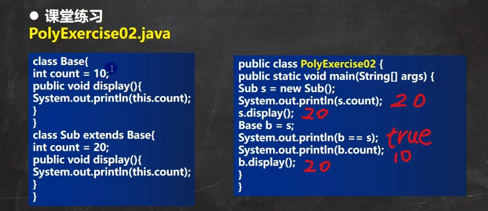
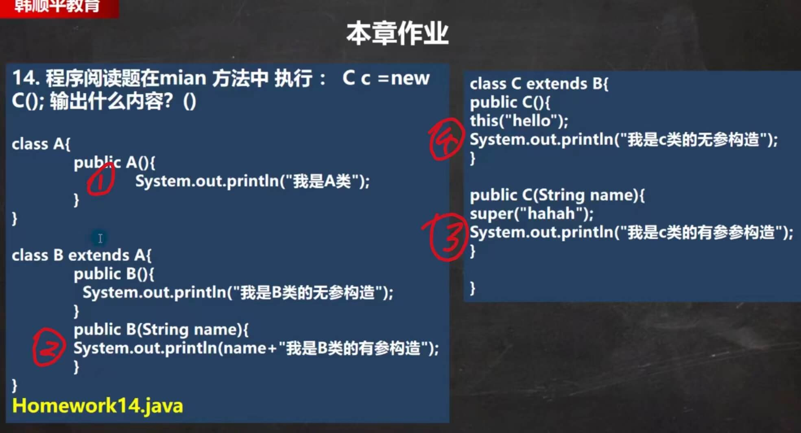

# 2_面向对象编程（中级）

- [2_面向对象编程（中级）](#2_面向对象编程中级)
  - [包](#包)
  - [访问修饰符](#访问修饰符)
  - [面向对象编程的三大特性](#面向对象编程的三大特性)
  - [封装](#封装)
  - [继承](#继承)
    - [继承基本介绍](#继承基本介绍)
    - [继承给编程带来的便利](#继承给编程带来的便利)
    - [继承的细节问题](#继承的细节问题)
    - [继承的内存分析](#继承的内存分析)
    - [练习](#练习)
  - [super 关键字](#super-关键字)
    - [super 与 this 的比较](#super-与-this-的比较)
  - [方法重写/覆盖（override）](#方法重写覆盖override)
    - [overload 与 override 比较](#overload-与-override-比较)
    - [练习](#练习-1)
  - [多态](#多态)
    - [多态的具体体现](#多态的具体体现)
    - [多态的向上转型 和 向下转型；](#多态的向上转型-和-向下转型)
    - [属性没有重写之说](#属性没有重写之说)
    - [instanceOf 关键字](#instanceof-关键字)
    - [Java的动态绑定机制](#java的动态绑定机制)
    - [多态练习](#多态练习)
      - [练习1:](#练习1)
      - [练习2:](#练习2)
    - [多态的应用](#多态的应用)
      - [多态数组](#多态数组)
      - [多态参数](#多态参数)
  - [Object 类详解](#object-类详解)
    - [equals方法](#equals方法)
      - [重写equals方法](#重写equals方法)
      - [equals 和 == 的区别](#equals-和--的区别)
      - [课堂练习](#课堂练习)
    - [hashCode 方法](#hashcode-方法)
    - [toString 方法](#tostring-方法)
    - [finalize 方法](#finalize-方法)
  - [零钱通项目](#零钱通项目)
  - [本章作业](#本章作业)
    - [练习13](#练习13)
    - [练习14](#练习14)
    - [练习15](#练习15)

## 包

- 包的三大作用
  - 区分相同名字的类
  - 方便管理类
  - 控制访问范围

- 包的基本语法
  - 声明包

  ``` java
  package 【包名】
  ```

  - 引入包中类

  ``` java
  import java.util.Scanner; // 表示只会引入java.util 包下的Scanner 类
  import java.util.*; // 表示将java.util包下的所有类都引入（导入）
  ```

- 包的本质分析
  - 包的本质实际上就是创建不同的文件夹来保存类文件

- 常用的包
  - `java.lang.**` // lang包是基本包，默认引入，不需要再引入
  - `java.util.*` // util包，系统提供的工具包，工具类，使用 Scanner
  - `java.net.*` // 网络包，网络开发
  - `java.awt.*` // 是做Java的界面开发，GUI

- 注意事项
  - package的作用是声明当前类所在的包，需要放在类的最上面，一个类中最多只能有一句package
  - import指令 位置放在package的下面，在类定义前面，可以有多句且没有顺序要求

## 访问修饰符

- Java提供了四种修饰符，用于控制方法和属性（成员变量）的访问权限（范围）：
  - 公开级别：用public修饰，对外公开
  - 受保护级别：用protected修饰，对子类和同一个包中的类公开
  - 默认级别：没有修饰符，向同一个包的类公开
  - 私有级别：用private修饰，只有类本身可以访问，不对外公开。

| 权限修饰符 | 类内部 | 本包 | 子类 | 外部包 |
| ---------- | ------ | ---- | ---- | ------ |
| public     | Y      | Y    | Y    | Y      |
| protected  | Y      | Y    | Y    | N      |
| default    | Y      | Y    | N    | N      |
| private    | Y      | N    | N    | N      |

- 注意事项
  - 修饰符可以用来修饰 `类中的属性`，`类中的成员方法` 和 `类`;
  - 只有默认的和public才能修饰类！**注意：** *内部类可以使用任意修饰符*;
  - 属性和方法 的访问规则是一样的；

## 面向对象编程的三大特性

三大特征：封装、继承、多态；

## 封装

- 封装的介绍

封装（encapsulate）就是把抽象出的数据[属性]和对数据的操作方法[方法]封装在一起，数据被保护在内部，程序的其他部分只有通过被授权的操作[方法]，才能对数据进行操作。

- 封装的好处
  - 隐藏实现细节
  - 可以对数据进行验证，保证安全合理

- 封装的步骤
  
  1. 将属性私有化；
  2. 提供一个公共的set方法，用于对属性判断并赋值
  3. 提供一个公共的get方法，用于获取属性的值

- 快速入门案例

``` java
/*
请大家看一个小程序(Encapsulation01.java)，不能随便查看人的年龄，工资等隐私，
并对设置的年龄进行合理的验证。年龄合理就设置，否则给默认·年龄，必须在1-120，年龄，
工资不能直接查看，
name的长度在2-6之间·
*/
```

[查看代码](./code2/src/main/java/org/gx/chapter08/p04/Encapsulation01.java)

- 课堂练习

``` java
/*
com.hspedu.encap 包:AccountTest.java 和 Account.java
创建程序，在其中定义两个类：Account和AccountTest类体会Java的封装性。1. Account类要求具有属性：姓名（长度为2位3位或4位）、余额(必须>20)密码（必须是六位），如果不满足，则给出提示信息，并给默认值2.通过setXxx的方法给Account 的属性赋值。
3.在AccountTest中测试
提示知识点：:String name=int len = name.length();
*/
```

[查看代码](./code2/src/main/java/org/gx/chapter08/p05/encap/AccountTest.java)

## 继承

### 继承基本介绍

继承可以解决代码复用，让我们的编程更加靠近人类思维，当多个类存在相同的属性和方法时，可以从这些类中抽象出父类，在父类中定义这些相同的多属性和方法，所有的子类不需要重新定义这些属性和方法，只需要通过extends来声明继承父类即可。

### 继承给编程带来的便利

- 代码的复用性提高了；
- 代码的扩张性和维护性提高了；

### 继承的细节问题

1. 子类继承了父类所有的属性和方法，但是父类私有属性不能在子类直接访问，要通过公共的方法去访问；
2. 子类必须调用父类的构造器，完成父类的初始化；
3. 当创建子类对象时，不管使用子类的哪个构造器，默认情况下总会去调用父类的午无参构造器，如果父类没有提供无参构造器，则必须在子类的构造器中用super去指定使用父类的哪个构造器完成对父类的初始化工作，否则，编译不会通过；
4. 如果希望指定去调用父类的某个构造器，则显示的调用一下；
5. super在构造器中使用时，需要放在构造器第一行；
6. super() 和 this() 都只能放在构造器第一行，因此这两个方法不能存在一个构造器中；
7. java 所有类都是`Object`类都子类，Object是所有类的基类；
8. 父类构造器的调用不限于直接父类！将一直往上追溯直到Object类（顶级父类）；
9. 子类最多只能继承一个父类（指直接继承），即Java中是**单继承机制**；
10. 不能滥用继承，子类和父类之间必须满足 `is-a` 的逻辑关系；

### 继承的内存分析


### 练习

[查看代码](./code2/src/main/java/org/gx/chapter08/p10/ExtendsExercise03.java)

## super 关键字

super 代表父类的引用，用于访问父类的属性、方法、构造器

- super 的使用
  - 访问父类的属性，但不能访问父类的private属性；
  - 访问父类的方法，不能访问父类的private方法；
  - 访问父类的构造器；

- super给编程带来的便利
  - 调用父类的构造器的好处 （分工明确，父类属性由父类初始化，子类的属性由子类初始化）；
  - 当子类中有和父类中的成员重名时，为了访问父类的成员，必须通过super。如果没有重名，使用super、this、直接访问是一样的效果；
  - super的访问不限于直接父类，如果爷爷类和本类中有同名的成员，也可以使用super去访问爷爷类的成员；如果多个基类中都有同名的成员，使用super访问遵循就近原则。 A -> B -> C 

### super 与 this 的比较

| No. | 区别点     | this                                                   | super                                    |
| --- | ---------- | ------------------------------------------------------ | ---------------------------------------- |
| 1   | 访问属性   | 访问本类中的属性，如果本类没有此属性则从父类中继续查找 | 访问父类中的属性                         |
| 2   | 调用方法   | 访问本类中的方法，如果本类没有此方法则从父类中继续查找 | 直接访问父类中的方法                     |
| 3   | 调用构造器 | 调用本类的构造器，必须放在构造器的首行                 | 调用父类构造器，必须放在子类构造器的首航 |
| 4   | 特殊       | 表示当前对象                                           | 子类访问父类对象                         |

## 方法重写/覆盖（override）

方法重写（覆盖）就是子类有一个方法，和父类的某个方法的名称、返回类型、参数一样，那么我们就说子类的这个方法覆盖了父类的方法


- <font color=red>*注意事项* **(重要)**</font>
  - <font color=red>子类方法的参数、方法名称，要和父类方法的参数，方法名称完全一样。</font>
  - <font color=red>子类方法的返回类型和父类方法返回类型一样，或者是父类返回类型的子类。</font>
  - <font color=red>子类方法不能缩小父类方法的访问权限；</font>

### overload 与 override 比较

| 名称             | 发生范围     | 方法名 | 参数列表                          | 返回类型                 | 修饰符                     |
| ---------------- | ------------ | ------ | --------------------------------- | ------------------------ | -------------------------- |
| 重载（overload） | 本类         | 相同   | 类型，个数或者顺序 至少有一个不同 | 相同                     | 没有要求                   |
| 重写（override） | 子类覆盖父类 | 相同   | 相同                              | 相同，或者是父类型的子类 | 不能缩小父类方法的访问权限 |

### 练习

[查看代码](./code2/src/main/java/org/gx/chapter08/p11/Override01.java)

## 多态

方法或对象具有多种形态。

### 多态的具体体现

1. 方法的多态，重写和重载就体现多态；

1. 对象的多态
   1. 一个对象的编译类型和运行类型可以不一致；
   2. 编译类型在定义对象时，就确定了，不能改变；
   3. 运行类型是可以变化的；
   4. 编译类型看定义时 `=` 的左边，运行类型看 `=` 的右边；

### 多态的向上转型 和 向下转型；

多态的前提是：两个对象（类）存在继承关系；

- 向上转型：
  - 本质：父类的引用指向了子类的对象
  - 语法：`父类类型 引用名 = new 子类类型();`
  - 特点：编译类型看左边，运行类型看右边；
    - <font color=red>可以调用父类中的所有成员（需要遵守访问权限）</font>
    - <font color=red>不能调用子类中的特有成员</font>

- 向下转型：
  - 语法：子类类型 引用名 = （子类类型）父类引用；
  - 只能强转父类的引用，不能强转父类的对象；
  - 要求父类的引用必须指向的是当前目标类型的对象；
  - 当向下转型后，可以调用子类类型中所有成员；

### 属性没有重写之说

<font color=red>属性没有重写之说！属性的值看编译类型</font>

[查看代码](./code2/src/main/java/org/gx/chapter08/p12/PolyDetail02.java)

### instanceOf 关键字

`instanceOf` 比较操作符，用于判断对象的*运行类型*是否为XX类型或XX类型的子类型

### Java的动态绑定机制

- Java的动态绑定机制
  - <font color=red>当调用对象方法的时候，该方法和该对象的内存地址/运行类型绑定；</font>
  - <font color=red>当调用对象属性时，没有动态绑定机制，哪里声明，哪里使用；</font>

### 多态练习

#### 练习1:

说出下面的每条语句，哪些是正确的，哪些是错误的，为什么？

``` java
public class PolyExercise01 {
    public static void main(String[] args) {
        double d = 13.4; // ok
        long l = (long)d; // ok
        System.out.println(l); // 13
        int in = 5; // ok
//        boolean b = (boolean) in; // 不对，boolean 不能转成 int ， 编译错误
        Object obj = "hello"; // OK，向上转型
        String objStr = (String) obj;// OK，向下转型
        System.out.println(objStr);// hello
        Object objPri = new Integer(5); // ok
//        String str = (String) objPri; // 不对，String 不能转成 Integer， 运行时异常 ClassCastException
        Integer str1 = (Integer) objPri; // OK，向下转型
    }
}
```

[查看代码](./code2/src/main/java/org/gx/chapter08/p13/poly/exercise/PolyExercise01.java)

#### 练习2:

写出程序运行结果：



[查看代码](./code2/src/main/java/org/gx/chapter08/p13/poly/exercise/PolyExercise02.java)

### 多态的应用 

#### 多态数组

应用实例：现有一个继承结构如下：要求创建1个Person对象，2个Student对象和2个Teacher对象，统一放在数组中，并调用Say方法。

应用实例升级：如何调用子类特有的方法，比如：Teacher有一个teach，Student有一个study？

[查看代码](./code2/src/main/java/org/gx/chapter08/p15/PolyArray.java)

#### 多态参数

方法定义的形参类型为父类类型，实参类型允许为子类类型；

## Object 类详解

### equals方法

- == 和 equals 的对比
  1. == ：即可以判断基本类型，又可以判断引用类型
  2. == ：如果判断基本类型，判断的是值是否相等。示例：int 1 = 10; double d = 10.0;
  3. == ：如果判断引用类型，判断的是地址是否相等，即判断是否是同一个对象。
  4. equals ：是Object类中的方法，只能判断引用类型
  5. 默认判断的是地址是否相等，子类中往往重写该方法，用于判断内容是否相等。

#### 重写equals方法

[查看代码](./code2/src/main/java/org/gx/chapter08/p16/object_/EqualsOverride.java)

#### equals 和 == 的区别

| 名称   | 概念           | 用于基本类型     | 用于引用类型                                                             |
| ------ | -------------- | ---------------- | ------------------------------------------------------------------------ |
| ==     | 比较运算符     | 判断值值是否相等 | 判断两个对象是否相同                                                     |
| equals | Object类的方法 | 不可用           | 默认判断两个对象是否相同，但是子类可以重写该方法，比较对象的属性是否相等 |

#### 课堂练习

``` java
Person p1 = new Person();
p1.name = "aoo";

Person p2 = new Person();
p2.name = "aoo";

System.out.println(p1 == p2); // false
System.out.println(p1.name.equals(p2.name)); // true
System.out.println(p1.equals(p2)); // false

String s1 = new String("asdf");
String s2 = new String("asdf");
System.out.println(s1.equals(s2)); // true
System.out.println(s1 == s2); // false
```

### hashCode 方法

Hash，一般翻译做散列、杂凑，或音译为哈希，是把**任意长度**的输入（又叫做预映射pre-image）通过散列算法变换成固定长度的输出，该输出就是散列值。这种转换是一种压缩映射，也就是，散列值的空间通常远小于输入的空间，不同的输入可能会散列成相同的输出，所以不可能从散列值来确定唯一的输入值。简单的说就是一种将任意长度的消息压缩到某一固定长度的消息摘要的函数。

- 提高具有哈希结构的容器的效率；
- 两个引用，如果指向的是同一个对象，则哈希值肯定是一样的；
- 两个引用，如果指向的是不同对象，则哈希值是不一样的；
- 哈希值主要根据地址号来的！但是不能完全将哈希值等价于地址；

### toString 方法

- 默认返回：全类名+@+哈希值的十六进制；
- 子类往往重写toString方法，用于返回对象的属性信息；
- 直接输出对象时，toString方法会被默认调用；

### finalize 方法

- 当对象被垃圾回收器回收时，会调用finalize()方法；

## 零钱通项目

[查看代码](./code2/src/main/java/org/gx/chapter08/p18/SmallChangeSysShell.java)

## 本章作业

### 练习13

- 案例题目描述:
  - 做一个Student类，Student类有名称（name），性别(sex),年龄(age），学号（stu_id），做合理封装，通过构造器在创建对象时将4个属性赋值。
  - 写一个Teacher类，Teacher类有名称（name），性别（sex），年龄(age），工龄(work_age),做合理封装，通过构造器在创建对象时将4个属性赋值。
  - 抽取一个父类Person类，将共同属性和方法放到Person类
  - 学生需要有学习的方法（study)，在方法里写生“我承诺，我会好好
学习。“
  - 教师需要有教学的方法（teach），在方法里写上“我承诺，我会认真
教学。”
  - 学生和教师都有玩的方法（play），学生玩的是足球，老师玩的是象棋此方法是返回字符串的，分别返回“xx爱玩足球”和“xx爱玩象棋”（其中xx分别代表学生和老师的姓名）。因为玩的方法名称都一样，所以要求此方法定义在父类中，子类实现重写。
  - 定义多态数组，里面保存2个学生和2个教师，要求按年龄从高到低排序，
  - 定义方法，形参为Person类型，功能：调用学生的study或教师的teach方法;

[查看代码：Homework13.java](./code2/src/main/java/org/gx/chapter08/p20/Homework13.java)

### 练习14



### 练习15

- 什么事多态？多态具体体现有哪些？
  - 多态：方法或对象具有多种形态，是OOP的第三大特征，是建立在封装和继承基础之上。
  - 多态具体体现：
    1. 方法多态：
       1. 重载体现多态
       2. 重写体现多态
    2. 对象多态
       1. 对象的编译类型和运行类型可以不一致，编译类型在定义时，就确定，不能变化；
       2. 对象的运行类型时可以变化的，可以通过getClass()方法来查看运行类型；
       3. 编译类型看定义时=号左边，运行类型看=号右边；

