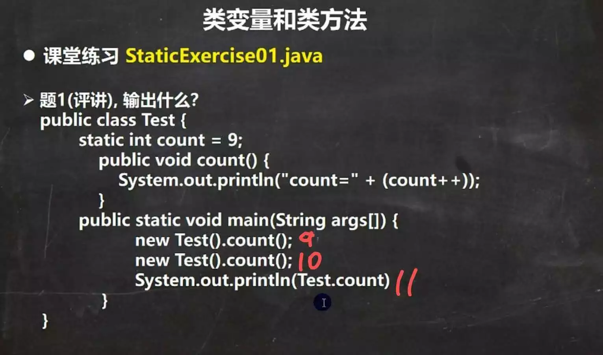
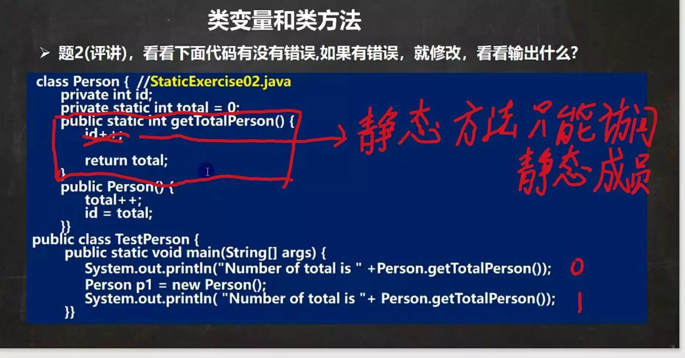
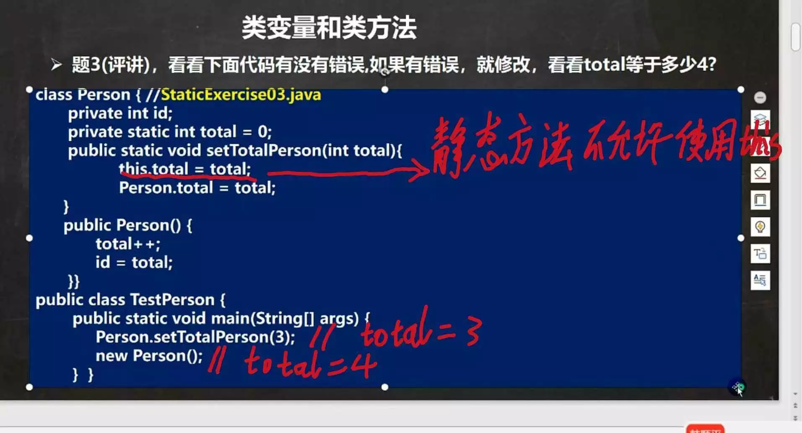
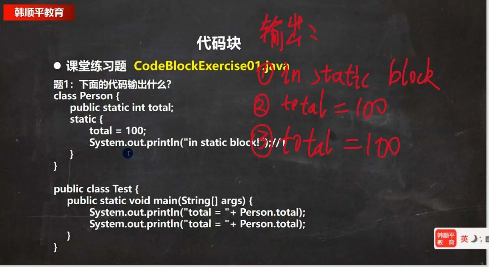
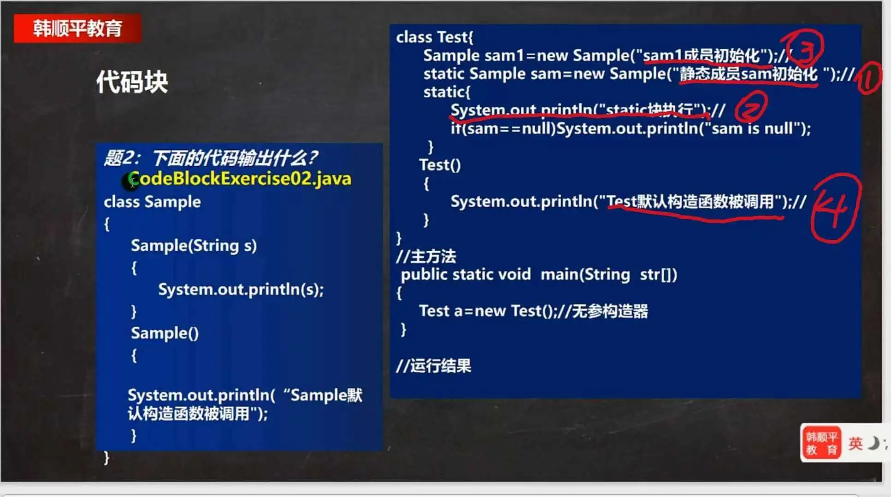
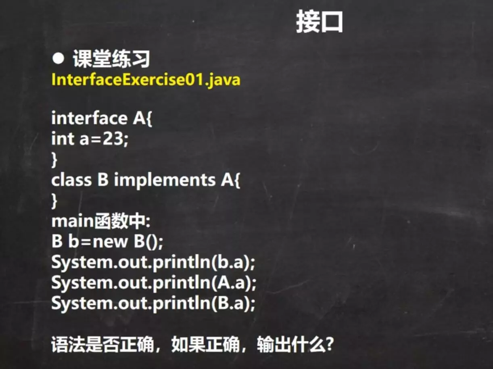
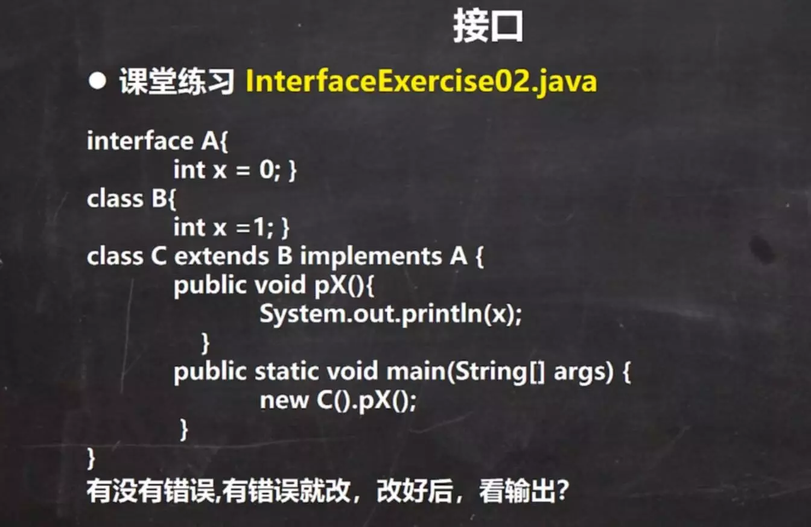

# 3_面向对象编程（高级）

- [3_面向对象编程（高级）](#3_面向对象编程高级)
  - [类变量（静态变量）](#类变量静态变量)
    - [如何定义类变量](#如何定义类变量)
    - [如何使用类变量](#如何使用类变量)
    - [注意事项](#注意事项)
  - [类方法（静态方法）](#类方法静态方法)
    - [类方法的使用场景](#类方法的使用场景)
    - [注意事项](#注意事项-1)
    - [练习：](#练习)
  - [main方法](#main方法)
  - [代码块](#代码块)
    - [基本语法](#基本语法)
    - [注意事项](#注意事项-2)
    - [练习](#练习-1)
  - [单例设计模式](#单例设计模式)
    - [什么是单例模式](#什么是单例模式)
    - [饿汉方式](#饿汉方式)
    - [懒汉方式](#懒汉方式)
  - [final 关键字](#final-关键字)
  - [抽象类](#抽象类)
    - [抽象类的注意事项和使用细节](#抽象类的注意事项和使用细节)
    - [抽象类的最佳实践 —— 模版设计模式](#抽象类的最佳实践--模版设计模式)
  - [接口](#接口)
    - [接口注意事项](#接口注意事项)
    - [实现接口 VS 继承类](#实现接口-vs-继承类)
    - [接口练习题](#接口练习题)
  - [内部类](#内部类)
    - [内部类 - 基本介绍](#内部类---基本介绍)
    - [内部类 - 基本语法](#内部类---基本语法)
    - [内部类的分类](#内部类的分类)
    - [局部内部类](#局部内部类)
    - [匿名内部类](#匿名内部类)
    - [成员内部类](#成员内部类)
    - [静态内部类](#静态内部类)

## 类变量（静态变量）

类变量也叫静态变量/静态属性，是该类的所有对象共享的变量，任何一个该类的对象去访问它时，取到的都是相同的值，同样任何一个该类的对象去修改它时，修改的也是同一个变量。

### 如何定义类变量

访问修饰符 static 数据类型 变量名;

### 如何使用类变量

- 类名称.变量名 【推荐】
- 对象名.变量名 【不推荐】

### 注意事项

- 什么时候需要用类变量
  - 当我们需要让某个类的所有对象都共享一个变量时，就可以考虑使用类变量（静态变量）；
- 类变量与实例变量的区别
  - 类变量是该类的所有对象共享的；
  - 实例变量是每个对象独享的；
- 类变量是在类加载时就初始化了，也就是说，即使没有创建对象，只要类加载了，就可以使用类变量了。
- 类变量的生命周期是随类的加载开始，随类消亡而销毁；

## 类方法（静态方法）

类方法的定义： 访问修饰符 static 返回数据类型 方法名(){ }
类方法的调用： 类名.方法名()

### 类方法的使用场景

- 当方法中不涉及到任何和对象相关的成员，则可以将方法设计成静态方法，提高开发效率。

比如：工具类中的方法 uitls : Math类，Arrays类，Collections集合类 等等；

### 注意事项

- 类方法和普通方法都是随着类的加载而加载，将结构信息存储在方法区：
  - 类方法中无this的参数
  - 普通方法中隐含着this的参数
- 类方法可以通过类名调用，也可以通过对象名调用。
- 类方法中不允许使用和对象有关的关键字，比如`this`和`super`。
- <font color=red>静态方法，只能访问静态的成员；非静态的方法，可以访问静态成员和非静态成员；</font>
- <font color=red>静态方法，不能被子类重写；</font>

### 练习：





## main方法

- 深入理解main方法
  - 解释main方法的形式：public static void main(String[] args){}
    1. Java 虚拟机需要调用类的main()方法，所以该方法的访问权限必须是public；
    2. Java 虚拟机在执行main()方法时不必创建对象，所以该方法是static；
    3. 该方法接收String类型的数组参数，该数组中保存执行java 命令时传递给所运行的类的参数；
    4. java 执行的程序：参数1，参数2，参数3；
  - 由于main()方法是静态方法，，所以可以直接调用类的静态成员；但是，不能直接访问该类的非静态成员，必须创建对象后，才能使用。

## 代码块

<font color=red>代码块又称初始化块，属于类中的成员【即是类的一部分】，类似于方法，将逻辑语句封装在方法体中，通过{}包围起来；

但和方法不同，没有方法名，没有返回，没有参数，只有方法体，而且不用通过对象或类显示调用，而是加载类时，或创建对象时瘾式调用。
</font>

### 基本语法

``` java
[修饰符] {
    代码
};
```

- 注意
  - 修饰符 可选，要写的话，也只能写 static
  - 代码块分为两类，使用static修饰符的叫静态代码块；没有static修饰符的，叫普通代码块。
  - 逻辑语句可以为任何逻辑语句（输入、输出、方法调用、循环、判断等）。
  - 代码块结束的`;`可以写，也可以省略；

- 普通代码块的好处和运用场景
  - 相当于另一种形式的构造器（对构造器的补充机制），可以做初始化的操作；
  - 场景：如果都给构造都有重复的语句，可以抽取到代码块中，提高代码的重用性；
  - <font color=red>普通代码块 调用的顺序优先于构造器 ；</font>

### 注意事项

0. 静态代码块只能直接调用静态成员，普通代码可以调用任意成员；

1. static 代码块也叫静态代码块，作用就是对类进行初始化，而且它随着**类的加载**而执行，并且只会执行一次。如果普通代码块，每创建一个对象，就执行。

2. 类什么时候被加载
   1. 创建对象实例时（new）；
   2. 创建子类对象实例，父类也会被加载；
   3. 使用类的静态成员时；

3. 普通的代码块，在创建对象实例时，会被隐式的调用。被创建一次，就会被调用一次。

4. <font color=red>创建一个对象时，在一个类 调用顺序是：（重点、难点）</font>

   1. 调用静态代码块和静态属性初始化（注意：静态代码块和静态属性初始化调用的优先级一样，如果有多个静态代码块和多个静态变量初始化，则按他们定义的顺序调用）；
   2. 调用普通代码块和普通属性的初始化（注意：普通代码块和普通属性初始化调用的优先级一样，如果有多个普通代码块和多个普通属性初始化，则按定义顺序调用）；
   3. 调用构造方法。
   
5. 构造方法（构造器）的最前面其实隐含了 super()和 调用普通代码块；静态相关的代码块，静态属性初始化，在类加载时，就执行完毕，因此优先于 构造器和普通代码块执行的；

6. <font color=red>创建一个子类时（继承关系），他们的静态代码块，静态属性初始化，普通代码块初始化，构造方法的调用顺序如下：</font>
   1. 父类的静态代码块和静态属性（优先级一样，按定义顺序执行）；
   2. 子类的静态代码块和静态属性（优先级一样，按定义顺序执行）；
   3. 父类的普通代码块和普通属性初始化（优先级一样，按定义顺序执行）；
   4. <font color=red>父类构造器；</font>
   5. 子类的普通代码块和普通属性初始化（优先级一样，按定义顺序执行）；
   6. 子类构造器；

面试题：[查看代码](./code2/src/main/java/org/gx/chapter09/p01/CodeBlockDetail02.java)

### 练习




## 单例设计模式

### 什么是单例模式

- 所谓类的单例设计模式，就是采取一定的方法保证在整个的软件系统中，对某个类只能存在一个对象实例，并且该类只提供一个取得其对象实例的方法；
- 单例模式有两种方式：1）饿汉方式；2）懒汉方式

### 饿汉方式

- 步骤如下：
  - 构造器私有化
  - 类的内部创建对象
  - 向外暴露一个静态的公共方法。getInstance

[查看代码](./code2/src/main/java/org/gx/chapter09/p02/single/HungrySingle.java)

 <font color=red> 注意饿汉方式的缺点：</font>不管是否用到，在类加载时对象就会被创建，导致资源浪费；

### 懒汉方式

- 步骤如下：
  - 构造器私有化
  - 类的内部声明对象，先不要进行实例化；
  - 向外暴露一个静态的公共方法：getInstance()。在该方法中先校验声明的对象有没有被创建，如果没有创建就创建一个；如果已创建，则返回；

[查看代码](./code2/src/main/java/org/gx/chapter09/p02/single/LazySingle.java)

``` java
public class LazySingle {
    private static LazySingle single;
    private LazySingle() {
        System.out.println("LazySingle constructor");
    }
    public static LazySingle getInstance() {
        if (null == single) {
            // 线程不安全，有可能在对象创建之前，getInstance被再次调用，从而再次创建对象，导致单例被破坏；
            single = new LazySingle();
        }
        return single;
    }
}
```

- 优点：懒汉方式 **是在使用时才创建对象**。

- <font color=red> 注意懒汉方式的缺点：</font>；线程安全问题；

## final 关键字

- final 中文意思是：最终的，最后的。
- final 可以修饰类、属性、方法和局部变量。

- final的使用 ：
  - final修饰的类，不能被继承；
  - final修饰的方法，不能被重写；
  - final修饰的属性 和 局部变量，不能被修改；

- 注意事项：
  - final修饰的属性又叫常量，一般用 XX_XX_XX 命名；
  - final修饰的属性在定义时，必须赋初值，并且以后不能再修改，赋值可以在如下位置之一：[查看代码](./code2/src/main/java/org/gx/chapter09/p03/final_/FinalDetail01.java)
    - 定义时；如：public final double TAX_RATE = 0.08;
    - 在构造器中；
    - 在代码块中；
  - 如果final修饰的属性是静态的，则初始化的位置只能是：1）定义时；2）在静态代码块。不能在构造器中赋值。[查看代码](./code2/src/main/java/org/gx/chapter09/p03/final_/FinalDetail02.java)
  - final类不能继承，但是可以实例化对象；
  - 如果类不是final类，但是含有final方法，则该方法虽然不能被重写，但是可以被继承。[查看代码](./code2/src/main/java/org/gx/chapter09/p03/final_/FinalDetail03.java)
  - 一般来说，如果一个类已经是final类类，就没有必要再将方法修饰成final方法。
  - final不能修饰构造器方法。
  - final和static往往搭配使用，效率更高，底层编译做了优化处理。
  - 包装类（Integer，Double，Float，Boolean，Long 等等）都是final类，String 也是final类。

## 抽象类

当父类的某些方法，需要声明，但是又不确定如何实现时，可以将其声明为抽象类；

``` java
abstract class Animal {
  private String name;
  // 父类方法不确定如何实现
  public abstract void eat();
}
```

- 介绍
  - 用abstract关键字来修饰一个类时，这个类就叫抽象类；
  - 用abstract关键字来修饰一个方法时，这个方法就是抽象方法；抽象方法没有方法体；
  - 抽象类的价值更多是用于设计，时设计者设计好后，让子类继承实现抽象类；


### 抽象类的注意事项和使用细节

- 注意事项：
  - 抽象类不能被实例化；
  - 抽象类不一定要包含abstract方法。也就是说，抽象类可以没有abstract方法；
  - 一旦类包含了abstract方法，则这个类必须声明为abstract；
  - abstract只能修饰类和方法，不能修饰属性和其他的；
  - 抽象类可以有任意成员【**因为抽象类的本质还是类**】，比如：抽象方法，构造器，静态属性等等；
  - 抽象方法不能有方法体，即不能实现；
  - 如果一个类继承抽象类，则它必须实现抽象类的所有抽象方法，除非它自己也声明为abstract类。
  - <font color=red>抽象方法不能使用private、final 和 static 来修饰，因为这些关键字都是和重写相违背的。</font>

### 抽象类的最佳实践 —— 模版设计模式

- 需求：
  - 有多个类，完成不同的任务job
  - 要求能够得到各自完成任务的时间

``` java
// 模版类
abstract class Task {
    // 计算job方法执行时间
    public void calculateTime() {
        long s = System.currentTimeMillis();
        job();
        long e = System.currentTimeMillis() - s;
        System.out.println(this.getClass().getName() + ",工作时间：" + (System.currentTimeMillis() - s) + "毫秒");
    }
    // 抽象的模版方法
    abstract void job();
}
```

[查看代码：AbstractTemplate.java](./code2/src/main/java/org/gx/chapter09/p04/AbstractTemplate.java)

## 接口

接口就是给出一些没有实现的方法，封装到一起，到某个类药使用的时候，在根据具体情况把这些方法写出来。

- 注意
  - <font color=red>在 JDK7.0前，接口里的所有方法都没有方法体，都是抽象方法。</font>
  - <font color=red>JDK8.0后接口类可以有静态方法，默认方法，也就是说接口中可以有方法的具体实现。</font>

### 接口注意事项

- 接口不能被实例化；
- 接口中所有的方法都是 public方法；接口中抽象方法，可以不用abstract修饰；
- 一个普通类实现接口，就必须将该接口的所有方法都实现；
- 抽象类实现接口，可以不用实现接口的方法；
- 一个类同时可以实现多个接口；
- 接口中的属性，只能是final的，而且是public static final 修饰符。 比如：int i = 1;实际上是public static final int i = 1; (必须初始化)；
- 接口中属性的访问形式：接口名.属性名；
- 接口不能继承其他的类，但是可以继承多个别动接口；
- 接口的修饰符 只能是 public 和 默认，这点和类的修饰符是一样的。

### 实现接口 VS 继承类

- 接口和继承解决的问题不同：
  - 继承的价值主要在于：解决代码的复用性和可维护性。
  - 接口的价值主要在于：设计，设计好各种规范（方法），让其他类去实现这些方法。
- 接口笔继承更加灵活：
  - 继承是满足 `is-a`的关系，而接口只需要满足 `like-a`的关系；
- 接口在一定程度上实现代码解耦；

### 接口练习题



[查看代码，练习1](./code2/src/main/java/org/gx/chapter09/p05/exercise/InterfaceExercise01.java)



[查看代码，练习2](./code2/src/main/java/org/gx/chapter09/p05/exercise/InterfaceExercise02.java)

## 内部类

### 内部类 - 基本介绍

一个类的内部又完整的嵌套了另一个类结构。被嵌套的类称为内部类（inner class），嵌套其他类的类称为外部类（outer class）。

内部类是我们类的第五大成员：`属性`，`方法`，`构造器`，`代码块`，`内部类`

内部类最大的特点就是可以直接访问私有属性，并且可以体现类与类直接的包含关系。

### 内部类 - 基本语法
 
``` java
class Outer { // 外部类
  class Inner{ // 内部类

  }
}
class Other { // 外部其他类

}
```

### 内部类的分类

- 定义在外部类局部位置上（比如方法内）：
  - 局部内部类（有类名）
  - 匿名内部类（没有类名）
- 定义在外部类的成员位置上：
  - 成员内部类（没有用static修饰）
  - 静态内部类（使用static修饰）

### 局部内部类

局部内部类是定义在外部类的局部位置，比如方法中，并且有类名。

- 说明：
  - 可以直接访问外部类的所有成员，包含私有的；
  - 不能添加访问修饰符，因为它的地位就是一个局部变量。局部变量是不能使用修饰符的。但是可以使用final修饰，因为局部变量也可以使用final；
  - 作用域：仅仅在定义它的方法或代码块中；
  - 局部内部类---访问--->外部类的成员 【访问方式：直接访问】；
  - 外部类---访问--->局部内部类的成员访问方式：创建对象，再访问（注意：必须在作用域内）；
  - 外部其他类---不能访问--->局部内部类（因为 局部内部类 的地位是一个局部变量） ；
  - 如果外部类和局部内部类的成员重名时，默认遵循就近原则，如果想访问外部类的成员，则可以使用（外部类名.this.成员）去访问；

[查看代码 -- 局部内部类演示.java](./code2/src/main/java/org/gx/chapter09/p06/inner/InnerClass01.java)

### 匿名内部类

匿名内部类是定义在外部类的局部位置，比如方法中，并且没有类名； 

``` java
new 类或接口(参数列表){
  类体
}
```

- 特点：
  - 本质是类；
  - 内部类；
  - 该类没有名字；
  - 同时还是一个对象；
  - 可以直接访问外部类的所有成员，包含私有的；
  - 不能添加访问修饰符，因为它的地位就是一个局部变量；
  - 作用域：仅仅在定义它的方法或代码块中。
  - 匿名内部类---访问--->外部类成员。【访问方式：直接访问】；
  - 外部其他类---不能访问--->匿名内部类（因为 匿名内部类地位是一个局部变量）
  - 如果外部类和匿名内部类的成员重名时，内部类访问的话，默认遵循就近原则，如果想访问外部类的成员，则可以使用（外部类名.this.成员）去访问；

- 匿名内部类的最佳实践
  - 当作实参直接传递，简洁高效。
    - [查看代码 -- 练习1 -- InnerClassExercise01.java](./code2/src/main/java/org/gx/chapter09/p06/inner/InnerClassExercise01.java)
    - [查看代码 -- 练习2 -- InnerClassExercise02.java](./code2/src/main/java/org/gx/chapter09/p06/inner/InnerClassExercise02.java)

### 成员内部类

成员内部类时定义在外部类的成员位置，并且没有static修饰。

- 特点：
  - 可以直接访问外部类的所有成员，包含私有的；
  - 可以添加任意访问修饰符（public，protected、默认、private），因为它的地位就是一个成员；
  - 作用域：和外部类的其他成员一样，为整个类体；
  - 成员内部类---访问--->外部类（比如：属性）【访问方式：直接访问】；
  - 外部类---访问--->内部类（说明：）【访问方式：创建对象，再访问】；
  - 外部其他类--访问-->成员内部类 ， 有两种方式
    - 方式1 ： 外部类的对象.new 内部类()

      ``` java
      Outer outer = new Outer();
      Outer.Inner inner1 = outer.new Inner();
      ```

    - 方式2 ： 在外部类中，编写一个方法，可以返回 Inner 对象

      ``` java
      Outer outer = new Outer();
      uter.Inner inner1 = outer.getInner();
      ```

  - 如果外部类和成员内部类的成员重名时，内部类访问的话，默认遵循就近原则，如果想访问外部类的成员，则可以使用（外部类名.this.成员）去访问；

    ``` java
    class Outer{
      String str = "abc";
      class Inner{
        void m(){
          String str = "123";
          System.out.println(str); // 123
          System.out.println(Outer.this.str); // abc 外部类名.this.成员
        }
      }
    }
    ```

[查看代码 -- 成员内部类演示.java](./code2/src/main/java/org/gx/chapter09/p06/inner/MemberInnerClass01.java)

### 静态内部类

静态内部类是定义在外部类的成员位置，并且有static修饰；

- 特点：
  - 可以直接访问外部类的所有**静态成员**，包含私有的，但不能直接访问非静态成员；
  - 可以添加任意访问修饰符（public，protected、默认、private），因为它的地位就是一个成员；
  - 作用域：同其他的成员，为整个类体；
  - 静态内部类---访问--->外部类（比如：静态属性）【访问方式：直接访问所有静态成员】
  - 外部类---访问--->静态内部类【访问方式：创建对象，再访问】
  - 外部其他类--访问-->静态内部类: new 外部类.内部类()

    ``` java
    // 外部其他类，使用静态内部类
    Outer.Inner inner = new Outer.Inner(); // new 外部类.内部类()
    ```

  - 如果外部类和静态内部类的成员重名时，内部类访问的话，默认遵循就近原则，如果想访问外部类的成员，则可以使用（外部类名.成员）去访问；

[查看代码 -- MemberInnerClass02.java](./code2/src/main/java/org/gx/chapter09/p06/inner/MemberInnerClass01.java)