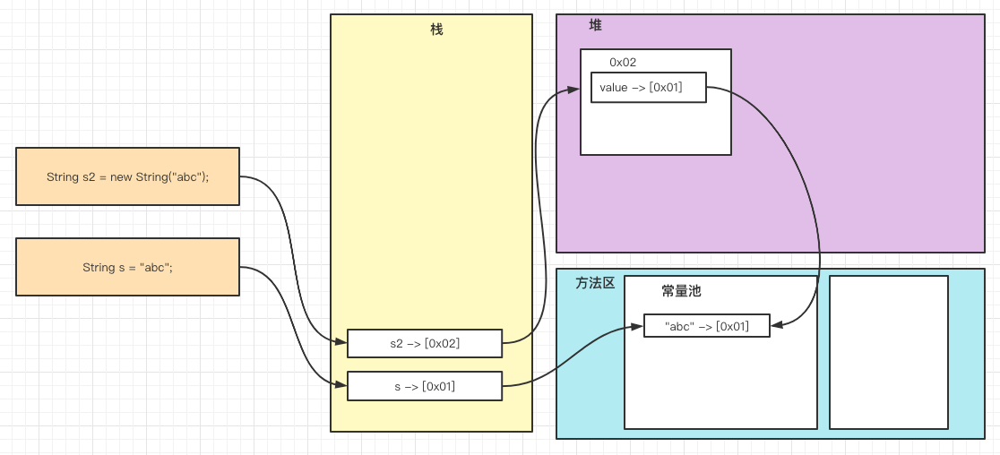

# 5_常用类

- [5_常用类](#5_常用类)
  - [包装类 （wrapper）](#包装类-wrapper)
    - [装箱/拆箱](#装箱拆箱)
    - [包装类型和String类型的相互转换](#包装类型和string类型的相互转换)
    - [包装类的常用方法](#包装类的常用方法)
    - [Integer 应用](#integer-应用)
  - [String](#string)
  - [StringBuffer类](#stringbuffer类)
    - [String VS StringBuffer](#string-vs-stringbuffer)
    - [StringBuffer常见方法](#stringbuffer常见方法)
    - [StringBuffer练习](#stringbuffer练习)
  - [StringBuilder类](#stringbuilder类)
  - [String、StringBuffer 和 StringBuilder的比较](#stringstringbuffer-和-stringbuilder的比较)
  - [Math类](#math类)
  - [Arrays 类](#arrays-类)
  - [System 类](#system-类)
  - [BigInteger和BigDecimal类](#biginteger和bigdecimal类)
    - [加、减、乘、除](#加减乘除)
  - [日期类](#日期类)
    - [Date类和SimpleDateFormate类](#date类和simpledateformate类)
    - [Calendar类](#calendar类)
    - [Date 和 Calendar 的存在的问题](#date-和-calendar-的存在的问题)
    - [LocalDate类、LocalTime类 和 LocalDateTime类](#localdate类localtime类-和-localdatetime类)
    - [DateTimeFormatter格式日期类](#datetimeformatter格式日期类)
    - [Instant 时间戳 类](#instant-时间戳-类)
  - [本章作业](#本章作业)
    - [练习1](#练习1)
    - [练习4](#练习4)

## 包装类 （wrapper）

- 包装类的分类
  - 针对八种基本类型定义相对应的引用类型，称之为`包装类`；
  - 有了类的特点，就可以调用类中的方法；

| 基本数据类型 | 包装类    |
| ------------ | --------- |
| boolean      | Boolean   |
| char         | Character |
| byte         | Byte      |
| short        | Short     |
| int          | Integer   |
| long         | Long      |
| float        | Float     |
| double       | Double    |

### 装箱/拆箱

- jdk1.5前的手动装箱和拆箱方式，装箱：基本类型 -> 包装类型，反之，拆箱;
- jdk1.5以后（含jdk5）的自动装箱和拆箱的方式;
- 自动装箱底层调用的是valueOf方法，比如：`Integer.valueOf()`;

``` java
Object obj = true ? new Integer(1) : new Double(2.0);
System.out.println(obj); // 输出：1.0 , 因为三元运算符看作是一个整体；
```

### 包装类型和String类型的相互转换

``` java
// 包装类 -> String类型
Integer i = 10；
// 方式1:
String s1 = i.toString();
// 方式2:
String s2 = String.valueOf(i);
// 方式3:
String s3 = i + "";
// String -> 包装类
// 方式1:
Integer j = new Integer(s1);
// 方式2:
Integer j2 = Integer.valueOf(s1);
// 方式3:
Integer j3 = Integer.parseInt(s1);
```

### 包装类的常用方法

``` java
System.out.println(Integer.MIN_VALUE); // 返回最小值
System.out.println(Integer.MAX_VALUE); // 返回最大值

System.out.println(Character.isDigit('a')); // 判断是不是数字
System.out.println(Character.isLetter('a')); // 判断是不是字母
System.out.println(Character.isUpperCase('a')); // 判断是不是大写
System.out.println(Character.isLowerCase('a')); // 判断是不是小写
System.out.println(Character.isWhitespace('a')); // 判断是不是空格
System.out.println(Character.toUpperCase('a')); // 转成大写
System.out.println(Character.toLowerCase('a')); // 转成小写

```

### Integer 应用

``` java
Integer i11 = 127;
int i12 = 127;
System.out.println(i11 == i12); // true , 只要有基本数据类型，判断的是值是否相同

Integer i13 = 128;
int i14 = 128;
System.out.println(i13 == i14); // true , 只要有基本数据类型，判断的是值是否相同

```

## String

- 关于String
  - String 对象用于保存字符串，也就是一组字符串序列；
  - 字符串常量对象是用双引号括起来的字符序列。例如："你好"，"12.34"，"abc"等；
  - 字符串的字符使用Unicode字符编码，一个字符（不区分字母还是汉子）占两个字节

- 创建String对象的两种方式
  - 方式一：直接赋值 `String s = "abc";`
    - <font color=red>从常量池查看是否有"abc"数据空间，如果有，直接指向；如果没有则重新创建，然后指向。s最终指向的是常量池的空间地址；</font>
  - 方式二：调用构造器 `String s2 = new String("abc");`
    - <font color=red>先在堆中创建空间，里面维护了value属性，指向常量池的"abc"空间，如果常量池没有"abc"，重新创建，如果有，直接通过value指向。最终指向的是堆中的空间地址；</font>

  - 上述两种方式的内存图：
    - 

- 练习
  - 题1

    ``` java
    String a = "hello" + "abc";
    // 创建了几个对象？
    // 创建了一个对象，底层做了优化，等价于 `String a = "helloabc"`
    ```

## StringBuffer类

- `java.lang.StringBuffer`代表可变的字符序列，可以对字符串内容进行增删；
- 很多方法与String相同，但StringBuffer是可变长度的；
- StringBuffer是一个容器；

### String VS StringBuffer

1. String 保存的是字符串常量，里面的值不能更改，每次String类的更新实际上就是更改地址，效率较低；

2. StringBuffer 保存的是字符串变量，里面的值可以更改，每次StringBuffer的更改实际上可以更新内容，不用每次更新地址，效率较高； `char[] value;` // 这个放在堆中

### StringBuffer常见方法

1. 增 append();
2. 删 delete(start,end);
3. 改 replace(start,end,string); // start至end 之间的内容替换掉，不含end
4. 查 indexOf // 查找子串在字符串第1次出现的索引，如果找不到返回-1
5. 插 insert
6. 获取长度 length

### StringBuffer练习

- 下面代码输出什么？

  ``` java
  String str = null;
  StringBuffer sb1 = new StringBuffer();
  sb1.append(str);
  System.out.println(sb1.length()); // 4
  System.out.println(sb1); // null

  StringBuffer sb2 = new StringBuffer(str); //异常： 空指针，因为 StringBuffer构器中，使用类 str.length()
  System.out.println(sb2);
  ```

## StringBuilder类

- 一个可变的字符序列。此类提供一个与StringBuilder 兼容的API，但不保证同步。该类被设计用作StringBuffer 的一个简易替换，用在字符串缓冲区被单个线程使用的时候。如果可能，建议优先采用该类，因为在大多数实现中，它比StringBuffer 要快。
- 在StringBuilder 上的主要操作是 append 和 insert 方法，可重载这些方法，以接受任意类型的数据。

## String、StringBuffer 和 StringBuilder的比较

1. StringBuilder 和 StringBuffer 非常类似，均代表可变的字符序列，而且方法也一样；
2. String：不可变字符序列，效率低，但是复用率高。
3. StringBuffer：可变字符序列、效率较高（增删）、线程安全。
4. StringBuilder：可变字符序列、效率最高、线程不安全。
5. String 使用注意说明：

  ``` java
  string s="a"; // 创建了一个字符串
  s += "b"; // 实际上原来的"a"字符串对象已经丢弃了，现在又产生了一个字符串 s+"b" (也就是"ab")。如果多次执行这些改变串内容的操作，会导致大量副本字符串对象存留在内存中，降低效率。如果这样的操作放到循环中，会极大影响程序的性能 
  // 结论：如果我们对String 做大量修改，不要使用 String 
  ```

- 使用原则
  - 如果字符串存在大量的修改操作，一般使用 StringBuffer 或 StringBuilder；
  - 如果字符串存在大量的修改操作，并在单线程的情况，使用 StringBuilder；
  - 如果字符串存在大量的修改操作，并在多线程的情况，使用 StringBuffer；

## Math类

Math 类包含用于执行基本数学运算的方法，如初等指数、对数、平方根 和 三角函数。

- 常用方法（均为静态方法）：
  - abs 绝对值
  - pow 求幂
  - ceil 向上取整
  - floor 向下取整
  - round 四舍五入
  - sqrt 求开方
  - random 求随机数
    - 思考：请写出获取a-b之间的一个随机整数，a,b均为整数？ 

    ``` java
    a + (int) (Math.random() * (b - a + 1));
    ```

  - max 求两个数的最大值
  - min 求两个数的最小值

## Arrays 类

Arrays里面包含了一系列静态方法，用于管理或操作数组（比如排序和搜索）

- Arrays 类 常用方法：
  - toString 返回数组的字符串形式；
  - sort 排序（自然拍下和定制排序）；
  - binarySearch 通过二分搜索法进行查找，要求必须排好序；
  - copyOf 数组元素的复制
  - fill 数组元素的填充  
  - equals 比较两个数组元素内容是否完全一致
  - asList 将一组值，转换成List

## System 类

- System 类 常见方法：
  - exit 退出当前程序；
  - arraycopy 复制数组元素，比较适合底层调用，一般使用`Arrays.copyOf`完成数组的复制；
  - currentTimeMillis 返回当前时间距离1970-1-1的毫秒数；
  - gc 运行垃圾回收机制；

## BigInteger和BigDecimal类

- 应用场景
  - BigInteger 适合保存较大的整数；
  - BigDecimal适合保存精度更高的浮点型（小数）；

### 加、减、乘、除

- add 加
- subtract 减
- multiply 乘
- divide 除

``` java
BigDecimal b1 = new BigDecimal("3.1415926");
BigDecimal b2 = new BigDecimal("100");
// 加
System.out.println(b1.add(b2));
// 减
System.out.println(b1.subtract(b2));
// 乘
System.out.println(b1.multiply(b2));
// 除，有可能除不尽，会报异常，所有有必要设置一下 精度
System.out.println(b1.divide(b2, 2, RoundingMode.HALF_UP));
// 指定精度，保留两位，四舍五入
System.out.println(b1.divide(b2,2, RoundingMode.HALF_UP));
```

## 日期类

### Date类和SimpleDateFormate类

- Date：精确到毫秒，代表特定的瞬间
- SimpleDateFormat：格式和解析日期的类
  - 将日期转成文本（指定格式的）
  - 将文本转成日期

### Calendar类

Calendar类是一个抽象类，它为特定瞬间与一组如： YEAR, MONTH, DAY_OF_MONTH, HOUR 等日历字段之间的转换提供了一些方法，并为操作日历（例如获得下星期的日期）提供了一些方法。

### Date 和 Calendar 的存在的问题

- 可变性：像日期和时间这样的类应该是不可变的；
- 偏移性：Date中的年份是从1990开始的，而月份是从0开始。
- 格式化：格式化只对Date有用，Calendar则不行。
- 此外，他们也不是线程安全的；不能处理闰秒（每隔2天，多出1s）。

### LocalDate类、LocalTime类 和 LocalDateTime类

- JDK8 加入的新的日期类
- LocalDate只包含日期，可以获取日期字段
- LocalTime只包含时间，可以获取时间字段
- LocalDateTime 包含日期+时间，可以获取日期和时间字段

### DateTimeFormatter格式日期类

- 类似于SimpleDateFormat

### Instant 时间戳 类

- 类似于Date
- 提供了一系列和Date类转换的方式
- Instant --> Date
  - `Date date = Date.from(instant);`
- Date --> Instant
  - `Instant instant = date.toInstant();`

## 本章作业

### 练习1

- 题目：
  - 将字符串中指定部分进行反转。比如将"abcdef"反转为"aedcbf"；
  - 编写方法 `public static String reverse(String str, int start, int end)`;

- 答案：
  - [Homework01.java](./code2/src/main/java/org/gx/chapter13/p09/Homework01.java)
  - [老师解答：Homework01_t.java](./code2/src/main/java/org/gx/chapter13/p09/Homework01_t.java)

### 练习4

- 题目：
  - 统计一个字符串中，有多少个大写字母，有多少个小写字母，有多少个数字

- 答案：
  - [Homework04.java](./code2/src/main/java/org/gx/chapter13/p09/Homework04.java)