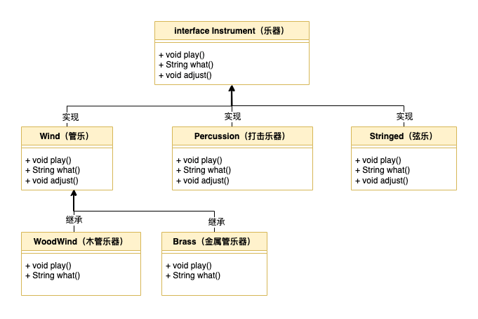
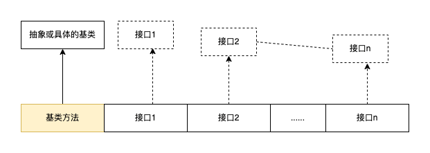

# 10. 接口

- [10. 接口](#10-接口)
  - [10.1. 抽象类和抽象方法](#101-抽象类和抽象方法)
  - [10.2. 接口定义](#102-接口定义)
    - [10.2.1. 默认方法](#1021-默认方法)
  - [10.2.2. 多重继承](#1022-多重继承)
    - [10.2.3. 接口中的静态方法](#1023-接口中的静态方法)
    - [10.2.4. 作为接口的 Instrument](#1024-作为接口的-instrument)
  - [10.3. 抽象类与接口](#103-抽象类与接口)
  - [10.4. 完全解耦](#104-完全解耦)
  - [10.5. 组合多个接口](#105-组合多个接口)
  - [10.6. 通过继承来扩展接口](#106-通过继承来扩展接口)
    - [10.6.1. 组合接口时的命名冲突](#1061-组合接口时的命名冲突)
  - [10.7. 适配接口](#107-适配接口)
  - [10.8. 接口中的字段](#108-接口中的字段)
  - [10.9. 嵌套接口](#109-嵌套接口)
  - [10.10. 接口和工厂](#1010-接口和工厂)
  - [10.11. 新特性：接口的 private 方法](#1011-新特性接口的-private-方法)
  - [10.12. 新特性：密封类和密封接口](#1012-新特性密封类和密封接口)
  - [10.13. 总结](#1013-总结)

## 10.1. 抽象类和抽象方法

- 在 `Instrument（乐器）` 示例中，创建此通用接口的唯一原因是，不同子类可以用不同的方式来表示这个接口。它建立了一种基本形式，这样就可以抽象出所有子类的共同之处。换言之，`Instrument（乐器）` 可称为 `抽象基类，或简称抽象类` ；

- Java 提供了一种称为 `抽象方法（abstract method）` 的机制。这是一个不完整的方法，它只有一个声明，没有方法体。以下是抽象方法声明的语法：

``` java
abstract void f();
```

- 包含抽象方法的类称为 `抽象类` 。*<u>如果一个类包含一个或多个抽象方法，则该类必须被定义为抽象类，否则编译器会产生编译错误。</u>*

- 如果试图创建一个抽象类的对象，会收到来自编译器的错误消息。这样就保证了抽象类的纯粹，不用担心它会被误用；

- 如果一个新类型继承了抽象类，并希望能生成自己的对象，那它必须为基类中的所有抽象方法提供方法定义。如果不这么做，那么子类也是抽象的，编译器将强制你使用 `abstract` 关键字来限定这个子类；

- 一个抽象类可以不包含任何抽象方法。如果一个类并不需要包含抽象方法，但同时还想阻止对它的任何实例化，这时将其定义为抽象类很有用了。

- 抽象类几乎对访问权限没有什么限制，但不允许使用 `private abstract` ，因此在 `AbstractAccess` 的任何子类中都不可能给这样的方法提供一个合法的定义。

- 抽象类和抽象方法很有用，因为它们明确了类的抽象性，并告诉用户和编译器自己的预期用途。抽象类还是有用的重构工具，它能让你轻松地在继承层次结构中向上移动通用方法。

## 10.2. 接口定义

- 使用关键字 `interface` 来定义接口。

``` java
// Java 8 之前的接口是这样的：
public interface PureInterface {
    int m1();
    void m2();
    double m3();
}
```

- 在 Java 8 之前，可以这样说：

> interface 关键字创建了一个完全抽象的类，它不代表任何实现。接口描述了一个类应该是什么样子和做什么的，而不是应该如何做。它确定了方法名、参数列表和返回类型，但不提供方法体。接口提供一种形式，并且除了某些受限制的情况外，它通常不提供实现。
> 
> 对于一个接口来说，它其实是在表示 “所有实现了这个特定接口的类看起来都这样”。因此，任何接口是用来在类之间建立 “协议” 的 。

- Java 8 允许 `默认方法` 和 `静态方法`;

- `接口` 和 `抽象类` 之间最显著的区别可能是两者的惯用方式。接口通常暗示“类的类型”或作为形容词来使用，例如 `Runnable` 和 `Serializable` ，而抽象类通常是类层次结构的一部分，并且是“事物的类型”，例如 `String` 或 `Instrument` 。

- 要创建接口，使用 `interface` 关键字而不是 <span style="text-decoration: line-through"> `class` </span> 关键字。与类一样，可以在 `interface` 关键字之前添加 `public` 关键字，如果去掉 `public` 关键字，将获得默认包访问权限；

- 接口也可以包含字段，但这些字段是隐式的 `static` 和 `final` 。

- 要创建一个符合特定接口（或一组接口）的类，使用 `implements` 关键字，它表示 “接口只是定义了它看起来是怎么样的，但现在要声明它是如何工作的”。

### 10.2.1. 默认方法

- Java 8 为 default 关键字找到了一个额外的用途（以前只在 switch 语句和注解中使用）。当在接口中使用时，default 会允许方法创建一个方法体，实现了该接口的类可以在不定义方法的情况下替换方法体。

``` java
// InterfaceWithDefault.java
public interface InterfaceWithDefault {
    void firstMethod();

    void secondMethod();

    default void newMethod() {
        System.out.println("newMethod");
    }
}

// Implementation2
public class Implementation2 implements InterfaceWithDefault {
    @Override
    public void firstMethod() {
        System.out.println("firstMethod");
    }
    @Override
    public void secondMethod() {
        System.out.println("secondMethod");
    }
    public static void main(String[] args) {
        InterfaceWithDefault i = new Implementation2();
        i.firstMethod();
        i.secondMethod();
        i.newMethod();
    }
}
```

- 添加默认方法的一个令人信服的原因是，它允许向现有接口中添加方法，而不会破坏已经在使用该接口的所有代码。默认方法有时也称为`防御方法（defender method）`或`虚拟扩展方法（virtual extension method）`;

- 在 JDK 9 中，接口里的 `default` 和 `static` 方法都可以是 `private` 的 。

## 10.2.2. 多重继承

- `多重继承`意味着一个类可以从多个基类型继承特性和功能。

- Java 严格来说是一种单继承语言：只能继承一个类（或抽象类）。可以实现任意数量的接口。

- 但在 Java 8 之后，通过默认方法，Java 拥有了多重继承的一些特性。将接口与默认方法结合，意味着可以结合来自多个基类的行为。因为接口任然不允许包含字段（接口里只有静态字段），所以字段任然只能来自单个基类或抽象类。也就是说，不能拥有有状态的多重继承；

``` java
interface One {
    default void first() {
        System.out.println("first");
    }
}

interface Two {
    default void second() {
        System.out.println("second");
    }
}

interface Three {
    default void third() {
        System.out.println("third");
    }
}

class MI implements One, Two, Three { // 实现多接口
}

public class MultipleInheritance { // 多重继承
    public static void main(String[] args) {
        MI mi = new MI();
        mi.first();
        mi.second();
        mi.third();
    }
}
```

- 当多个基类（接口）中存在相同行为（即方法。签名相同，方法名+参数列表）时，子类则必须重新该方法，否则编译器报错；重新写可以使用 `super` 关键字来选择一个基类实现，或者直接重新；
- 例如下面4个案例：

``` java
// 案例 1：
interface Bob1 {
    default void bob() { System.out.println("bob"); }
}
interface Bob2 {
    default void bob() { System.out.println("bob"); }
}
//class Bob implements Bob1, Bob2{}
// error : Bob inherits unrelated defaults for bob() from Bob1, Bob2

// 案例 2：
interface Sam1 {
    default void sam() { System.out.println("Sam1::sam"); }
}
interface Sam2 {
    default void sam(int i) { System.out.println(i * 2); }
}
class Sam implements Sam1, Sam2 {}

// 案例 3：
interface Max1 {
    default void max() { System.out.println("Max1::max"); }
}
interface Max2 {
    default int max() { return 47; }
}
//class Max implements Max1,Max2{}
// error: 'max()' in 'Max1' clashes with 'max()' in 'Max2'; attempting to use incompatible return type
// 试图使用不兼容的返回类型

// 案例 4：
interface Jim1{
    default void jim(){ System.out.println("Jim1::jim"); }
}
interface Jim2{
    default void jim(){ System.out.println("Jim2::jim"); }
}
class Jim implements Jim1,Jim2{
    @Override
    public void jim() {
        Jim2.super.jim(); // 使用super关键字来选择一个基类实现
    }
}

public class MICollision {
    public static void main(String[] args) {
        Jim jim = new Jim();
        jim.jim();
    }
}

```

### 10.2.3. 接口中的静态方法

- Java 8 还可以在接口中包含静态方法。这允许我们在接口里包含逻辑上属于它的实用程序。

- 例如下例，实用程序通常是像 `runOps()` 这种操作该接口的方法，或者 `show()` 这样的通用工具：

``` java
// 操作接口
public interface Operation {
    void execute();

    static void runOps(Operation... ops) {
        for (Operation op : ops) {
            op.execute();
        }
    }

    static void show(String msg) {
        System.out.println(msg);
    }
}

```

- `runOps()` 是 **`模版方法（Template Method）`** 设计模式的一个例子。`runOps()` 使用可变参数列表，因此我们可以根据需要传递任意数量的 `Operation`参数，并按顺序运行它们，例如：

``` java
class Heat implements Operation{
    @Override
    public void execute() {
        Operation.show("Heat");
    }
}

public class MetalWork {
    public static void main(String[] args) {
        // 必须在静态上下文中定义才能使用方法引用
        Operation twist = new Operation() {
            @Override
            public void execute() {
                System.out.println("Twist");
            }
        };

        Operation.runOps(
                new Heat(), // [1] 常规类 Heat
                new Operation() { // [2] 匿名类
                    @Override
                    public void execute() {
                        Operation.show("Hammer");
                    }
                },
                twist::execute, // [3] 方法引用
                () -> Operation.show("Anneal") // [4] Lambda 表达式 —— 需要最少的代码
                );
    }
}

```

- 在这里，可以看到创建 Operation 的不同方式。
  - [1] 常规类 Heat ；
  - [2] 匿名类 ；
  - [3] 方法引用 ；
  - [4] Lambda 表达式 —— 需要最少的代码 ；

### 10.2.4. 作为接口的 Instrument



## 10.3. 抽象类与接口

| 特性             | 接口                                                           | 抽象类                                   |
| ---------------- | -------------------------------------------------------------- | ---------------------------------------- |
| 组合             | 可以在新类中组合多个接口                                       | 只能继承一个抽象类                       |
| 状态             | 不能包含字段（静态字段除外，但他们不支持对象状态）             | 可以包含字段，非抽象方法可以引用这些字段 |
| 默认方法与抽象类 | 默认方法不需要在子类里实现，它只能引用接口里的方法（字段不行） | 抽象方法必须在子类里实现                 |
| 构造器           | 不能有构造器                                                   | 可以有构造器                             |
| 访问权限控制     | 隐式的 public                                                  | 可以为 protected 或 包访问权限           |

## 10.4. 完全解耦

- 当方法与类而不是接口配合使用时，你就只能使用该类或子类。如果想将该方法应用于不在这个继承层次结构的类上，那就束手无策了。而接口大大放宽了这种限制，因此可以编写更多可复用的代码。

``` java
import java.util.Arrays;

class Processor { // 处理器
    public String name() {
        return getClass().getSimpleName();
    }
    public Object process(Object input) {
        return input;
    }
}

class Upcase extends Processor {
    @Override
    public String process(Object input) {
        return ((String) input).toUpperCase();
    }
}

class Downcase extends Processor {
    @Override
    public String process(Object input) {
        return ((String) input).toLowerCase();
    }
}

class Splitter extends Processor {
    @Override
    public String process(Object input) {
        return Arrays.toString(((String) input).split(" "));
    }
}

public class Applicator { // 应用程序
    public static void apply(Processor p, Object s) {
        System.out.println("Using Processor " + p.name());
        System.out.println(p.process(s));
    }

    public static void main(String[] args) {
        String s = "We are such stuff as dreams are made on";
        apply(new Upcase(), s);
        apply(new Downcase(), s);
        apply(new Splitter(), s);
    }

}

/* OUTPUT:
Using Processor Upcase
WE ARE SUCH STUFF AS DREAMS ARE MADE ON
Using Processor Downcase
we are such stuff as dreams are made on
Using Processor Splitter
[We, are, such, stuff, as, dreams, are, made, on]
 */
```

- `Applicator.apply()`方法接受任何类型的 `Processor`，将其应用到一个 `Object` 并打印结果。可以创建这样一个方法，它根据传递的参数对象来表现出不同的行为，这就是 `策略（Strategy）设计模式`。方法包含了算法的固定部分，而策略包含了变化的部分。策略是传入的对象，其中包含代码。这里 `Processor` 对象是策略，`main()` 方法里显示了应用于字符串 `s` 的三种策略。

- 现在假设你发现了一组电子过滤器、它们看起来可能适合 `Applicator.apply()` 方法：

``` java
// Waveform.java
public class Waveform { // 波形;波形图;输出波形;波型;波形示波器
    private static long counter;
    private final long id = counter++;

    @Override
    public String toString() {
        return "Waveform " + id;
    }
}

// Filter.java
public class Filter { // 过滤器
    public String name() {
        return getClass().getSimpleName();
    }

    public Waveform process(Waveform input) {
        return input;
    }
}

// LowPass.java
public class LowPass extends Filter{ // 低通
    double cutoff; // 中止;切断;

    public LowPass(double cutoff) {
        this.cutoff = cutoff;
    }

    @Override
    public Waveform process(Waveform input) { // 哑处理（dummy processing）
        return input;
    }
}

// HighPass.java
public class HighPass extends Filter{ // 高通
    double cutoff; // 中止;切断;

    public HighPass(double cutoff) {
        this.cutoff = cutoff;
    }

    @Override
    public Waveform process(Waveform input) {
        return input;
    }
}

// BandPass.java
public class BandPass extends Filter{ // 带通
   double lowCutoff, highCutoff;

    public BandPass(double lowCutoff, double highCutoff) {
        this.lowCutoff = lowCutoff;
        this.highCutoff = highCutoff;
    }

    @Override
    public Waveform process(Waveform input) {
        return input;
    }
}
```

- `Filter` 和 `Processor` 具有相同的接口元素，但因为 `Filter` 类的创建者并不知道你可能想把它当 `Processor` 来使用，所有它没有继承 `Processor`，这样你就不能在 `Applicator.apply()` 方法里使用 `Filter` 了，即使它能正常工作。基本上，`Applicator.apply()` 和 `Processor` 之间的耦合超过了需要的程度，这阻止了 `Applicator.apply()` 代码的复用 —— 在它本可以被复用的时候。

``` java
// Processor.java
public interface Processor {
    default String name(){
        return getClass().getSimpleName();
    }

    Object process(Object input);
}

// Applicator.java
public class Applicator {
    public static void apply(Processor p, Object s){
        System.out.println("Using Processor " + p.name());
        System.out.println(p.process(s));
    }
}
```

- 复用代码的第一种方法是，调用者可以编写符合这个接口的类，如下所示：

``` java
import java.util.Arrays;
public interface StringProcessor extends Processor {
    @Override
    String process(Object input); // [1]

    String S = "If she weighs the same as a duck, She's made of wood"; // [2]

    static void main(String[] args) { // [3]
        Applicator.apply(new Upcase(), S);
        Applicator.apply(new Downcase(), S);
        Applicator.apply(new Splitter(), S);
    }
}

class Upcase implements StringProcessor {
    @Override
    public String process(Object input) {
        return ((String) input).toUpperCase();
    }
}

class Downcase implements StringProcessor {
    @Override
    public String process(Object input) {
        return ((String) input).toLowerCase();
    }
}


class Splitter implements StringProcessor {
    @Override
    public String process(Object input) {
        return Arrays.toString(((String) input).split(" "));
    }
}
```

- 说明：
  - [1] 这个声明是不必要的，如果删除它，编译器也不会提示错误。但它能指出方法的返回值从 `Object` 协变为 `String`；
  - [2] 字段 `s` 自动是 `static` 和 `final` 的，因为它是在接口内定义的。
  - [3] 你甚至可以在接口中定义一个 `main()` 方法
  
- 在这里，这种处理方式是有效的。但是你经常会遇到无法修改改类的情况。以上面的电子过滤器为例，库一般是被发现而不是被创建的。在这些情况下，可以使用 **`适配器（Adapter）设计模式`** ，*<u>在适配器里，编写代码来通过已有的接口生成需要的接口</u>*，如下所示：

``` java
// FilterAdapter.java
public class FilterAdapter implements Processor {
    Filter filter;

    public FilterAdapter(Filter filter) {
        this.filter = filter;
    }

    @Override
    public String name() {
        return filter.name();
    }

    @Override
    public Waveform process(Object input) {
        return filter.process((Waveform) input);
    }
}
// FilterProcessor.java
public class FilterProcessor {
    public static void main(String[] args) {
        Waveform w = new Waveform();
        Applicator.apply(new FilterAdapter(new LowPass(1.0)), w);
        Applicator.apply(new FilterAdapter(new HighPass(2.0)), w);
        Applicator.apply(new FilterAdapter(new BandPass(3.0,4.0)), w);
    }
}
```

- 在使用适配器的实现方式里，`FilterAdapter` 构造器通过你拥有的 `Filter`接口，来生成一个你需要的 `Processor`接口对象。`FilterAdapter` 类中同时也使用了 `委托`；

- 接口与实现的解耦允许我们将一个接口应用于多个不同的实现，因此代码更具可复用性。

## 10.5. 组合多个接口

- 因为接口根本没有实现，也就是说，没有与接口关联的存储，所以也就没有什么可以阻止多个接口组合在一起。这是很有用的，因为有时你想说，“一个x是一个a，同时也是一个b和一个c”。



- 在一个子类里，Java 并没有强制要求其基类是抽象的或具体的（即没有抽象方法）。如果**确实**是从非接口里继承，则只能继承一个。其余的所有元素都必须是接口。
- 将所有的接口名称放在 `implement` 关键字后面，并用逗号分隔它们。
- 你可以拥有任意数量的接口。
- 可以向上转型到每个接口，因为每个接口都是一个独立的类型。

``` java
interface CanFight{ // 可以战斗
    void fight(); // 战斗
}

interface CanSwim { // 可以游泳
    void swim(); // 游泳
}

interface CanFly{ // 可以飞行
    void fly(); // 飞行
}

class ActionCharacter { // 动作角色
    public void fight(){} // 战斗
}

class Hero extends ActionCharacter implements CanFight,CanSwim,CanFly {
    @Override
    public void swim() { }
    @Override
    public void fly() { }
}

//冒险
public class Adventure { 
    public static void t(CanFight x) { x.fight(); }
    public static void u(CanSwim x) { x.swim(); }
    public static void v(CanFly x) { x.fly(); }
    public static void w(ActionCharacter x) { x.fight(); }
    public static void main(String[] args) {
        Hero h = new Hero();
        t(h); // 当作一个CanFight
        u(h); // 当作一个CanSwim
        v(h); // 当作一个CanFly
        w(h); // 当作一个ActionCharacter
    }
}
```

- `fight()` 的签名在接口 `CanFight` 和类 `ActionCharacter` 中是相同的，并且在 `Hero` 中没有提供 `fight()` 的定义。你可以扩展一个接口，但是你的接口并非只有一个。当创建一个对象时，所有的定义必须都已经存在。尽管 `Hero` 没有明确提供 `fight()` 的定义，但继承的 `ActionCharacter` 提供了。

## 10.6. 通过继承来扩展接口

- 可以使用继承轻松地向接口添加新的方法声明，也可以通过继承多个接口组合成一个新接口。这两种情况下，都会获得一个新接口。

``` java
// 通过继承来扩展接口
interface Monster { // 怪物
    void menace(); // 威胁
}
interface DangerousMonster extends  Monster{ // 危险的怪物
    void destroy(); // 摧毁
}

interface Lethal{ // 致命的
    void kill();
}

class DragonZilla implements DangerousMonster { // Zilla龙
    @Override public void menace() {}
    @Override public void destroy() {}
}

interface Vampire extends DangerousMonster, Lethal { // 吸血鬼
    void drinkBlood(); // 饮血
}

class VeryBadVampire implements Vampire { // 非常坏的吸血鬼
    @Override public void menace() { }
    @Override public void destroy() { }
    @Override public void kill() { }
    @Override public void drinkBlood() { }
}

public class HorrorShow { // 恐怖秀
    static void u(Monster b) { b.menace(); }
    static void v(DangerousMonster d) {
        d.menace();
        d.destroy();
    }
    static void w(Lethal l) { l.kill(); }

    public static void main(String[] args) {
        DangerousMonster barney = new DragonZilla();
        u(barney);
        v(barney);
        Vampire vlad = new VeryBadVampire();
        u(vlad);
        v(vlad);
        w(vlad);
    }
}
```

### 10.6.1. 组合接口时的命名冲突

``` java
// 接口命名冲突
interface I1 { void f(); }
interface I2 { int f(int i); }
interface I3 { int f(); }
class C { public int f() { return 1;} }

class C2 implements I1, I2 {
    @Override public void f() { }
    @Override public int f(int i) { return 1; } // 重载
}

class C3 extends C implements I2 {
    @Override public int f(int i) { return 1; } // 重载
}

class C4 extends C implements I3 {
    // 完全相同，没有问题
    @Override public int f() { return 1; }
}

// 方法只有返回类型不同
//class C5 extends C implements I1 {}
// interface I4 extends I1, I3 {}
```

- 之所以出现问题，是因为重写、实现和重载令人不快地混合在一起。此外，重载方法不能只有返回类型不同。

- 将接口组合在一起时，在不同接口中使用相同的方法名称通常会导致代码可读性较差。应该努力避免这种情况。

## 10.7. 适配接口

- 引入接口最令人信服的原因之一是，可以允许同一接口有多个市县。在简单的情况下，它的体现形式可以时一个接受接口的方法，调用者实现该接口并将其对象传递给该方法。

- 因此，接口的一个创建用途就是 `策略设计模式` 。你编写一个执行某些操作的方法，该方法接受指定的接口作为参数。你基本上是在表示 “可以用这个方法来操作任何对象，只要这个对象遵循我的接口”。这使你的方法更加灵活、通用，并且可复用性也更高。

- 例如，`Scanner` 类的构造器接受一个 `Readable` 接口作为参数。你会发现 `Readable` 不是 Java 标准库中任何其他方法的参数，它是专门为 `Scanner` 创建的，因此 `Scanner` 就不用将其他参数限制为特定的类。这样 `Scanner` 可以处理更多的类型。如果创建了一个新类型并希望它可以和 `Scanner` 类一起使用，那么让它实现 `Readable` 接口就可以了。

``` Java
// 通过实现接口来适配方法

import java.io.IOException;
import java.nio.CharBuffer;
import java.util.Random;
import java.util.Scanner;

public class RandomStrings implements Readable {
    private static Random rand = new Random(47);
    private static final char[] CAPITALS =  // 大写字母
            "ABCDEFGHIJKLMNOPQRSTUVWXYZ".toCharArray();
    private static final char[] LOWERS =   // 小写字母
            "abcdefghijklmnopqrstuvwxyz".toCharArray();
    private static final char[] VOWELS = "aeiou".toCharArray(); // 元音

    private int count;

    public RandomStrings(int count) {
        this.count = count;
    }

    @Override
    public int read(CharBuffer cb) throws IOException {
        if (count-- == 0) {
            return -1; // 表示输入已经结束
        }
        cb.append(CAPITALS[rand.nextInt(CAPITALS.length)]);
        for (int i = 0; i < 4; i++) {
            cb.append(VOWELS[rand.nextInt(VOWELS.length)]);
            cb.append(LOWERS[rand.nextInt(LOWERS.length)]);
        }
        cb.append(" ");
        return 10; // 添加的字符串
    }

    public static void main(String[] args) {
        Scanner s = new Scanner(new RandomStrings(10));
        while (s.hasNext()) {
            System.out.println(s.next());
        }
    }
}
```

- 假设有一个类型还没有实现 Readable ，如何能使它与 Scanner 一起工作？下面是一个生成随机浮点数的示例：

``` java
public interface RandomDoubles {
    Random RAND = new Random(47);
    default double next() {
        return RAND.nextDouble();
    }

    static void main(String[] args) {
        RandomDoubles rd = new RandomDoubles() {
        };
        for (int i = 0; i < 7; i++) {
            System.out.println(rd.next() + " ");
        }
    }
}
```

- 通用，我们可以使用 `适配器模式` ，但在这里我们通过实现两个接口来创建适配的类。因此，使用 interface 关键字提供了*<u>多重继承</u>*，我们生成一个新的类，它同时实现了 `RandomDoubles` 和 `Readable` :

``` java
public class RandomDoublesAdapter implements RandomDoubles, Readable {
    private int count;
    public RandomDoublesAdapter(int count) {
        this.count = count;
    }

    @Override
    public int read(CharBuffer cb) throws IOException {
        if (count-- == 0) {
            return -1;
        }
        String result = Double.toString(next()) + " ";
        cb.append(result);
        return result.length();
    }

    public static void main(String[] args) {
        Scanner s = new Scanner(new RandomDoublesAdapter(7));
        while (s.hasNext()) {
            System.out.println(s.nextDouble() + " ");
        }
    }
}
```

- 因为任何现有类都可以通过这种方式添加接口，所以这意味着把接口作为参数的方法可以让任何类都适应它。这就是不使用类而使用接口的威力。

## 10.8. 接口中的字段

- *<u>接口中的任何字段都自动是 `static` 和 `final` 的，因此接口是创建一组常量值的便捷工具。</u>*

- 接口中定义的字段不能使 “空白的 final”，但它可以是非常量表达初始化。

``` java
// 使用接口创建一组常量值
public interface Months {
    int JANUARY = 1, FEBRUARY = 2, MARCH = 3,
            APRIL = 4, MAY = 5, JUNE = 6, JULY = 7,
            AUGUST = 8, SEPTEMBER = 9, OCTOBER = 10,
            NOVEMBER = 11, DECEMBER = 12;
}

// 用非常量初始化表达式来初始化接口
public interface RandVals {
    Random RAND = new Random(47);
    int RANDOM_INT = RAND.nextInt();
    long RANDOM_LONG = RAND.nextLong();
    double RANDOM_DOUBLE = RAND.nextDouble();
}
```

- 这些字段都是静态的，所以它们会在类第一次加载时被初始化，首次访问该接口的任何字段都会被触发这个加载。

## 10.9. 嵌套接口

- 接口可以嵌套在类和其他接口中。

``` java
// 嵌套接口

class A {
    interface B {
        void f();
    }

    public class BImp implements B {
        @Override public void f() { }
    }

    private class BImp2 implements B {
        @Override public void f() { }
    }

    public interface C {
        void f();
    }

    class CImp implements C {
        @Override public void f() { }
    }

    private class CImp2 implements C {
        @Override public void f() { }
    }

    private interface D {
        void f();
    }

    private class DImp implements D {
        @Override public void f() { }
    }

    public class DImp2 implements D {
        @Override public void f() { }
    }

    public D getD() {
        return new DImp2();
    }

    private D dRef;
    public void receiveD(D d) {
        dRef = d;
        dRef.f();
    }
}

interface E {
    interface G {
        void f();
    }

    // 多余的 public
    public interface H {
        void f();
    }

    void g();

    // 接口内不能用 private
    // private interface I {}
}

public class NestingInterfaces {
    public class BImp implements A.B {
        @Override public void f() { }
    }

    class CImp implements A.C {
        @Override public void f() { }
    }

//    private 的接口只能在定义的类里面实现
//    class DImp implements A.D {
//        public void f() { }
//    }

    class EImp implements E {
        @Override public void g() { }
    }

    class EGImp implements E.G {
        @Override public void f() { }
    }

    class EGImp2 implements E {
        @Override public void g() { }
        class EG implements E.G {
            @Override public void f() { }
        }
    }

    public static void main(String[] args) {
        A a = new A();
        // 无法访问 A.D
        // A.D ad = a.getD();
        // 只能返回 A.D
        // A.DImp2 di2 = a.getD();
        // 无法访问该接口的方法
        // a.getD().f();
        // 另一个A才能处理 getD();
        A a2 = new A();
        a2.receiveD(a.getD());
    }
}

```

- 在类中嵌套接口的语法相当明显。就像非嵌套接口一样，它们可以具有 `public` 或包访问权限的可见性。
- 另外在这里有一个不易理解之处：接口也可以时 `private` 的，如 `A.D` 中所示（嵌套接口和嵌套类使用相同的限定语法）。`private` 的嵌套接口有什么好处？你可能会猜测，它只能作为 `DImp` 中的私有内部类来实现，但是 `A.DImp2` 表明它也可以作为 `public` 类来实现。不过 `A.DImp2` 在使用时只能被视为自身的类型，你不能提及它实现了 `private` 的接口 `D`。所以实现了 `private` 接口的话，可以在不添加任何类型信息的情况下，限定该接口中的方法定义（也就是说，不允许任何向上转型）。
- 方法 `getD()` 让我们进一步陷入困境，这与 `private` 接口有关：它是一个 `public` 方法，但返回了一个 `private` 接口的引用。可以对这个方法的返回值做些什么？在 `main()` 里我们多次尝试使用该返回值，但都失败了。该返回值必须传递给一个有权使用它的对象 —— 这里是另一个 `A` ，它可以通过 `receiveD()` 方法使用这个返回值。
- 接口 E 表明，接口之间也可以嵌套。然而，关于接口的规则 —— 特别是所有接口元素必须是 `public` 的 —— 在这里是严格执行的，所以嵌套在另一个接口中的接口自动为 `public` 的，不能设为 `private`。

## 10.10. 接口和工厂

- 接口是通向多个实现的网关，如果想生存适合某个接口的对象，一种典型的方式是 `工厂方法（Factory Method）设计模式` 。你不是直接调用构造器，而是在工厂对象上调用创建方法，它可以生产接口实现。这样，理论上，你的代码与接口实现完全隔离，从而可以透明地讲一种实现替换为另一种实现。下面是一个示例，展示了工厂方法的结构：

``` java

interface Service {
    void method1();
    void method2();
}

interface ServiceFactory {
    Service getService();
}

class Service1 implements Service {
    // 包访问权限
    Service1() { }

    @Override public void method1() { System.out.println("Service1.method1()"); }

    @Override public void method2() { System.out.println("Service1.method2()"); }
}

class Service1Factory implements ServiceFactory {
    @Override public Service getService() { return new Service1(); }
}

class Service2 implements Service {
    // 包访问权限
    Service2() {
    }
    @Override public void method1() { System.out.println("Service2.method1()"); }
    @Override public void method2() { System.out.println("Service2.method2()"); }
}

class Service2Factory implements ServiceFactory {
    @Override public Service getService() { return new Service2(); }
}

public class Factories {
    // 消费者
    public static void serviceConsumer  (ServiceFactory fact){
        Service s = fact.getService();
        s.method1();
        s.method2();
    }

    public static void main(String[] args) {
        serviceConsumer(new Service1Factory());
        // 服务是无安全可以互换的
        serviceConsumer(new Service2Factory());
    }
}
```

- 如果没有工厂方法，你的代码必须在某处指定创建 Service 的确切类型，以调用相应的构造器。

- 为什么要添加这种额外的间接层？一个常见的原因是创建框架。假设你正在创建一个系统来玩游戏，例如想要在同一个棋盘上玩国际象棋和跳棋：

``` java

interface Game { boolean move(); }

interface GameFactory { Game getGame(); }

class Checkers implements Game {
    private int moves = 0;
    private static final int MOVES = 3;
    @Override
    public boolean move() {
        System.out.println("Checkers move " + moves);
        return ++moves != MOVES;
    }
}

class CheckersFactory implements GameFactory {
    @Override public Game getGame() { return new Checkers(); }
}

class Chess implements Game {
    private int moves = 0;
    private static final int MOVES = 4;
    @Override
    public boolean move() {
        System.out.println("Chess move " + moves);
        return ++moves != MOVES;
    }
}

class ChessFactory implements GameFactory {
    @Override public Game getGame() { return new Chess(); }
}

public class Games {
    public static void playGames(GameFactory factory) {
        Game g = factory.getGame();
        while (g.move()) ;
    }

    public static void main(String[] args) {
        playGames(new CheckersFactory());
        playGames(new ChessFactory());
    }
}
```

- 如果 `Games` 类代表了一段复杂的代码，这种方式意味着你可以在不同类型的游戏中复用该代码。可以想象，更加复杂的游戏可以从这种模式中受益。

## 10.11. 新特性：接口的 private 方法

- 随着 `default` 和 `static` 方法引入接口，我们可以在接口中编写方法的代码了，但同时可能不想让这些方法称为 `public` 的。在 `Old` 类中，`fd()` 和 `fs()` 分别是 `default` 和 `static` 方法。这些方法只被 `f()` 和 `g()` 调用，所以我们希望它们是 `private` 的：

``` java
// {NewFeature} 从 JDK9 开始
interface Old {
    default void fd(){
        System.out.println("Old::fd()");
    }
    static void fs(){
        System.out.println("Old::fs()");
    }
    default void f(){
        fd();
    }
    static void g(){
        fs();
    }
}
class ImlOld implements Old {}

interface JDK9 {
    private void fd() { // 自动是 default
        System.out.println("JDK9::fd()");
    }
    private static void fs(){
        System.out.println("JDK9::fs()");
    }
    default void f(){
        fd();
    }
    static void g(){
        fs();
    }
}
class ImlJDK9 implements JDK9 {}

public class PrivateInterfaceMethods {
    public static void main(String[] args) {
        new ImlOld().f();
        Old.g();
        new ImlJDK9().f();
        JDK9.g();
    }
}
```

- 类 `JDK9` 使用了 `JDK 9` 里最终确定的特性，将 `fd()` 和 `fs()` 转换为 `private` 方法。注意，`fd()` 不再需要 `default` 关键字，因为变成了 `private` 后自动就是 `default` 的了。

## 10.12. 新特性：密封类和密封接口

- 枚举创建了一个只有固定数量实例的类。`JDK 17` 最终确定引入了`密封（sealed）类`和`密封接口`，因此基类或接口可以限制自己能派生出哪些类。这让我们可以对一组固定种类的值进行建模：

``` java
// {NewFeature} 从 JDK 17 开始
sealed class Base permits D1,D2 {}

final class D1 extends Base {}
final class D2 extends Base {}
// 非法
// final class D3 extends Base {}
```

- 还可以密封接口和抽象类：

``` java
// {NewFeature} 从 JDK 17 开始
sealed interface Ifc permits Imp1, Imp2 {}

final class Imp1 implements Ifc {}
final class Imp2 implements Ifc {}

sealed abstract class AC permits X {}
final class X extends AC {}
```

- 如果所有的子类都定义在同一个文件中，则不需要 `permits` 子句：

``` java
// {NewFeature} 从 JDK 17 开始

sealed class Shape {}
final class Circle extends Shape {}
final class Triangle extends Shape {}
```

- `permits` 子句允许我们在单独的文件中定义子类：

``` java
// {NewFeature} 从 JDK 17 开始

// Pet.java
sealed class Pet permits Dog, Cat {}

// Dog.java
final class Dog extends Pet {}
// Cat.java
final class Cat extends Pet {}
```

- `sealed` 类的子类只能通过下面的某个修饰符来定义。
  - `final` ： 不允许有进一步的子类。
  - `sealed` ： 允许有一组密封子类。
  - `no`-sealed ： 一个新关键字，允许未知的子类来继承它。

- `sealed` 的子类保持来对层次结构的严格控制：

``` java
// {NewFeature} 从 JDK 17 开始

sealed class Bottom permits Level1 {}
sealed class Level1 extends Bottom permits Level2 {}
sealed class Level2 extends Bottom permits Level3 {}
final class Level3 extends Level2 {}
```

- *<u>注意，一个 sealed 类必须至少有一个子类。</u>*

- 一个 `sealed` 的基类无法阻止 `non-sealed` 的子类的使用，因此可以随时放开限制：

``` java
// {NewFeature} 从 JDK 17 开始

sealed class Super permits Sub1, Sub2 {}
final class Sub1 extends Super {}
non-sealed class Sub2 extends Super {}
class Any1 extends Sub2 {}
class Any2 extends Sub2 {}
```

- `JDK 16` 的 `record` 也可以作用接口的密封实现。因为 `record` 是隐式的 `final` ， 所以他们不需要在前面加 `final` 关键字：

``` java
// {NewFeature} 从 JDK 17 开始

sealed interface Employee permits CLevel, Programmer {}

record CLevel(String type) implements Employee {}
record Programmer(String type) implements Employee {}
```

- 编译器会阻止我们从密封层次结构中向下转型为非法类型：

``` java
sealed interface II permits JJ {}
final class JJ implements II {}
class Something {}

public class CheckedDowncast {
    public void f(){
        II i = new JJ();
        JJ j = (JJ)i;
        // Something s = (Something) i;
        // error: incompatible types: II cannot be converted to Something
    }
}
```

- 可以在运行使使用 `getPermittedSubclasses()` 方法来发现允许的子类：

``` java
sealed class Color permits Red, Green, Blue {}
final class Red extends Color {}
final class Green extends Color {}
final class Blue extends Color {}

public class PermittedSubclasses {
    public static void main(String[] args) {
        for (Class<?> p : Color.class.getPermittedSubclasses()) {
            System.out.println(p.getSimpleName());
        }
    }
}
/* OUTPUT
Red
Green
Blue
*/
```

## 10.13. 总结

- 重点复习：
  - [10.4. 完全解耦](#104-完全解耦)
  - [10.7. 适配接口](#107-适配接口)
  - [10.10. 接口和工厂](#1010-接口和工厂)

- 涉及：`策略设计模式`，`适配器设计模式`，`工厂方法设计模式`

> 摘录：
>
> 我们可能很容易就会觉得接口是好的，因此总是选择接口而不是具体的类。几乎任何要创建一个类的场景，都可以创建一个接口和一个工厂来代替。
>
> 许多人受到了这种诱惑，只要有可能就创建接口和工厂。这里的逻辑似乎是，你可能会用到不同的实现，因此应该始终添加这层抽象。这是一种过早的设计优化。
>
> 任何抽象都应该由真正的需求来驱动。接口应该是在必要时用来重构的东西，而不是任何地方都多加一个间接层级，进而带来额外的复杂性。这种额外的复杂性影响很大，如果你让某人在克服这种复杂性上花费时间，而他最终却发现你添加接口只不过是为了“以防万一”，而非出于什么令人信服的其他理由 —— 那好吧，如果我看到这样的设计，就会开始质疑这个人做过的其他所有设计。
>
> 一个比较恰当的指导方针是 “优先使用类而不是接口”。从类开始设计，如果很明显接口是必要的，那么就重构。接口是一个很好的工具，但它很容易被滥用；

