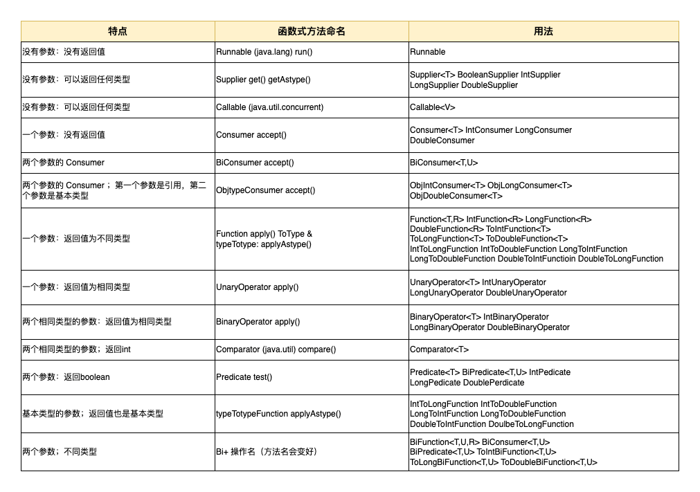

# 13. 函数式编程

- [13. 函数式编程](#13-函数式编程)
  - [13.0. 引言](#130-引言)
  - [13.1. 旧方法和新方式](#131-旧方法和新方式)
  - [13.2. lambda 表达式](#132-lambda-表达式)
    - [13.2.1. 递归](#1321-递归)
  - [13.3. 方法引用](#133-方法引用)
    - [13.3.1. Runnable](#1331-runnable)
    - [13.3.2. 未绑定方法引用](#1332-未绑定方法引用)
    - [13.3.3. 构造器方法引用](#1333-构造器方法引用)
  - [13.4. 函数式接口](#134-函数式接口)
    - [13.4.1. 带有更多参数的函数式接口](#1341-带有更多参数的函数式接口)
    - [13.4.2. 解决缺乏基本类型函数式接口的问题](#1342-解决缺乏基本类型函数式接口的问题)

## 13.0. 引言

- **`函数式编程（functional programming, FP）`**，通过整合现有代码来产生新的功能，而不是从零开始编写所有内容，由此我们会得到更可靠的代码，而且实现起来更快。这个理论看起来是成立的，至少在某些情况下如此。在发展过程中，函数式语言设计出了优秀的语法，一些非函数式语言也借用了。

- <u>**`面向对象抽象数据，而函数式编程抽象行为。`**</u>

- `纯函数式语言`在安全方面做出了更多努力。它规定了额外的约束条件，即所有的数据比心是<u>**不可变的**</u>：<u>*设置一次，永不改变*</u>。函数会接受值，然后产生新值，但是绝不会修改自身之外的任何东西（包括其参数或该函数作用域之外的元素）。有了这一保证，我们知道不会再有任何由所谓的“副作用” 引起的 bug ，因为函数只创建并返回了一个结果，别的什么都没做。

- 更妙的是，“不可变对象和无副作用”这一编程范式解决了并行编程（当程序的不同部分同时在多个处理器上运行时）中最基本和最棘手的问题之一 —— “可变的共享状态” 问题。 “可变的共享状态” 意味着，运行在不同处理器上的代码的不同部分，可能会同时尝试修改同一块内存（谁会成功？没人知道）。如果函数绝对不会修改现有值，而只是生成新值 —— 这个纯函数式语言的定义 —— 那么就不能存在内存的竞争。因此，纯函数式语言经常被当作并行编程问题的解决方案，当然也有其他可行的解决方案。

## 13.1. 旧方法和新方式

- 通常情况下，方法会根据所传递的数据产生不同的结果。如果想让一个方法在每次调用时都有不同的表现呢？如果将代码传递给方法，就可以控制其行为。

- 以前的做法是，创建一个对象，让它的一个方法包含所需行为，然后将这个对象传递给我们想控制的方法。下面的示例演示了这一点，然后增加了 `Java 8` 的实现方式：`方法引用`和`lambda 表达式`；

``` java
package org.gx.onjava.chapter13_funcational;

interface Strategy { // 策略
    String approach(String msg); // 方法
}

class Soft implements Strategy { // 柔和的策略
    @Override
    public String approach(String msg) {
        return msg.toLowerCase() + "?";
    }
}

class Unrelated { // 不相关的
    static String twice(String msg) { // 两次
        return msg + " " + msg;
    }
}

public class Strategize { // 制定战略
    Strategy strategy; // 策略
    String msg;

    public Strategize(String msg) {
        strategy = new Soft(); // [1]
        this.msg = msg;
    }

    void communicate() { // 交流
        System.out.println(strategy.approach(msg));
    }

    void changeStrategy(Strategy strategy) { // 改变策略
        this.strategy = strategy;
    }

    public static void main(String[] args) {
        Strategy[] strategies = {
                new Strategy() { // [2]
                    @Override
                    public String approach(String msg) {
                        return msg.toUpperCase() + "!";
                    }
                },
                msg -> msg.substring(0, 5), // [3]
                Unrelated::twice // [4]
        };
        Strategize s = new Strategize("Hello there");
        s.communicate();
        for (Strategy newStrategy : strategies) {
            s.changeStrategy(newStrategy); // [5]
            s.communicate(); // [6]
        }
    }
}
/* OUTPUT:
hello there?
HELLO THERE!
Hello
Hello there Hello there
 */
```

- 分析上面代码：
  - [1] 在 `Strategize` 中可以看到，`Soft` 是默认的策略，因为它是在构造器中指定的。
  - [2] 更简洁、自然的方式是创建一个匿名内部类。这样仍然会存在一定数量的重复代码，而且我们总是要花点功夫才能明白这里是在使用匿名内部类。
  - [3] 这是 `Java 8` 的 **`lambda表达式`**，突出的特点是用箭头 `->` 将参数和函数体分隔开来。箭头右边是从 `lambda` 返回的表达。这和类定义及匿名内部类实现了同样的效果，但是代码要少得多。
  - [4] 这是 `Java 8` 的 **`方法引用`**，突出的特点是 `::` 。 `::` 的左边是类名或对象名，右边是方法名，但是没有参数列表。
  - [5] 在使用了默认的 `Soft` 策略之后，我们遍历数组中的所有策略，并使用 `changeStrategy()` 方法将每个策略放入 `s` 中。
  - [6] 现在，每次调用 `communicate()` 都会产生不同的行为，这取决于此时所使用的策略“代码对象”。<u>*我们传递了行为，而不只是传递数据*</u>。

## 13.2. lambda 表达式

- **`lambda 表达式`** <u>*是使用尽可能少的语法编写的函数定义*</u>。

- `lambda` 表达式产生的是函数，而不是类。在 `Java` 的虚拟机（JVM）上，一切都是类，所以幕后会有各种各样的操作，让 `lambda` 看起来像函数。但是作为程序员，我们可以开心地假装它们“就是函数”。

- `lambda` 表达式的语法尽可能宽松，而又恰好使其容易编写和使用。

- 任何 `lambda` 表达式的基本语法如下所示：
  1. 参数；
  2. 后面跟 `->` ，你可以将其读作 “生产（produces）” ；
  3. `->` 后面的都是方法体；

    ``` java
    interface Description { // 描述
        String brief(); // 简明的
    }

    interface Body {
        String detailed(String head); // 详细的
    }

    interface Multi { // 更多
        String twoArg(String head, Double d); // 两参数
    }

    public class LambdaExpressions {
        static Body bod = h -> h + "No parens!"; // [1]
        static Body bod2 = (h) -> h + "More details"; // [2]
        static Description desc = () -> "Short info"; // [3]
        static Multi mult = (h, n) -> h + n; // [4]

        static Description moreLines = () -> { // [5]
            System.out.println("moreLines");
            return "from moreLines()";
        };

        public static void main(String[] args) {
            System.out.println(bod.detailed("Oh! "));
            System.out.println(bod2.detailed("Hi! "));
            System.out.println(desc.brief());
            System.out.println(mult.twoArg("Pi! ", 3.14159));
            System.out.println(moreLines.brief());
        }
    }
    /* OUTPUT:
    Oh! No parens!
    Hi! More details
    Short info
    Pi! 3.14159
    moreLines
    from moreLines()
    */
    ```

- 分析上面代码：
  - [1] 只有一个参数，可以只写这个参数，<u>*不写括号*</u>；
  - [2] 通常情况是用括号将参数包裹起来。为了一致性，在单个参数时可以使用括号，尽管这并不常见；
  - [3] 在没有参数的情况下，<u>**必须**</u>使用括号来指示空的参数列表；
  - [4] 在多个参数的情况下，将它们放在使用括号包裹起来的参数列表内。
  - > 注意，到目前为止，所有 `lambda` 表达式的方法体都是一行。方法体中表达式的结果会自动成为 `lambda` 表达式的发返回值，这里使用 `return` 关键字时不合法的。这是 `lambda` 表达式简化描述功能的语法的又一种体现。
  - [5] 如果 `lambda` 表达式需要多行代码，则必须将这些代码行放到花括号中。这种情况下又需要使用 `return` 从 `lambda` 表达式生成一个值了。

### 13.2.1. 递归

- **递归**意味着一个函数调用了自身。在 `Java` 中也可以编写递归的 `lambda` 表达式，但是有一点要注意：这个 `lambda` 表达式必须被赋值给一个 `静态变量` 或 `实力变量`，否则会出现编译错误。我们分别创建一个示例来说明每种情况：

- 这两个示例都使用了一个同样的接口，其方法接受 `int` 参数，并返回 `int` ：

    ``` java
    public interface IntCall {
        int call(int arg);
    }
    ```

- **`阶乘`**，整数 `n` 的 阶乘` 是所有小于等于 `n` 的正整数的乘积。阶乘函数是一个常见的递归示例：

    ``` java
    public class RecursiveFactorial {
        static IntCall fact; // 因式

        public static void main(String[] args) {
            fact = n -> n == 0 ? 1 : n * fact.call(n - 1);
            for (int i = 0; i < 10; i++) {
                System.out.println(fact.call(i));
            }
        }
    }
    ```

  - > 注意：不能在定义的时候像这样来初始化 fact:

    ``` java
    static IntCall fact = n -> n == 0 ? 1 : n * fact.call(n - 1);
    ```

- **`斐波那契数列`**，这次使用的是实例变量，用构造器来初始化：

    ``` java
    // lambda 实现 斐波那契数列
    public class RecursiveFibonacci {
        IntCall fib;

        RecursiveFibonacci() {
    //        fib = n -> n == 0 ? 0 :
    //                   n == 1 ? 1 :
    //                   fib.call(n - 1) + fib.call(n - 2);
            fib = n -> {
                if (n == 0) return 0;
                if (n == 1) return 1;
                return fib.call(n - 1) + fib.call(n - 2);
            };
        }

        int fibonacci(int n) {
            return fib.call(n);
        }

        public static void main(String[] args) {
            RecursiveFibonacci rf = new RecursiveFibonacci();
            for (int i = 0; i < 10; i++) {
                System.out.println(rf.fibonacci(i));
            }
        }
    }
    ```

## 13.3. 方法引用

- `Java 8` 方法引用指向的是方法，没有之前 `Java` 版本的历史包袱。方法引用是用类名或对象名，后面跟着 `::` ， 然后是方法名：

    ``` java
    interface Callable { // [1]
        void call(String s);
    }

    class Describe{
        void show(String msg){ // [2]
            System.out.println(msg);
        }
    }

    public class MethodReferences {
        static void hello(String name){ // [3]
            System.out.println("hello, " + name);
        }
        static class Description{
            String about;

            public Description(String about) {
                this.about = about;
            }
            void help(String msg){ // [4]
                System.out.println(about + " " + msg);
            }
        }
        static class Helper {
            static void assist(String msg) { // [5]
                System.out.println(msg);
            }
        }

        public static void main(String[] args) {
            Describe d = new Describe();
            Callable c = d::show; // [6]
            c.call("call()"); // [7]

            c = MethodReferences::hello; // [8]
            c.call("Bob");

            c = new Description("valuable")::help; // [9]
            c.call("information");

            c = Helper::assist; // [10]
            c.call("Help!");
        }
    }
    /*
    call()
    hello, Bob
    valuable information
    Help!
    */
    ```

- 分析上面代码：
  - [1] 我们从只包含一个方法的接口开始；
  - [2] `show()` 的**签名**（参数类型和返回类型）和 `Callable` 中 `call()` 的签名一致。
  - [3] `hello()` 的签名也和 `call()` 一致；
  - [4] `help()` 是静态内部类中的一个非静态方法；
  - [5] `assist()` 是静态内部类中的一个静态方法；
  - [6] 我们将 `Describe` 对象的一个方法引用赋值给了一个 `Callable`，`Callable` 中没有 `show()` 方法，只有一个 `call()` 方法。然而，`Java` 似乎对这种看似奇怪的赋值并没有一样，因为这个方法引用的签名和`Callable`中的`call()`方法一致；
  - [7] 现在可以通过调用 `call()` 来调用 `show()`，因为 `Java` 将 `call()` 映射到了 `show()` 上；
  - [8] 这是一个静态方法引用； 
  - [9] 这是[6]的另一个版本：对某个活跃对象上的方法引用，有时叫作 “<u>*绑定方法引用（bound method reference）*</u>”
  - [10] 最后，获得静态内部类中的静态方法的方法引用，看起来就像在[8]处的外部类版本。

### 13.3.1. Runnable

- `Runnable` 接口在 `java.lang` 包中，所以不需要 `import` 。 它也遵从特殊的单方法接口格式：其 `run()` 方法没有参数，也没有返回值。所以我们可以将 `lambda表达式` 或 `方法引用` 用作 `Runnable` :

    ``` java
    class Go {
        static void go() {
            System.out.println("Go::go()");
        }
    }

    public class RunnableMethodReference {
        public static void main(String[] args) {
            new Thread(new Runnable() { // 匿名内部类
                @Override
                public void run() {
                    System.out.println("Anonymous");
                }
            }).start();

            new Thread(() -> System.out.println("lambda"))
                    .start();

            new Thread(Go::go).start();
        }
    }
    ```

### 13.3.2. 未绑定方法引用

- **`未绑定方法引用（unbound method reference）`** 指的是尚未关联到某个对象的普通（非静态）方法。<u>*对于未绑定引用，必须先提供对象，然后才能使用*</u>：

    ``` java
    // 未绑定对象的方法引用

    class X {
        String f() {
            return "X::f()";
        }
    }

    interface MakeString{
        String make();
    }

    interface TransformX{
        String transform(X x);
    }

    public class UnboundMethodReference {
        public static void main(String[] args) {
            // MakeString ms = X::f; // [1]
            TransformX sp = X::f;
            X x = new X();
            System.out.println(sp.transform(x)); // [2]
            System.out.println(x.f());
        }
    }
    /*
    X::f()
    X::f()
    */
    ```

- 分析上面代码：
  
  - 到目前为止，我们看到的对方法的引用，与其关联接口的签名是相同的。在 [1] 处，我们常说对 `X` 中的 `f()` 做同样的事情， 将其赋值给 `MakeString` 。编译器会保持，提示“无效方法引用（invalid method reference）” ，即使 `make()` 的签名和 `f()` 相同。问题在于，这里事实上还涉及另一个（隐藏）参数： `this` 。如果没有一个可供附着的 `X` 对象，就无法调用 `f()` 。因此，`X::f` <u>*代表的是一个未绑定方法引用，因为它没有绑定到某个对象*</u>。
  
  - 为类解决这个问题，我们需要一个 `X` 对象，所以我们的接口事实上还需要一个额外的参数，如果 `TransformX` 中所示。如果将 `X::f` 赋值给一个 `TransformX` ， `Java` 会开心地接受。我们必须在做一次心里调节：<u>*在未绑定引用的情况下，**函数式方法**（接口中的单一方法）的签名与方法引用的签名不再完全匹配*</u>。这样做有一个很好的理由，那就是我们需要一个对象，让方法在其上调用。

  - 在 [2] 处，我们接受了未绑定引用，然后以 `X` 为参数在其上调用了 `transform()` , 最终以某种方式调用了 `x.f()` 。 `Java` 知道它必须接受第一个参数，事实上就是 `this` ，并在它的上面调用该方法。

- 查看案例：[有多个参数的未绑定方法](../../hsp/1_java_basics/code2/src/main/java/org/gx/onjava/chapter13_funcational/MultiUnbound.java)

### 13.3.3. 构造器方法引用

- 我们也可以捕获对某个构造器的引用，之后通过该引用来调用那个构造器。

    ``` java
    class Dog{
        String name;
        int age = -1; // For "unknown"
        Dog() { name = "stray"; }
        Dog(String name) { this.name = name; }
        Dog(String name, int age) { this.name = name; this.age = age; }
    }

    interface MakeNoArgs {
        Dog make();
    }

    interface Make1Arg {
        Dog make(String name);
    }

    interface Make2Args {
        Dog make(String name, int age);
    }

    public class CtorReference {
        public static void main(String[] args) {
            MakeNoArgs mna = Dog::new; // [1]
            Make1Arg m1a = Dog::new; // [2]
            Make2Args m2a = Dog::new; // [3]

            Dog dn = mna.make();
            Dog d1 = m1a.make("Comet");
            Dog d2 = m2a.make("Ralph", 4);
        }
    }
    ```

- 分析上面代码：
  
  - 注意我们在 [1]，[2] 和 [3] 中式如何使用 `Dog::new` 的。所有这3个构造器都只是一个名字： `::new` 。但是在每种情况下，构造器引用被赋值给了不同的接口，编译器可以从接口来判断使用哪个构造器。

## 13.4. 函数式接口

- `方法引用`和`lambda表达式`都必须赋值，而这些赋值都需要类信息，让编译器却不类型的正确性。尤其是`lambda表达式`，又引入了新的要求。考虑如下代码：

    ``` java
    x -> x.toString()
    ```

- 我们看到返回类型必须是 `String` ，但是 `x` 是什么类型呢？因为 `lambda表达式`包含了某种形式的<u>**类型推断**</u>（编译器推断出类型的某些信息，而不需要程序员显示指定），所以编译器必须能够以某种方式推断出 `x` 的类型。

- 同样的情况也适用于方法引用。假设想把 `System.out::println` 传递给正在编写的一个方法，那么方法的参数应该是什么类型呢？

- 为了解决这个问题，`Java 8` 引入了包含一组接口的 `java.util.function` ，这些接口是 `lambda表达式` 和 `方法引用` 的目标类型。<u>*每个接口都只包含一个抽象方法*，叫作 **函数式方法**</u> 。

- 当编写接口时，这种 “函数式方法” 模式可以使用 `@FunctionalInterface` 注解来强制实施：

    ``` java
    @FunctionalInterface
    interface Functional{
        String goodbye(String s);
    }

    interface FunctionalNoAnn{
        String goodbye(String s);
    }

    /*
    @FunctionalInterface
    interface NotFunctional{
        String goodbye(String s);
        String helle(String s);
    }
    产生错误：
    Multiple non-overriding abstract methods found in interface
    */

    public class FunctionalAnnotation {
        public String goodbye(String s){
            return "Goodbye" + s;
        }

        public static void main(String[] args) {
            FunctionalAnnotation fa = new FunctionalAnnotation();
            Functional f = fa::goodbye;
            FunctionalNoAnn fna = fa::goodbye;
            // Functional fac = fa; // 不兼容
            Functional fl = a -> "Goodbye" + a;
            FunctionalNoAnn fnal = a -> "Goodbye" + a;
        }
    }
    ```

- `@FunctionalInterface` 注解是可选的。在 `NotFunctional` 的定义中，我们可以看到 `@FunctionalInterface` 的价值：<u>*如果接口中的方法多于一个，则会产生一条编译错误信息*</u> ；

- 使用了 `@FunctionalInterface` 注解的接口也叫作 <u>**`单一抽象方法（Single Abstract Method, SAM）类型`**</u>；

- `java.util.function` 旨在创建一套足够完备的目标接口，这样一般情况下我们就不需要定义自己的接口了。接口的数量有了明显的增长，这主要是由于基本类型的缘故。如果理解命名模式，一般来说通过名字就可以了解特定的接口是做什么的。下面是基本的命名规则。
  
  1. 如果接口只处理对象，而非基本类型，那就会用一个直截了当的名字，像 `Function` 、`Consumer（消费者）` 和 `Predicate（断言）` 等。参数类型会通过泛型添加。
  
  2. 如果接口接受一个基本类型的参数，则会用名字的第一部分来表示，例如  `LongFunction` 、`DoubleConsumer` 和 `IntPredicate` 等接口类型。基本的 `Supplier（供应商）` 类型是个例外。
  
  3. 如果接口返回的是基本类型的结果，则会用 `To` 来表示，例如 `ToLongFunction<T>` 和 `IntToLongFunction` ；
  
  4. 如果接口返回的类型和参数类型相同，则会被命名为 `Operator` 。 `UnaryOperator` 用于表示一个参数，`BinaryOperator` 用于表示两个参数；
  
  5. 如果接口接受一个参数并返回 `boolean`，则会被命名为 `Predicate（断言）` ；
  
  6. 如果接口接受两个不同类型的参数，则名字中会一个 `Bi` (比如 `BiPredicate`) ;

- 下面表中描述了 `java.util.function` 中的目标类型（例外情况会指出来），帮助你推断所需的函数式接口：

    

  - 下面这个示例列举了可用于 `lambda` 表达式的所有不同的 `Function` 变种：

    ``` java
    package org.gx.onjava.chapter13_funcational;
    // 不同的 Function 变种

    import java.util.function.*;

    class Foo {}

    class Bar {
        Foo f;
        Bar(Foo f) { this.f = f; }
    }

    class IBaz {
        int i;
        IBaz(int i) { this.i = i;}
    }

    class LBaz {
        long l;
        LBaz(long l) { this.l = l;}
    }

    class DBaz {
        double d;
        DBaz(double d) { this.d = d;}
    }

    public class FunctionVariants {
        static Function<Foo, Bar> f1 = f -> new Bar(f);
        static IntFunction<IBaz> f2 = i -> new IBaz(i);
        static LongFunction<LBaz> f3 = l -> new LBaz(l);
        static DoubleFunction<DBaz> f4 = d -> new DBaz(d);
        static ToIntFunction<IBaz> f5 = ib -> ib.i;
        static ToLongFunction<LBaz> f6 = lb -> lb.l;
        static ToDoubleFunction<DBaz> f7 = db -> db.d;
        static IntToLongFunction f8 = i -> i;
        static IntToDoubleFunction f9 = i -> i;
        static LongToIntFunction f10 = l -> (int) l;
        static LongToDoubleFunction f11 = l -> l;
        static DoubleToIntFunction f12 = d -> (int) d;
        static DoubleToLongFunction f13 = d -> (long) d;

        public static void main(String[] args) {
            Bar b = f1.apply(new Foo());
            IBaz ib = f2.apply(11);
            LBaz lb = f3.apply(11);
            DBaz db = f4.apply(11);
            int i = f5.applyAsInt(ib);
            long l = f6.applyAsLong(lb);
            double d = f7.applyAsDouble(db);
            l = f8.applyAsLong(12);
            d = f9.applyAsDouble(12);
            i = f10.applyAsInt(12);
            d = f11.applyAsDouble(12);
            i = f12.applyAsInt(13.0);
            l = f13.applyAsLong(13.0);
        }
    }
    ```

  - 下面这个示例列举了可用于 `方法引用` 的 `函数式接口`：

    ``` java
    class In1 {}
    class In2 {}

    public class MethodConversion {
        static void accept(In1 i1, In2 i2) {
            System.out.println("accept()");
        }
        static void someOtherName(In1 i1, In2 i2) {
            System.out.println("someOtherName()");
        }

        public static void main(String[] args) {
            BiConsumer<In1, In2> bic;

            bic = MethodConversion::accept;
            bic.accept(new In1(), new In2());

            bic = MethodConversion::someOtherName;
            // bic.someOtherName(new In1(),new In2()); // 不行
            bic.accept(new In1(), new In2());
        }
    }
    ```

    - 查阅 `BiConsumer` 的文档，会看到它的函数式方法是 `accept()` 。 的确，如果将我们的方法命名为 `accept()` ，它可以用作方法引用。但是如果给它起个完全不同的名字，比如 `someOtherName()` ，<u>*只要参数类型和返回类型与 `BiConsumer` 的 `accept()` 相同，也是没问题的*</u>。

  - <u>*因此，当使用函数式接口时，名字并不重要，重要的只有参数类型和返回类型。`Java` 会将我们起的名字映射到接口的函数式方法上。要调用我们的方法，就要调用这个函数式方法的名字（在这个示例中是 `accept()`），而不是我们的方法的名字*</u>；

  - 下面是可用于`方法引用`的所有基于类的`函数式接口`：

    ``` java
    import java.util.Comparator;
    import java.util.function.*;

    class AA {}
    class BB {}
    class CC {}
    public class ClassFunctionals {
        static AA f1() { return new AA(); }
        static int f2(AA aa1, AA aa2) {return 1;}
        static void f3(AA aa) {}
        static void f4(AA aa, BB bb) {}
        static CC f5(AA aa) { return new CC(); }
        static CC f6(AA aa, BB bb) { return new CC(); }
        static boolean f7(AA aa) { return true; }
        static boolean f8(AA aa, BB bb) { return  true; }
        static AA f9(AA aa) { return new AA(); }
        static AA f10(AA aa1, AA aa2) { return new AA(); }

        public static void main(String[] args) {
            Supplier<AA> s = ClassFunctionals::f1;
            s.get();
            Comparator<AA> c = ClassFunctionals::f2;
            c.compare(new AA(), new AA());
            Consumer<AA> cons = ClassFunctionals::f3;
            cons.accept(new AA());
            BiConsumer<AA,BB> bicons = ClassFunctionals::f4;
            bicons.accept(new AA(),new BB());
            Function<AA,CC> f = ClassFunctionals::f5;
            f.apply(new AA());
            BiFunction<AA,BB,CC> bif = ClassFunctionals::f6;
            bif.apply(new AA(),new BB());
            Predicate<AA> p = ClassFunctionals::f7;
            boolean result = p.test(new AA());
            BiPredicate<AA,BB> bip = ClassFunctionals::f8;
            result = bip.test(new AA(),new BB());
            UnaryOperator<AA> uo = ClassFunctionals::f9;
            AA aa = uo.apply(new AA());
            BinaryOperator<AA> bo = ClassFunctionals::f10;
            aa = bo.apply(new AA(),new AA());
        }
    }
    ```

### 13.4.1. 带有更多参数的函数式接口

- `java.util.function` 中的接口毕竟是有限的。<u>*必要时我们可以编写自己的接口*</u>：

``` java
@FunctionalInterface
public interface TirFunction<T, U, V, R> {
    R apply(T t, U u, V v);
}
```

- 下面是简短的测试来验证它是否能工作：

``` java
public class TriFunctionTest {
    static int f(int i, long l, double d) { return 99; }

    public static void main(String[] args) {
        TirFunction<Integer, Long, Double, Integer> tf
                = TriFunctionTest::f; // 方法引用

        tf = (i, l, d) -> 12; // lambda 表达式
    }
}
```

### 13.4.2. 解决缺乏基本类型函数式接口的问题

- 简单地使用了适合的包装器类型，而自动装箱和自动拆箱会处理基本类型及其包装器类型直接的来回转换。我们也可以在其他函数式接口中使用包装器类型，比如 `Function`，而不是提前定义好各种变种：

``` java
public class FunctionWithWrapped {
    public static void main(String[] args) {
        Function<Integer, Double> fid = i -> (double) i;
        IntToDoubleFunction fid2 = i -> i;
    }
}
```

- 如果没有使用类型转换，则会出现编译错误：“`Integer` 无法转换为 `Double`。” 然而 `IntToDoubleFunction` 版本就没有这样的问题。源码如下：

``` java
@FunctionalInterface
public interface IntToDoubleFunction {
    double applyAsDouble(int value);
}
```

- 因为直接编写 `Function<Integer, Double>` 就能得到可行的方案，所以很明显，存在函数式接口的基本类型变种的唯一原因，<u>*就是防止在传递参数和返回结果时涉及自动装箱和自动拆箱。也就是说，为例性能*</u>；