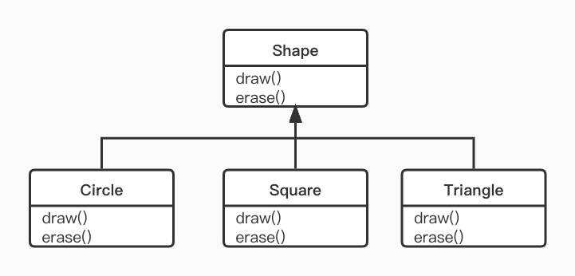
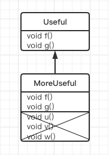

# 第8章 多态

- [第8章 多态](#第8章-多态)
  - [8.1 再论向上转型](#81-再论向上转型)
    - [8.1.1 忘记对象类型](#811-忘记对象类型)
  - [8.2 转机](#82-转机)
    - [8.2.1 方法调用绑定](#821-方法调用绑定)
    - [8.2.2 产生正确的行为](#822-产生正确的行为)
    - [8.2.3 可扩展性](#823-可扩展性)
    - [8.2.4 缺陷：“覆盖”私有方法](#824-缺陷覆盖私有方法)
    - [8.2.5 缺陷：域或静态方法](#825-缺陷域或静态方法)
  - [8.3 构造方法和多态](#83-构造方法和多态)
    - [8.3.1 构造器的调用顺序](#831-构造器的调用顺序)
    - [8.3.2 继承与清理](#832-继承与清理)
    - [8.3.3 构造器内部的多态方法的行为](#833-构造器内部的多态方法的行为)
  - [8.4 协变返回类型](#84-协变返回类型)
  - [8.5 用继承进行设计](#85-用继承进行设计)
    - [8.5.1 纯继承与扩展](#851-纯继承与扩展)
    - [8.5.2 向下转型与运行时类型识别](#852-向下转型与运行时类型识别)
  - [8.6 总结](#86-总结)

---

**面向对象程序设计语言的三种基本特征：`抽象`、`继承`和`多态`。**

多态通过分离做什么和怎么做，从另一角度将接口和实现分类开来。多态不但能够改善代码的组织结构和可读性，还能创建*可扩展*的程序 —— 即无论在项目最初创建时还是在需要添加新功能时都可以“生长”。

“封装”通过合并特征和行为来创建新的数据类型。“实现隐藏”则通过将细节“**私有化**”把接口和实现分离开来。而多态的作用则是消除类型之间的耦合关系。

## 8.1 再论向上转型

在第7章中我们已经知道，对象既可以作为它自己本身的类型使用，也可以作为它的基类型使用。而这种把对某个对象的引用视为对其基类型的引用的做法称为`向上转型` —— 因为在继承树的画法中，基类是放置在上方的。

### 8.1.1 忘记对象类型

示例：

``` java
/** 曲调 */
public enum Note {
    MIDDLE_C, C_SHARP, B_FLAT;
}
/** 乐器 */
public class Instrument {
    public void play(Note n) {
        System.out.println("Instrument.play()");
    }
}
/** 某种乐器 */
public class Wind extends Instrument {
    @Override
    public void play(Note n) {
        System.out.println("Wind.play() " + n);
    }
}
/** 音乐 */
public class Music {
    public static void tune(Instrument i){
        i.play(Note.MIDDLE_C);
    }

    public static void main(String[] args) {
        Wind wind = new Wind();
        tune(wind);
    }
}
```

`Music.java` 看起来似乎有些奇怪。为什么所有人都故意*忘记*对象的类型呢？在进行向上转型时，就会产生这种情况；并且如果让 `tune()` 方法直接接受一个 `Wind` 引用作为自己的参数，似乎会更为直观。但这样引发的一个重要问题是：*如果那样做，就需要为系统内 `Instrument` 的每一种类型都编写一个新的 `tune()` 方法*。

如果我们只写这样一个简单方法，它仅接收基类作为参数，而不是那些特殊的导出类。这样做情况会变得更好吗？也就是说，如果我们不管导出类的存在，编写的代码只是与基类打交道，会不会更好呢？这正是多态所允许的。

## 8.2 转机

观察上面示例中的 `tune()` 方法，它接受一个 `Instrument` 引用。那么在这种情况下，编译器怎样才能知道这个 `Instrument` 引用指向的是 `Wind` 对象，而不是 `Brass` 对象或者 `Stringed` 对象呢？实际上，编译器无法得知。为了深入理解这个问题，有必要研究一下 `绑定` 这个话题。

### 8.2.1 方法调用绑定

将一个方法调用同一个方法主体关联起来被称为`绑定`。若在程序执行前进行绑定（如果有的话，由编译器和连接程序实现），叫做`前期绑定`。

上述程序之所以令人迷惑，主要是因为前期绑定。因为，当编译器只有一个 `Instrument` 引用时，它无法知道究竟调用哪个方法才对。解决的办法就是`后期绑定`，它的含义就是在运行时根据对象的类型进行绑定。

`后期绑定`也叫做`动态绑定`或`运行时绑定`。如果一种语言想实现后期绑定，就必须具有某种机制，以便在运行时能判断对象的类型，从而调用恰当的方法。

Java中除了static方法和final方法（private方法属于final方法）之外，其他所有的方法都是后期绑定。这意味着通常情况下，我们不必判定是否应该进行后期绑定 —— 它会自动发生。

### 8.2.2 产生正确的行为

一旦知道Java中所有方法都是通过动态绑定实现多态这个事实之后，我们就可以编写只与基类打交道的程序代码了，并且这些代码对所有的导出类都可以正确运行。或者换一种说法，发送消息给某个对象，让该对象去判定该做什么事。

面向对象程序设计中，有一个经典的例子就是“几何图形”。有一个基类Shape，以及多个导出类 —— 如Cirele、Square、Triangle等。这个例子之所以好用，是因为我们可以说“圆是一种几何形状”，这种说法很容易被理解。

这个“几何图形”案例就是为了让大家理解：*在编译时，编译器不需要获得任何特殊信息就能进行正确的调用。对draw()方法的所有调用都是通过动态绑定进行的*。

### 8.2.3 可扩展性

回到“乐器”（Instrument）示例。由于有多态机制，我们可根据自己的需求对系统添加任意多的新类型，而不需要更改tune()方法。在一个设计良好的OOP程序中，大多数或者所有方法都会遵循tune()的模型，而且只与基类接口通信。这样的程序是*可扩展*的，因为可以通用的基类继承出新的数据类型，从而新添一些功能。那些操纵基类接口的方法不需要任何改动就可以引用于新类。

tune()方法完全可以忽略它周围代码所发生的全部变化，依旧正常运行。这正是我们期望多态所具有的特性。我们所做的代码修改，不会对程序中其他不应收到影响的部分产生破坏。换句话说，多态是一项让程序员“将改变事物于未变的事物分离开来”的重要技术。

### 8.2.4 缺陷：“覆盖”私有方法

``` java
public class PrivateOverride {
    private void f(){
        System.out.println("private f()");
    }
    public static void main(String[] args) {
        PrivateOverride po = new Derived();
        po.f();
    }
}

class Derived extends PrivateOverride {
    public void f(){
        System.out.println("public f()");
    }
}

 /* Output : 
private f()
 */
```

我们所期望的输出是`public f()`，但是由于private方法被自动认为是final方法，而且对导出类是屏蔽的。因此，在这种情况下，Derived类中的f()方法就是一个全新的方法；既然基类中的f()方法在子类Derived中不可见，因此甚至也不能被重载。

结论就是：只有非private方法才可以被覆盖；但是还需要密切关注覆盖private方法的现象，这时虽然编译器不会报错，但是也不会按照我们所期望的来执行。确切地说，在导出类中对于基类中的private方法，最好采取不同的名字。

### 8.2.5 缺陷：域或静态方法

一旦了解了多态机制，可能就会开始认为所有事物都可以多态地发生。然而，只有普通的方法调用可以是多态的。例如，如果直接访问某个域，这个访问就将在编译期进行解析，就像下面的示例：

``` java
class Super {
    public int field = 0;
    public int getField() { return this.field; }
}
class Sub extends Super {
    public int field = 1;
    public int getField() { return this.field; }
    public int getSuperField() { return super.field; }
}
public class FieldAccess {
    public static void main(String[] args) {
        Super sup = new Super();
        System.out.println("sup.field = " + sup.field + " , sup.getField() = " + sup.getField());
        Sub sub = new Sub();
        System.out.println("sub.field = " + sub.field + " , sub.getField() = " + sub.getField()
                + " , sub.getSuperField() = " + sub.getSuperField());
    }
}
/* Output:
sup.field = 0 , sup.getField() = 0
sub.field = 1 , sub.getField() = 1 , sub.getSuperField() = 0
 */
```

当Sub对象转型为Super引用时，任何域访问操作都由编译器解析，因此不是多态的。

> 注意：在实际生产开发中，通常会将所有的域（类的属性）都设置成**private**，因此不能直接访问它们，只能提供方法来访问。另外，你可能不会对基类中的域和导出类中的域赋予相同的名字，因为这种做法容易令人混淆。

如果某个方法是静态方法，它的行为就不具有多态性。因为：`静态方法与类相关联，而不是与单个对象相关联。`

## 8.3 构造方法和多态

> 通常，构造器不同于其他种类的方法。涉及到多态时仍是如此。尽管构造器并不具有多态性（它们实际上是static方法，只不过该static声明是隐式的），但还是非常有必要理解构造器怎样通过多态在复杂的层次结构中运作。

### 8.3.1 构造器的调用顺序

``` java
class Meal {
    Meal() { System.out.println("Meal()"); }
}

class Bread {
    Bread() { System.out.println("Bread()"); }
}

class Cheese {
    Cheese() { System.out.println("Cheese()"); }
}

class Lettuce {
    Lettuce() { System.out.println("Lettuce()"); }
}

class Lunch extends Meal {
    Lunch() { System.out.println("Lunch()"); }
}

class PortableLunch extends Lunch {
    PortableLunch() { System.out.println("PortableLunch()"); }
}

public class Sandwich extends PortableLunch {
    private Bread b = new Bread();
    private Cheese c = new Cheese();
    private Lettuce l = new Lettuce();
    public Sandwich() { System.out.println("Sandwich()"); }
    public static void main(String[] args) { new Sandwich(); }
}

/* Output
Meal()
Lunch()
PortableLunch()
Bread()
Cheese()
Lettuce()
Sandwich()
 */
```

在上面例子中，用其他类创建了一个复杂的类，而且每个类都有一个声明它自己的构造器。其中最重要的类是**Sandwich**，它反映了三层继承（若将自**Object**的隐含继承也算在内，就是四层）以及三个成员对象。当在**main()**里创建一个**Sandwich**对象后，就可以看到输出结果。这也表明了一复杂对象调用构造器要遵照下面的顺序：

1. 调用基类构造器。这个步骤会不断地反复递归下去，首先是构造器这种层次结构的根，然后是下一层导出类，等等，直到最底层的导出类。
2. 按声明顺序调用成员的初始化。
3. 调用导出类构造器的主体。

### 8.3.2 继承与清理

通过组合和继承方法来创建新类时，永远不必担心对象的清理问题，子对象通常都会留给垃圾回收器进行处理。如果确实遇到清理问题，那么必须用心为新类创建`dispose()`方法（在这里暂且选用此名）。并且由于继承的缘故，如果我们有其他作为垃圾回收一部分的特殊清理动作，就必须在导出类中覆盖`dispose()`方法。当覆盖被继承类的`dispose()`方法时，务必记住调用基类版本`dispose()`方法，否则，基类的清理动作就不会发生。

``` java
/*
Characteristic  译：特征
dispose         译：拥有
Description     译：描述
Living Creature 译：生物
Animal          译：动物
Amphibian       译：两栖动物
 */

class Characteristic {
    private String s;
    Characteristic(String s) {
        this.s = s;
        System.out.println("Creating Characteristic " + s);
    }
    protected void dispose() {
        System.out.println("disposing Characteristic " + s);
    }
}

class Description {
    private String s;
    Description(String s) {
        this.s = s;
        System.out.println("Creating Description " + s);
    }
    protected void dispose() {
        System.out.println("disposing Description " + s);
    }
}

class LivingCreature {
    private Characteristic p = new Characteristic("is alive");
    private Description t = new Description("Basic Living Creature");
    public LivingCreature() {
        System.out.println("LivingCreature()");
    }
    protected void dispose() {
        System.out.println("LivingCreature dispose");
        t.dispose();
        p.dispose();
    }
}

class Animal extends LivingCreature {
    private Characteristic p = new Characteristic("has heart");
    private Description t = new Description("Animal not Vegetable");
    public Animal() {
        System.out.println("Animal()");
    }
    protected void dispose() {
        System.out.println("Animal dispose");
        t.dispose();
        p.dispose();
        super.dispose();
    }
}

class Amphibian extends Animal {
    private Characteristic p = new Characteristic("can live in water");
    private Description t = new Description("Both water and land");
    public Amphibian() {
        System.out.println("Amphibian()");
    }
    protected void dispose() {
        System.out.println("Amphibian dispose");
        t.dispose();
        p.dispose();
        super.dispose();
    }
}

public class Frog extends Amphibian {
    private Characteristic p = new Characteristic("Croaks");
    private Description t = new Description("Eats Bugs");
    public Frog() {
        System.out.println("Frog()");
    }
    protected void dispose() {
        System.out.println("Frog dispose");
        t.dispose();
        p.dispose();
        super.dispose();
    }
    public static void main(String[] args) {
        Frog frog = new Frog();
        System.out.println("Bye!");
        frog.dispose();
    }
}
/* Output:
Creating Characteristic is alive
Creating Description Basic Living Creature
LivingCreature()
Creating Characteristic has heart
Creating Description Animal not Vegetable
Animal()
Creating Characteristic can live in water
Creating Description Both water and land
Amphibian()
Creating Characteristic Croaks
Creating Description Eats Bugs
Frog()
Bye!
Frog dispose
disposing Description Eats Bugs
disposing Characteristic Croaks
Amphibian dispose
disposing Description Both water and land
disposing Characteristic can live in water
Animal dispose
disposing Description Animal not Vegetable
disposing Characteristic has heart
LivingCreature dispose
disposing Description Basic Living Creature
disposing Characteristic is alive
 */
```

层次结构中的每个类都包含`Characteristic`和`Description`这两种类型的成员对象，并且它们也必须被销毁。*所以万一某个子对象要依赖于其他对象，销毁的顺序应该和初始顺序相反。对于字段，则意味着与声明的顺序相反（因为字段的初始化是按照声明的顺序进行的）。对于基类，应该首先对其导出类进行清理，然后才是基类。这是因为导出类的清理可能会调用基类中的某些方法，所以需要使基类中的构件仍起作用，而不是过早地销毁它们。*

> 注意：尽管通常不必执行清理工作，但是一旦选择要执行，就必须谨慎和小心。

如果这些成员对象中存在于其他一个或多个对象共享的情况，问题就变得复杂了，你就不能简单地假设你可以调用`dispose()`了。在这种情况下，也许就必需使用引用计数来跟踪仍旧访问着共享对象的对象数量来。如下：

``` java
/*
Reference Counting 译: 引用计数
Shared 译: 共享
Composing 译: 构成
 */
class Shared {
    private int refCount = 0;
    private static long counter = 0;
    private final long id = counter++;
    public Shared() { System.out.println("Creating " + this); }
    public void addRef() { refCount++; }
    protected void dispose() {
        if (--refCount == 0) {
            System.out.println("Dispose " + this);
        }
    }
    @Override
    public String toString() { return "Shared " + id; }
}
class Composing {
    private Shared shared;
    private static long counter = 0;
    private final long id = counter++;
    public Composing(Shared shared) {
        System.out.println("Creating " + this);
        this.shared = shared;
        this.shared.addRef();
    }
    protected void dispose() {
        System.out.println("dispose " + this);
        shared.dispose();
    }
    @Override
    public String toString() { return "Composing " + id; }
}

public class ReferenceCounting {
    public static void main(String[] args) {
        Shared shared = new Shared();
        Composing[] composings = {new Composing(shared), new Composing(shared), new Composing(shared),
                new Composing(shared), new Composing(shared)};
        for (Composing c : composings) {
            c.dispose();
        }
    }
}

/* Output:
Creating Shared 0
Creating Composing 0
Creating Composing 1
Creating Composing 2
Creating Composing 3
Creating Composing 4
dispose Composing 0
dispose Composing 1
dispose Composing 2
dispose Composing 3
dispose Composing 4
Dispose Shared 0
 */
```

`static long counter` 跟踪所创建的Shared的实例的数量，还可以为`id`提供数值。`counter`的类型是`long`而不是`int`，这样可以防止溢出。`id`是`final`的，因为我们不希望它的值在对象生命周期中被改变。

在将一个共享对象附着到类上时，必须记住调用`addRef()`，但是`dispose()`方法将跟踪引用数，并决定何时执行清理。使用这种技巧需要加倍地细心，但是如果你正在共享需要清理的对象，那么你就没有他多大选择余地了。

### 8.3.3 构造器内部的多态方法的行为

构造器调用的层次结构带来了一个有趣的两难问题。如果在一个构造器的内部调用正在构造的对象的某个动态绑定方法，那会发生什么情况呢？

``` java
/*
Glyph 译：字形
RoundGlyph 译：圆形字形
 */

class Glyph {
    void draw() { System.out.println("Glyph.draw()"); }
    Glyph() {
        System.out.println("Glyph() before draw()");
        draw();
        System.out.println("Glyph() after draw()");
    }
}

class RoundGlyph extends Glyph {
    private int radius = 1;
    RoundGlyph(int r) {
        this.radius = r;
        System.out.println("RoundGlyph(), radius = " + radius);
    }
    @Override
    void draw() { System.out.println("RoundGlyph.draw(), radius = " + radius); }
}

public class PolyConstructors {
    public static void main(String[] args) { new RoundGlyph(5); }
}

/* Output
Glyph() before draw()
RoundGlyph.draw(), radius = 0
Glyph() after draw()
RoundGlyph(), radius = 5
 */
```

`Glyph.draw()`方法设计为将要被覆盖，这种覆盖是在`RoundGlyph`中发生的。但是`Glyph`构造器会调用这个方法，结果导致了对`RoundGlyph.draw()`的调用，这看起来似乎是我们的目的。但是如果看到输出结果，我们会发现当`Glyph`的构造器调用`draw()`方法时，radius不是默认初始值1，而不是0.

前一节讲述的初始化顺序并不十分完整，初始化的实际过程是：

1. 在其他任何事物发生之前，将分配给对象的存储空间初始化成二进制的0。
2. 如前所诉那样调用基类构造器。此时，调用被覆盖后的draw()方法（要在调用RoundGlyph构造器之前调用），由于步骤1的缘故，我们此时会发现radius的值为0.
3. 按照声明的顺序调用成员的初始化方法。
4. 调用导出类的构造器主体。

这样做有一个优点，那就是所有东西都至少初始化成0（或者是某些特殊数据类型中与“0”等价的值），而不是仅仅留作垃圾。其中包括通过“组合”而嵌入一个类内部的对象引用，其值是`null`。所以如果忘记对该引用进行初始化，就会在运行时出现异常。

另一方面，我们应该对着干程序的结果相当震惊。在逻辑方面，我们做的已经十分完美，而它的行为却不可思议地错了，并且编译器也没有报错。诸如此类的错误会很容易被人忽略，而且要花很长时间才能发现。

> 注意：因此，编写构造器时有一条有效的准则：“用尽可能简单的那些方法是基类中的final final方法（也适用于private方法，它们自动属于final方法）。这些方法不能被覆盖，因此也就不会出现上述令人惊讶的问题。你可能无法总是能够遵循这条准则，但是应该朝着它努力。”

## 8.4 协变返回类型

Java SE5中添加了协变返回类型，它表示在导出类中的被覆盖方法可以返回基类方法的返回类型的某种导出类型：

``` java
class Grain {
    public String toString() { return "Grain"; }
}
class Wheat extends Grain {
    public String toString() { return "Wheat"; }
}
class Mill {
    Grain process() { return new Grain(); }
}
class WheatMill extends Mill {
    Wheat process() { return new Wheat(); }
}
public class CovariantReturn {
    public static void main(String[] args) {
        Mill m = new Mill();
        Grain g = m.process();
        System.out.println(g);
        m = new WheatMill();
        g = m.process();
        System.out.println(g);
    }
}
/* output :
Grain
Wheat
 */
```

Java SE5与Java较早版本之间的主要差异就是较早的版本将强制process()的覆盖版本必须返回Grain，而不能返还Wheat，尽管Wheat是从Grain导出的，因而也应该是一种合法的返回类型。协变返回类型允许返回更具体的Wheat类型。

## 8.5 用继承进行设计

学习了多态之后，看起来似乎所有东西都可以被继承，因为多态是一种如此巧妙的工具。事实上，当我们使用现成的类来建立新类时，如果首先考虑使用继承技术，反倒会加重我们的设计负担，事情变得不必要地复杂起来。更好的方式是首先选择“组合”，尤其是不能十分确定使用哪一种方式时。组合不会强制我们的程序设计进入继承的层次结构中。而且，组合更加灵活，因为它可以动态选择类型（因此也就选择了行为）；相反，继承在编译时就需要知道确切类型。

``` Java
/** 演员 */
class Actor {
    /** 表演 */
    public void act() { }
}
/** 喜剧演员 */
class HappyActor extends Actor {
    public void act() {
        System.out.println("HappyActor");
    }
}
/** 悲剧演员 */
class SadActor extends Actor {
    public void act() {
        System.out.println("SadActor");
    }
}
/** 舞台 */
class Stage {
    private Actor actor = new HappyActor();
    /** 转换演员 */
    public void change() {
        actor = new SadActor();
    }
    /** 开始表演 */
    public void performPlay() {
        actor.act();
    }
}
public class Transmogrify {
    public static void main(String[] args) {
        Stage stage = new Stage();
        stage.performPlay();
        stage.change();
        stage.performPlay();
    }
}
/* Output :
HappyActor
SadActor
 */
```

在这里，Stage对象包含一个对Actor的引用，而Actor被初始化为HapppyActor对象。这意味着performPlay()会产生某种特殊行为。既然引用在运行时可以与另一个不同的对象重新绑定起来，所以SadActor对象的引用可以在actor中被替代，然后由performPlay()产生的行为也随之改变。这样一来，我们在运行期间获得了动态灵活性（这也称做`状态模式`）。与此相反，我们不能在运行期间决定继承不同的对象，因为它要求在编译期间完全确定下来。

> 注意：一条通用的准则是：“用继承表达行为间的差异，并用字段表达状态上的变化”。在上述例子中，两者都用到了：通过继承得到两个不同的类，用于表达act()方法的差异；而Stage通过运用组合使自己的状态发生变化。在这种情况下，这种状态的改变也就产生了行为的改变。

### 8.5.1 纯继承与扩展

采取“纯粹”的方式来创建继承层次结构似乎是最好的方式。也就是说，只有在基类中已建立的方法才可以在导出类中被覆盖，如下图所示：



这被称作是纯粹的“is-a”（是一种）关系，因为一个类的接口已经确定了它应该是什么。继承可以确保所有的导出类具有基类的接口，且绝对不会少。按上图那么做，导出类也将具有和基类一样的接口。也可以认为这是一种`纯替代`，因为导出类可以完全替代基类，而且在使用它们时，完全不需要知道关于子类的任何额外信息。

`纯代替`它也有缺点。导出类中接口的扩展部分不能被基类访问，因此，一旦我们向上转型，就不能调用那些新方法。例如下图：




### 8.5.2 向下转型与运行时类型识别

## 8.6 总结
