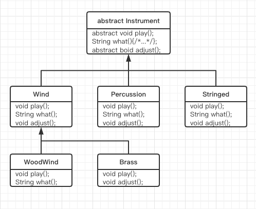

# 第9章 接口

- [第9章 接口](#第9章-接口)
  - [9.1 抽象类和抽象方法](#91-抽象类和抽象方法)
  - [9.2 接口](#92-接口)
  - [9.3 完全解藕](#93-完全解藕)
  - [9.4 Java中的多重继承](#94-java中的多重继承)
  - [9.5 通过继承来扩展接口](#95-通过继承来扩展接口)
    - [9.5.1 组合接口时的名字冲突](#951-组合接口时的名字冲突)
  - [9.6 适配接口](#96-适配接口)
  - [9.7 接口中的域](#97-接口中的域)
    - [9.7.1 初始化接口中的域](#971-初始化接口中的域)
  - [9.8 嵌套接口](#98-嵌套接口)
  - [9.9 接口与工厂](#99-接口与工厂)
  - [9.10 总结](#910-总结)

> 接口和内部类为我们提供了一种将接口与实现分离的更加结构化的方法。

## 9.1 抽象类和抽象方法

抽象类，它是普通的类与接口之间的一种中庸之道。

Java提供一种叫做`抽象方法`的机制，这种方法是不完整的；仅有声明而没有方法体。下面是抽象方法声明所采用的语法：

``` java
abstract void f();
```

包含抽象方法的类叫做`抽象类`。如果一个类爆红一个或多个抽象方法，该类必须被限定为**抽象类**。（否则编译器就会报错。）

抽象类的作用和特点：

1. 由于为抽象类创建对象是不安全的，所以我们会从编译器那里得到一条错误消息。这样，编译器会确保抽象类的纯粹性，我们不必担心会误用它。
2. 如果从一个抽象类继承，并想创建该新类的对象，那么就必须为基类中的所有抽象方法提供方法定义。如果不这样做（可以选择不这样做），那么导出类便也是抽象类，且编译器将会强制我们用`abstract`关键字来限定这个类。
3. 我们也可能会创建一个没有任何抽象方法的抽象类。考虑这种情况：如果一个类，让其包含任何abstract方法都显得没有实际意义，而且我们也想要阻止产生这个类的任何对象，那么这时这样做久很有用了。

第8章Instrument类可以很容易地转化成abstract类。既然使某个类成为抽象类并不需要所有的方法都是抽象的，所以仅需将某些方法声明为抽象的即可。如下图：



***

``` java
enum Note {
    MIDDLE_C, C_SHARP, B_FLAT;
}
abstract class Instrument {
    abstract void play(Note n);
    abstract void adjust();
    String what() { return "Instrument"; }
}
class Wind extends Instrument {
    @Override
    void play(Note n) {  System.out.println("Wind.play()" + n); }
    @Override
    void adjust() { System.out.println("Adjusting Wind"); }
    @Override
    String what() { return "Wind"; }
}
class Percussion extends Instrument {
    @Override
    void play(Note n) { System.out.println("Percussion.play()" + n); }
    @Override
    void adjust() { System.out.println("Adjusting Percussion"); }
    @Override
    String what() { return "Percussion"; }
}
class Stringed extends Instrument {
    @Override
    void play(Note n) { System.out.println("Stringed.play()" + n); }
    @Override
    void adjust() { System.out.println("Adjusting Stringed"); }
    @Override
    String what() { return "Stringed"; }
}
class Woodwind extends Wind {
    @Override
    void play(Note n) { System.out.println("Woodwind.play()" + n); }
    @Override
    String what() { return "Woodwind"; }
}
class Brass extends Wind {
    @Override
    void play(Note n) { System.out.println("Brass.play()" + n); }
    @Override
    void adjust() { System.out.println("Adjusting Brass"); }
}
public class Music4 {
    static void tune(Instrument i) { i.play(Note.C_SHARP); }
    static void tuneAll(Instrument[] e) { for (Instrument i : e) { tune(i); } }
    public static void main(String[] args) {
        Instrument[] orchestra = {
                new Wind(), new Percussion(), new Stringed(),
                new Brass(), new Woodwind()
        };
        tuneAll(orchestra);
    }
}
/* output
Wind.play()C_SHARP
Percussion.play()C_SHARP
Stringed.play()C_SHARP
Brass.play()C_SHARP
Woodwind.play()C_SHARP
 */
```

创建抽象类和抽象方法非常有用，因为它们可以使类的抽象性明确起来，并告诉用户和编译器打算怎样来使用它们。抽象类还是很有用的重构工具，因为它们使得我们可以很容易地将公共方法沿着继承层次结构向上移动。

## 9.2 接口

## 9.3 完全解藕

## 9.4 Java中的多重继承

## 9.5 通过继承来扩展接口

### 9.5.1 组合接口时的名字冲突

## 9.6 适配接口

## 9.7 接口中的域

### 9.7.1 初始化接口中的域

## 9.8 嵌套接口

## 9.9 接口与工厂

## 9.10 总结
