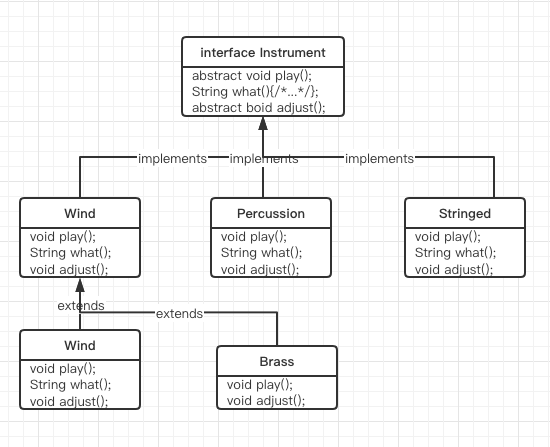

# 第9章 接口

- [第9章 接口](#第9章-接口)
  - [9.1 抽象类和抽象方法](#91-抽象类和抽象方法)
  - [9.2 接口](#92-接口)
  - [9.3 完全解藕](#93-完全解藕)
  - [9.4 Java中的多重继承](#94-java中的多重继承)
  - [9.5 通过继承来扩展接口](#95-通过继承来扩展接口)
    - [9.5.1 组合接口时的名字冲突](#951-组合接口时的名字冲突)
  - [9.6 适配接口](#96-适配接口)
  - [9.7 接口中的域](#97-接口中的域)
    - [9.7.1 初始化接口中的域](#971-初始化接口中的域)
  - [9.8 嵌套接口](#98-嵌套接口)
  - [9.9 接口与工厂](#99-接口与工厂)
  - [9.10 总结](#910-总结)

> 接口和内部类为我们提供了一种将接口与实现分离的更加结构化的方法。

## 9.1 抽象类和抽象方法

抽象类，它是普通的类与接口之间的一种中庸之道。

Java提供一种叫做`抽象方法`的机制，这种方法是不完整的；仅有声明而没有方法体。下面是抽象方法声明所采用的语法：

``` java
abstract void f();
```

包含抽象方法的类叫做`抽象类`。如果一个类爆红一个或多个抽象方法，该类必须被限定为**抽象类**。（否则编译器就会报错。）

抽象类的作用和特点：

1. 由于为抽象类创建对象是不安全的，所以我们会从编译器那里得到一条错误消息。这样，编译器会确保抽象类的纯粹性，我们不必担心会误用它。
2. 如果从一个抽象类继承，并想创建该新类的对象，那么就必须为基类中的所有抽象方法提供方法定义。如果不这样做（可以选择不这样做），那么导出类便也是抽象类，且编译器将会强制我们用`abstract`关键字来限定这个类。
3. 我们也可能会创建一个没有任何抽象方法的抽象类。考虑这种情况：如果一个类，让其包含任何abstract方法都显得没有实际意义，而且我们也想要阻止产生这个类的任何对象，那么这时这样做久很有用了。

第8章Instrument类可以很容易地转化成abstract类。既然使某个类成为抽象类并不需要所有的方法都是抽象的，所以仅需将某些方法声明为抽象的即可。如下图：


***

``` java
enum Note {
    MIDDLE_C, C_SHARP, B_FLAT;
}
abstract class Instrument {
    abstract void play(Note n);
    abstract void adjust();
    String what() { return "Instrument"; }
}
class Wind extends Instrument {
    @Override
    void play(Note n) {  System.out.println("Wind.play()" + n); }
    @Override
    void adjust() { System.out.println("Adjusting Wind"); }
    @Override
    String what() { return "Wind"; }
}
class Percussion extends Instrument {
    @Override
    void play(Note n) { System.out.println("Percussion.play()" + n); }
    @Override
    void adjust() { System.out.println("Adjusting Percussion"); }
    @Override
    String what() { return "Percussion"; }
}
class Stringed extends Instrument {
    @Override
    void play(Note n) { System.out.println("Stringed.play()" + n); }
    @Override
    void adjust() { System.out.println("Adjusting Stringed"); }
    @Override
    String what() { return "Stringed"; }
}
class Woodwind extends Wind {
    @Override
    void play(Note n) { System.out.println("Woodwind.play()" + n); }
    @Override
    String what() { return "Woodwind"; }
}
class Brass extends Wind {
    @Override
    void play(Note n) { System.out.println("Brass.play()" + n); }
    @Override
    void adjust() { System.out.println("Adjusting Brass"); }
}
public class Music4 {
    static void tune(Instrument i) { i.play(Note.C_SHARP); }
    static void tuneAll(Instrument[] e) { for (Instrument i : e) { tune(i); } }
    public static void main(String[] args) {
        Instrument[] orchestra = {
                new Wind(), new Percussion(), new Stringed(),
                new Brass(), new Woodwind()
        };
        tuneAll(orchestra);
    }
}
/* output
Wind.play()C_SHARP
Percussion.play()C_SHARP
Stringed.play()C_SHARP
Brass.play()C_SHARP
Woodwind.play()C_SHARP
 */
```

创建抽象类和抽象方法非常有用，因为它们可以使类的抽象性明确起来，并告诉用户和编译器打算怎样来使用它们。抽象类还是很有用的重构工具，因为它们使得我们可以很容易地将公共方法沿着继承层次结构向上移动。

## 9.2 接口

`interface`关键字使抽象的概念更向前迈进了一步。`abstract`关键字允许人们在类中创建一个或多个没有任何定义的方法 —— 提供了接口部分，但是没有提供任何相应的具体实现，这些实现是由此类的继承者创建的。`interface`这个关键字产生一个完全抽象的类，它根本就没有提供任何具有实现。它允许创建者确定方法名、参数列表和返回类型，但是没有任何方法体。接口只提供形式，而未提供任何具体实现。

一个接口表示：“所有实现了该特定接口的类看起来都像这样”。因此，任何使用某特定接口的代码都知道可以调用该接口的哪些方法，而且仅需要知道这些。因此，接口被用来建立类与类之间的`协议`。

但是，`interface`不仅仅时一个极度抽象的类，因为它允许人们通过创建一个能够被向上转型为多种基类的类型，来实现某种类似多重继变种的特性。

要想创建一个接口，需要用`interface`关键字来替代class关键字。就像类一样，可以在`interface`关键字前面添加`public`关键字（但仅限于该接口在与其同名的文件中被定义）。如果不添加`public`关键字，则它只是有包访问权限，这样它就只能在同一个包内可用。接口也可以包含域，但是这些域隐式地时`static`和`final`的。

要让一个类遵循某个特定接口（或者是一组接口），需要使用`implements`关键字，它表示：“`interface`只是它的外貌，但是现在我要声明它是如何工作的。”除此之外，它看起来还很像继承。“乐器”示例的图说明了这一点。



`可以选择在接口中显示地将方法声明未public的，但是即使不这么做，它们也是public的。`因此，当要实现一个接口时，在接口中被定义的方法比心被定义为是public的；否则，它们将只能得到默认的包访问权限，这样的方法被继承的过程中，其可访问权限就被降低了，这是Java编译器所不允许的。

``` java
enum Note { MIDDLE_C, C_SHARP, B_FLAT; }

interface Instrument {
    int VALUE = 5; // static & final
    void play(Note n);
    void adjust();
}

class Wind implements Instrument {
    @Override
    public void play(Note n) { System.out.println(this + ".play() " + n); }

    @Override
    public void adjust() { System.out.println(this + ".adjust() "); }

    @Override
    public String toString() { return "Wind"; }
}

class Percussion implements Instrument {
    @Override
    public void play(Note n) { System.out.println(this + ".play() " + n); }

    @Override
    public void adjust() { System.out.println(this + ".adjust() "); }

    @Override
    public String toString() { return "Percussion"; }
}

class Stringed implements Instrument {
    @Override
    public void play(Note n) { System.out.println(this + ".play() " + n); }

    @Override
    public void adjust() { System.out.println(this + ".adjust() "); }

    @Override
    public String toString() { return "Stringed"; }
}

class Woodwind extends Wind {
    @Override
    public String toString() { return "Woodwind"; }
}

class Brass extends Wind {
    @Override
    public String toString() { return "Brass"; }
}

public class Music5 {
    static void tune(Instrument i) {
        i.play(Note.C_SHARP);
    }

    static void tuneAll(Instrument[] e) {
        for (Instrument i : e) {
            tune(i);
        }
    }

    public static void main(String[] args) {
        Instrument[] orchestra = {
                new Wind(), new Percussion(), new Stringed(),
                new Brass(), new Woodwind()
        };
        tuneAll(orchestra);
    }
}
/* output:
Wind.play() C_SHARP
Percussion.play() C_SHARP
Stringed.play() C_SHARP
Brass.play() C_SHARP
Woodwind.play() C_SHARP
 */
```

## 9.3 完全解藕

只要一个方法与一个类而非一个接口工作在一起时，那么你就只能使用这个类及其子类。如果你想要将这个方法应用于不在此继承结构中的某个类，那么你就要倒霉了。接口可以在很大程度上放宽这种限制，因此，它使得我们可以编写可复用性更好的代码。

例如，假设有一个`Processor`类，它有一个`name()`方法；另外还有一个`process()`方法，该方法接受输入参数，修改它的值，然后产生输出。这个类作为基类而被扩展，用来创建各种不同类型的`Processor`。在本例中，`Processor`的子类将修改Srting对象（注意，返回类型可以时协变类型，而非参数类型）：

``` java
import java.util.Arrays;

class Processor { // 处理器
    public String name() { return getClass().getSimpleName(); }
    Object process(Object input) { return input; }
}

class Upcase extends Processor {
    @Override
    Object process(Object input) { return ((String) input).toUpperCase(); }
}

class Downcase extends Processor {
    @Override
    Object process(Object input) { return ((String) input).toLowerCase(); }
}

class Splitter extends Processor {
    @Override
    Object process(Object input) { return Arrays.toString(((String) input).split(" ")); }
}

public class Apply { // 运用
    public static void process(Processor p, Object o) {
        System.out.println("Using Processor " + p.name());
        System.out.println(p.process(o));
    }
    public static String s = "Disagreement with beliefs is by definition incorrect";
    public static void main(String[] args) {
        process(new Upcase(), s);
        process(new Downcase(), s);
        process(new Splitter(), s);
    }
}

/* output
Using Processor Upcase
DISAGREEMENT WITH BELIEFS IS BY DEFINITION INCORRECT
Using Processor Downcase
disagreement with beliefs is by definition incorrect
Using Processor Splitter
[Disagreement, with, beliefs, is, by, definition, incorrect]
 */
```

> Apply.process()方法可以接受任何类型的Processor，并将其应用到一个Object对象上，然后打印结果。像本例这样，创建一个能够根据所传递的参数对象的不同而具有不同行为的方法，被称为*策略设计模式*。这类方法包含所要执行的算法中固定不变的部分，而“**策略**”包含变化的部分。策略就是传递进去的参数对象，它包含要执行的代码。这里，`Processor`对象就是一个策略，在main()中可以看到有三种不同类型的策略应哟到了String类型的s对象上。

现在假设我们发现了一组电子滤波器，它们看起来好像使用于`Apply.process()`方法：

``` java
package interfaces.filters;
public class Waveform {
    private static long counter;
    private final long id = counter++;
    @Override
    public String toString() { return "waveform " + id; }
}

package interfaces.filters;
public class Filter {
    public String name() { return getClass().getSimpleName(); }
    public Waveform process(Waveform input) { return input; }
}

package interfaces.filters;
public class LowPass extends Filter { // 低通
    double cutoff; // 隔断
    public LowPass(double cutoff) { this.cutoff = cutoff; }
    @Override
    public Waveform process(Waveform input) { return input; }
}

package interfaces.filters;
public class HighPass extends Filter { // 高通
    double cutoff; // 隔断
    public HighPass(double cutoff) { this.cutoff = cutoff; }
    @Override
    public Waveform process(Waveform input) { return input; }
}

package interfaces.filters;
public class BandPass extends Filter { // 带通
    double lowCutoff, highCutoff;
    public BandPass(double lowCutoff, double highCutoff) {
        this.lowCutoff = lowCutoff;
        this.highCutoff = highCutoff;
    }
    @Override
    public Waveform process(Waveform input) { return input; }
}

```

`Filter`与`Processor`具有相同的接口元素，但是因为它并非继承自`Processor` —— 因为`Filter`类的创建者压根不清楚你想要将它作用`Processor` —— 因此你不能将`Filter`用于`Apply.process()`方法，即便这样做可以正常运行。这里主要是因为`Apply.process()`方法和`Processor`之间的耦合过紧，已经超出了所需要的程度，这就使得应该复用`Apply.process()`的代码时，复用却被禁止了。另外还需要注意的是它们的输入和输出都是Waveform。

但是，如果`Processor`是一个接口，那么这些限制就会变得松动，使得你可以复用结构该接口的`Apply.process()`。下面是`Processor`和`Apply`的修改版本：

``` java
package interfaces.interfaceprocessor;
public interface Processor {
    String name();
    Object process(Object input);
}

package interfaces.interfaceprocessor;
public class Apply {
    public static void process(Processor p, Object s) {
        System.out.println("Using Processor " + p.name());
        System.out.println(p.process(s));
    }
}

package interfaces.interfaceprocessor;
import java.util.Arrays;
public abstract class StringProcessor implements Processor {
    @Override
    public String name() {
        return getClass().getSimpleName();
    }
    public abstract String process(Object input);
    public static String s = "Disagreement with beliefs is by definition incorrect";
    public static void main(String[] args) {
        Apply.process(new Upcase(), s);
        Apply.process(new Downcase(), s);
        Apply.process(new Splitter(), s);
    }
}
class Upcase extends StringProcessor {
    @Override
    public String process(Object input) { return ((String) input).toUpperCase(); }
}
class Downcase extends StringProcessor {
    @Override
    public String process(Object input) { return ((String) input).toLowerCase(); }
}
class Splitter extends StringProcessor {
    @Override
    public String process(Object input) { return Arrays.toString(((String) input).split(" ")); }
}

```

复用代码的一种方式是客户端程序员遵循该接口来编写他们自己的类，就像上面这样：`StringProcessor.java`

但是，经常碰到的情况是你无法修改你想要使用的类。例如，在电子滤波器的例子中，Library是被发现而不是被创建的。在这种情况下，可以使用*适配器设计模式*。适配器中的代码将接受你所拥有的接口，并产生你所需要的接口，就像下面这样：

``` java
package pers.xgo.chapter9.interfaces.interfaceprocessor;
import pers.xgo.chapter9.interfaces.filters.*;
public class FilterAdapter implements Processor {
    Filter filter;
    public FilterAdapter(Filter filter) { this.filter = filter; }

    @Override
    public String name() { return filter.name(); }

    @Override
    public Object process(Object input) { return filter.process((Waveform) input); }
}

class FilterProcessor {
    public static void main(String[] args) {
        Waveform w = new Waveform();
        Apply.process(new FilterAdapter(new LowPass(1.0)), w);
        Apply.process(new FilterAdapter(new HighPass(2.0)), w);
        Apply.process(new FilterAdapter(new BandPass(3.0, 4.0)), w);
    }
}
/* output
Using Processor LowPass
waveform 0
Using Processor HighPass
waveform 0
Using Processor BandPass
waveform 0
 */
```

这种使用适配器的方式中，`FilterAdapter`的构造器接受你所拥有的接口`Filter`，然后生成具有你所有需要的`Processor`接口对象。你可能还注意到了，在FilterAdapter类中用到了代理。

将接口从具体实现中解藕使得接口可以应用于多种不同的具体实现，因此代码也就更具可复用性。

## 9.4 Java中的多重继承

接口不仅仅只是一种更纯粹形式的抽象类，它的目标比这要高。因为接口是根本没有任何具体实现的 —— 也就是说，没有任何与接口相关的存储；因此，也就无法阻止多个接口的组合。

组合多个类的接口的行为被称作*多重继承*。

在导出类中，不强制要求比心有一个抽象的或“具体的”（没有任何抽象方法的）基类。`如果要从一个非接口的类继承，那么只能从一个类区继承。其余的基元素都必须是接口。需要将所有的接口名都置于implements关键字之后，用逗号将它们一一隔开。可以继承任意多个接口，并可以向上转型为每个接口，因为每一个接口都是一个独立类型`。下面的例子展示了一个具体组合数个接口之后产生了一个新类：

``` java
interface CanFight { // 可以战斗
    void fight(); // 战斗
}
interface CanSwim { // 可以游泳
    void swim(); // 游泳
}
interface CanFly {
    void fly();
}
class ActionCharacter { // 行动角色
    public void fight() { }
}
class Hero extends ActionCharacter implements CanFight, CanSwim, CanFly {
    @Override
    public void swim() { }
    @Override
    public void fly() { }
}
public class Adventure { // 冒险
    public static void t(CanFight x) { x.fight(); }
    public static void u(CanSwim x) { x.swim(); }
    public static void v(CanFly x) { x.fly(); }
    public static void w(ActionCharacter x) { x.fight(); }

    public static void main(String[] args) {
        Hero h = new Hero();
        t(h); // 把它当作 CanFight
        u(h); // 把它当作 CanSwim
        v(h); // 把它当作 CanFly
        w(h); // 把它当作 ActionCharacter
    }
}
```

可以看到，`Hero`组合了具体类`ActionCharacter`和接口`CanFight`、`CanSwim和CanFly`。当通过这种方式将一个具体类和多个接口组合到一起时，这个具体类必须放在面前，后面跟着的才是接口。

注意：`CanFight`接口与`ActionCharacter`类中的`fight()`方法的特征签名时一样的，而且，在`Hero`中并没有提供`fight()`的定义。可以扩展接口，但是得到的只是另一个接口。当想要创建对象时，所有的定义首先必须都存在。即使`Hero`没有显式地提供`fight()`的定义，其定义也因`ActionCharacter`而随之而来，这样就使得创建`Hero`对象成为了可能。

一定要记住，前面的例子所展示的就是使用接口的核心原因：为了能够向上转型为多个基类型（以及由此而带来的灵活性）。然而，使用接口的第二个原因却是与使用抽象基类相同：防止客户端程序员创建该类的对象，并确保这仅仅是建立一个接口。

我们应该使用接口还是抽象类？如果要创建不带任何方法定义和成员变量的基类，那么就应该选择接口而不是抽象类。事实上，如果知道某事物应该成为一个基类，那么第一选择应该是使它成为一个接口。

## 9.5 通过继承来扩展接口

通过继承，可以很容易地在接口中添加新的方法声明，还可以通过继承在新接口中组合数个接口。这两种情况都可以获得新的接口，就像在下例中所看到的：

``` java
interface Monster { // 怪物
    void menace(); // 威胁
}
interface DangerousMonster extends Monster { // 危险的怪物
    void destroy(); // 破坏
}
interface Lethal { // 致命
    void kill();
}
class DragonZilla implements DangerousMonster { // 恶龙
    public void menace() { }
    public void destroy() { }
}
interface Vampire extends DangerousMonster, Lethal { // 吸血鬼
    void drinkBlood(); // 吸血
}
class VeryBadVampire implements Vampire { // 非常坏的吸血鬼
    public void menace() { }
    public void destroy() { }
    public void kill() { }
    public void drinkBlood() { }
}

public class HorrorShow { // 恐怖表演
    static void u(Monster b) { b.menace(); }
    static void v(DangerousMonster d) {
        d.menace();
        d.destroy();
    }
    static void w(Lethal l) { l.kill(); }
    public static void main(String[] args) {
        DangerousMonster barney = new DragonZilla();
        u(barney);
        v(barney);
        Vampire vlad = new VeryBadVampire();
        u(vlad);
        v(vlad);
        w(vlad);
    }
}
```

DangerousMonster是Monster的直接扩展，它产生了一个新接口。DragonZilla中实现了这个接口。

在Vampire中使用的语法仅适用接口继承。一般情况下，只可以将extends用于单一类，但是可以引用多个基类接口。就像所看到的，只需用逗号将接口名一一分隔开即可。

### 9.5.1 组合接口时的名字冲突

> 在打算组合的不同接口中使用相同的方法名通常会造成代码可读性的混乱，请尽量避免这种情况。

## 9.6 适配接口

## 9.7 接口中的域

### 9.7.1 初始化接口中的域

## 9.8 嵌套接口

## 9.9 接口与工厂

## 9.10 总结
