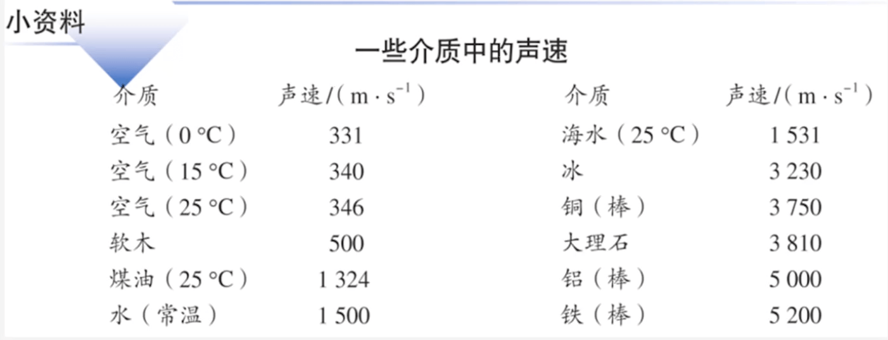
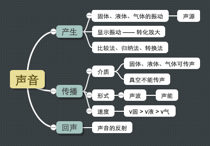

# 1. 八年级_上册

- [1. 八年级\_上册](#1-八年级_上册)
  - [1.1. 声现象](#11-声现象)
    - [1.1.1. 声音是什么](#111-声音是什么)

## 1.1. 声现象

### 1.1.1. 声音是什么

- **声音是由物体振动产生的** 。
- **声源：** 把正在发声的物体叫做声源。

***

- **声音的传播：**
  - 声音能在 **`固体`**、**`液体`** 和 **`气体`** 中传播。
  - **声源的传播需要 `介质`，不能在 `真空` 中传播** 。

***

- **声音是一种波：**
  - **声波：** 声音是一种波，我们把它叫作 **声波（sound wave）**。
  - **回声：** 声波遇到障碍物会反射回来，这就是回声。
  - **声能：** 声音具有能量，叫作声能。
  
***

- **声速：**

  - **声音在不同介质中的传播速度：**
    - **空气中：** 约 `340 m/s` 。
    - **水中：** 约 `1500 m/s` 。
    - **钢铁中：** 约 `5200 m/s` 。
  
    

  - 声速的大小跟介质的 `种类` 和介质的 `温度` 有关。

***

- **终结：**

  