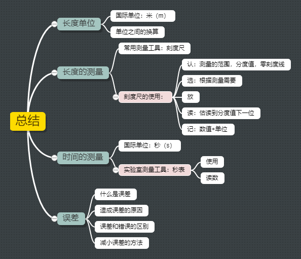

# 八年级 上 人教版

- [八年级 上 人教版](#八年级-上-人教版)
  - [序言 奇妙的物理世界](#序言-奇妙的物理世界)
  - [第一章 机械运动](#第一章-机械运动)
    - [第一节 长度和时间的测量](#第一节-长度和时间的测量)

## 序言 奇妙的物理世界

- **何为物理：**
  - `物理（Physics）` 是研究 <u>自然现象及规律第基础科学</u> 。
  - 物理以观察和实验为基础，崇尚理性、重视逻辑推理。

- **怎样学好物理：**
  - `善于观察、发现问题` > `勤于思考，科学推理` > `勇于探究，得出规律` > `乐于实际，联系实际`

- 物理学是研究物质及其运动规律的一门科学，它涉及 `力`、`热`、`声`、`光`、`电` 等形形色色的物理现象，与人们的生活息息相关。

- **总结：**

  

## 第一章 机械运动

### 第一节 长度和时间的测量

- **单位的定义：**
  - 长度、时间等可定性或定量描述第属性称为物理量。
  - 测量物理量的过程实际上是比较的过程，就是将一个待测的物理量与一个公认的标准量进行比较，这个标准量就是 `单位` 。

- **长度的单位：**
  - 长度的基本单位： `米（metre）` 。米的符号是 `m` 。

  | 名称 | 符号 | 同米的关系                      |
  | ---- | ---- | ------------------------------- |
  | 千米 | km   | 1km = 1000m = $10^3$m           |
  | 分米 | dm   | 1dm = 0.1m = $10^{-1}$m           |
  | 厘米 | cm   | 1cm = 0.01m = $10^{-2}$m          |
  | 毫米 | mm   | 1mm = 0.001m = $10^{-3}$m         |
  | 微米 | μm   | 1μm = 0.000 001m = $10^{-6}$m     |
  | 纳米 | nm   | 1nm = 0.000 000 001m = $10^{-9}$m |

- **长度的测量：**

  1. 常用测量工具：刻度尺、卷尺、游标卡尺 。
  2. 刻度尺的使用：
     - 认：零刻度线、测量的范围、单位、分度值（相邻两刻度之间的长度）。 
     - 放：刻度尺零刻度线对准被测物体的一端，有刻度线的一边要紧靠被测物理且与被测边保持平行，不能歪斜。
     - 读：视线要正对刻度线。
     - 记：测量结果 = 数值 + 单位。<u>*没有单位的记录是没有意义的*</u> 。

- **时间的测量：**
  1. 时间的国际单位： `秒（second）`，用字母 `s` 表示。
  2. 其他常用单位：`时（h）` ， `分（min）`

    ``` log
    1h = 60min = 3600s
    1min = 60s
    ```

- **误差：**
  1. 什么是误差：测量值和真实值之间的差异。
  2. 造成误差的原因：测量工具、测量方法和测量者。
  3. 误差与错误的区别：
     - 误差不是错误。
     - 任何测量都有误差，误差只能尽量减小。  
     - 错误是认为造成的，是可以避免的。
  4. 减小误差的方法：
     - 根据测量需要，选用较精密的仪器。
     - 多次测量取平均值；
     - 改进测量方法；

- **总结：**

  